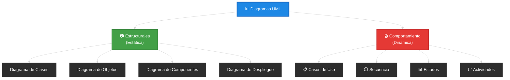
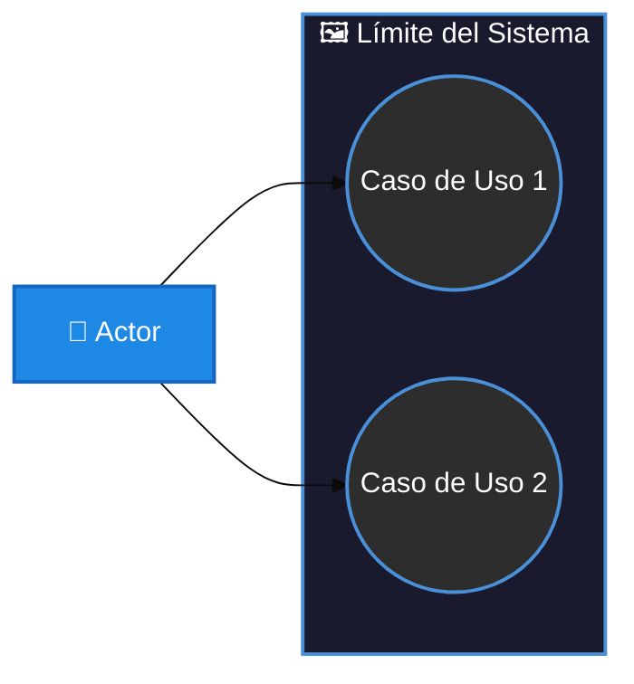
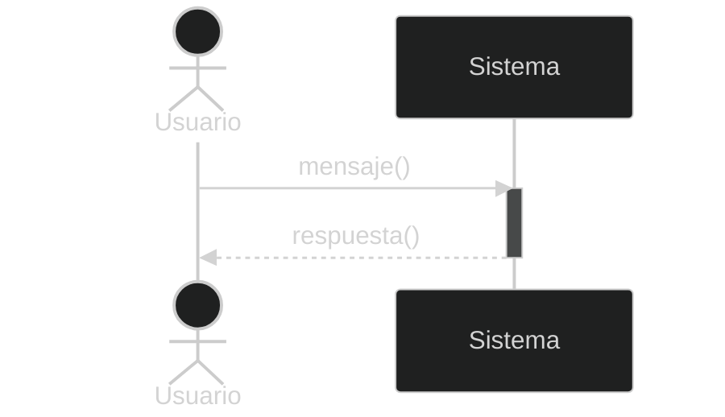
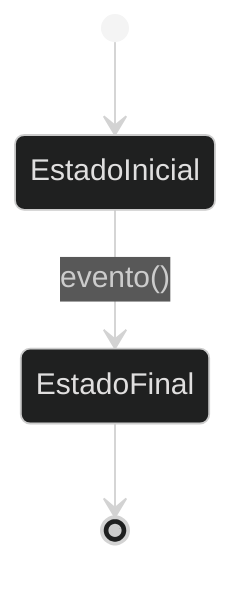

- [1. Introducción: El Sistema en Movimiento](#1-introducción-el-sistema-en-movimiento)
  - [1.1. Del "Qué es" (Clases) al "Cómo funciona" (Comportamiento)](#11-del-qué-es-clases-al-cómo-funciona-comportamiento)
  - [1.2. Clasificación de Diagramas de Comportamiento](#12-clasificación-de-diagramas-de-comportamiento)
    - [🗺️ Taxonomía de Diagramas UML](#️-taxonomía-de-diagramas-uml)
  - [1.3. Importancia del modelado dinámico: Evitando el "Código Espagueti"](#13-importancia-del-modelado-dinámico-evitando-el-código-espagueti)
  - [1.4. El concepto de Mensaje y Evento](#14-el-concepto-de-mensaje-y-evento)
    - [Ejemplo ASCII: Flujo de Login](#ejemplo-ascii-flujo-de-login)
  - [1.5. Herramientas: La potencia de Mermaid](#15-herramientas-la-potencia-de-mermaid)
    - [🛠️ Tutorial: Cómo hacer Diagramas de Comportamiento en Mermaid](#️-tutorial-cómo-hacer-diagramas-de-comportamiento-en-mermaid)
      - [Tipos de diagramas que usaremos:](#tipos-de-diagramas-que-usaremos)
      - [Ejemplo básico de Casos de Uso en Mermaid:](#ejemplo-básico-de-casos-de-uso-en-mermaid)
      - [Ejemplo básico de Secuencia en Mermaid:](#ejemplo-básico-de-secuencia-en-mermaid)
      - [Ejemplo básico de Estados en Mermaid:](#ejemplo-básico-de-estados-en-mermaid)
  - [1.6. Otras herramientas](#16-otras-herramientas)

# 1. Introducción: El Sistema en Movimiento

> 📝 **Nota del Profesor:** En la UD04 aprendimos a dibujar la "foto" del sistema (qué clases hay, qué atributos tienen, cómo se relacionan). En esta UD05 aprenderemos a hacer el "vídeo": qué sucede cuando el sistema está en funcionamiento, qué interacciones ocurren y cómo cambia el estado de los objetos a lo largo del tiempo.

En la unidad anterior aprendimos a diseñar la **estructura** del software (el "esqueleto"). Sabemos qué atributos tiene una clase y cómo se relaciona con otras. Sin embargo, un programa no es una foto fija; es un proceso vivo.

El **diseño dinámico** o de **comportamiento** responde a la pregunta: **¿Qué sucede cuando el usuario pulsa un botón?**. Aquí es donde modelamos la lógica, el orden de las llamadas y los cambios de estado.

---

## 1.1. Del "Qué es" (Clases) al "Cómo funciona" (Comportamiento)

Para entender la diferencia, usemos una analogía:

* **Diagrama de Clases (Estático):** Es el plano de un coche. Nos dice que tiene un motor, cuatro ruedas y un volante.
* **Diagramas de Comportamiento (Dinámico):** Es el manual de conducción. Nos dice que para arrancar hay que girar la llave (evento), que el motor pasa de *Apagado* a *Ralentí* (estado) y que el combustible fluye hacia los cilindros (interacción).

> 🧠 **Analogía del Día a Día:** Imagina que estás explicando cómo se hace una tortilla de patatas a alguien que nunca ha cocinado. Le cuentas los ingredientes (estructura = clases) y luego le explicas el proceso paso a paso: primero se pelan las patatas, luego se fríen, se baten los huevos, etc. (comportamiento = diagramas dinámicos). Ambas partes son necesarias para que la tortilla salga bien.

> 💡 **Tip del Examinador:** En un examen, si te piden "diseñar el sistema", necesitas AMBOS tipos de diagramas. Los diagramas de clases muestran el "qué" y los de comportamiento muestran el "cómo".

> ⚠️ **Error Común:** Muchos estudiantes solo dibujan clases y se olvidan del comportamiento. Un sistema sin comportamiento es como un libro sin historia: tiene páginas, pero no pasa nada.

**Regla de oro:** Si el diagrama de clases es el **sustantivo** (Coche, Usuario, Factura), el diagrama de comportamiento es el **verbo** (Arrancar, Login, Calcular Total).

---

## 1.2. Clasificación de Diagramas de Comportamiento

UML divide los diagramas de comportamiento en dos grandes familias que estudiaremos en esta unidad:

### 🗺️ Taxonomía de Diagramas UML



> 📝 **Nota del Profesor:** Fíjate que en la taxonomía completa hay 14 tipos de diagramas UML. Para esta unidad nos centramos en 3 de comportamiento: Casos de Uso, Secuencia y Estados. Los de actividades los dejamos para profundizar por tu cuenta ya que son muy similares a los de secuencia pero a nivel de procesos de negocio.

1. **Diagramas de Casos de Uso:** Modelan **QUÉ** hace el sistema desde el punto de vista del usuario (Requisitos).
2. **Diagramas de Interacción (Secuencia):** Modelan **CÓMO** colaboran los objetos entre sí para cumplir una tarea (Lógica temporal).
3. **Diagramas de Estados:** Modelan **CÓMO CAMBIA** un objeto específico a lo largo de su vida (Ciclo de vida).

> 💡 **Analogía Cinematográfica:** Los Casos de Uso son el "guión" de la película (qué escenas hay). Los Diagramas de Secuencia son el "storyboard" técnico (qué objetos aparecen en cada escena y qué se dicen). Los Diagramas de Estados son la "biografía" del personaje (cómo evoluciona a lo largo de la historia).

---

## 1.3. Importancia del modelado dinámico: Evitando el "Código Espagueti"

Muchos programadores cometen el error de saltar directamente al código. El resultado suele ser lógica desordenada o casos de error no controlados. Modelar el comportamiento nos permite:

> ⚠️ **Advertencia del Profesional:** El "código espagueti" es cuando tienes condicionales anidados por todas partes, métodos de 500 líneas y nadie (ni siquiera tú hace 2 semanas) entiende qué hace el código. El modelado previo evita esto.

* **Identificar métodos ocultos:** Si en un diagrama de secuencia vemos que la clase `Pedido` necesita pedirle algo a `Almacen`, acabamos de descubrir un método que debe existir en nuestro diagrama de clases.
* **Detectar errores de flujo:** ¿Qué pasa si el pago falla? ¿Y si no hay stock? Estos "caminos alternativos" se ven claramente en los diagramas de comportamiento antes de escribir una sola línea de C#.
* **Sincronización técnica:** Aseguramos que el Analista (que mira Casos de Uso) y el Programador (que mira Secuencia) están construyendo lo mismo.

> 📝 **Dato Curioso:** Los estudios demuestran que el coste de corregir un error aumenta exponencialmente según la fase en que se обнаружен:
> - En diseño: 1x
> - En código: 5x
> - En pruebas: 10x
> - En producción: 50x
> Por eso modelar antes cuesta "tiempo" pero ahorra dinero.

---

## 1.4. El concepto de Mensaje y Evento

En los diagramas de comportamiento, la comunicación es la clave.

* **Evento:** Algo que sucede (El usuario hace clic, llega un sensor de temperatura).
* **Mensaje:** Una llamada a un método entre dos objetos.

> 🧠 **Analogía del Restaurant:** El cliente mira el menú y decide pedir (EVENTO). El camarero va a la cocina y dice "una mesa 3, paella" (MENSAJE). El chef prepara la paella y el camarero la trae (RESPUESTA). Sin eventos no hay acción, sin mensajes no hay comunicación.

### Ejemplo ASCII: Flujo de Login

```text
  USUARIO              SISTEMA              BASE DE DATOS
    |                    |                        |
    |--- Introduce credenciales ---->             |
    |                    |                        |
    |                    |------- Consultar ----->|
    |                    |                        |
    |                    |<------ Retornar OK ----|
    |                    |                        |
    |<-- Mostrar Inicio -|                        |
```

> 💡 **Tip para el Examen:** En los diagramas de secuencia, los mensajes siempre van de arriba hacia abajo (orden temporal). El primer mensaje está arriba y el último abajo.

---

## 1.5. Herramientas: La potencia de Mermaid

Para esta unidad, seguiremos utilizando **Mermaid**, ya que nos permite generar diagramas profesionales escribiendo código simple. Esto es especialmente útil en los diagramas de comportamiento, donde los cambios de lógica son frecuentes y mover cajas a mano en herramientas visuales es tedioso.

> 📝 **Nota del Profesor:** Mermaid es perfecto para documentación técnica porque vive junto al código. Puedes incluirlo en archivos Markdown, GitHub, GitLab, Notion, etc. No necesitas instalar nada.

### 🛠️ Tutorial: Cómo hacer Diagramas de Comportamiento en Mermaid

#### Tipos de diagramas que usaremos:

| Tipo de Diagrama | Keyword Mermaid            | Enlace Documentación                               |
| ---------------- | -------------------------- | -------------------------------------------------- |
| Casos de Uso     | `graph LR` con `((óvalo))` | https://mermaid.js.org/syntax/flowchart.html       |
| Secuencia        | `sequenceDiagram`          | https://mermaid.js.org/syntax/sequenceDiagram.html |
| Estados          | `stateDiagram-v2`          | https://mermaid.js.org/syntax/stateDiagram.html    |

#### Ejemplo básico de Casos de Uso en Mermaid:



#### Ejemplo básico de Secuencia en Mermaid:



#### Ejemplo básico de Estados en Mermaid:



---

## 1.6. Otras herramientas

Aunque Mermaid es nuestra herramienta principal, existen otras opciones:

> 💡 **Tip del Profesional:** Mermaid es ideal para documentación asíncrona y código. Si estás en una reunión de análisis con el cliente, Draw.io puede ser más intuitivo para sketch rápidos.

- **Draw.io (diagrams.net):** Herramienta gratuita perfecta para bocetos rápidos. Permite exportar en XML. Puedes integrarla en VS Code, GitHub y otras plataformas. https://app.diagrams.net/
- **StarUML.io:** Herramienta CASE (Computer Aided Software Engineering). No solo dibuja, genera código C# real a partir de tus diagramas. Es la herramienta que se usa cuando el diseño debe ser 100% riguroso. https://staruml.io/

> ⚠️ **Aviso del Profesor:** StarUML genera código, pero ese código suele necesitar refactorización. No confíes ciegamente en la generación automática; el código generado es un punto de partida, no el producto final.

---
