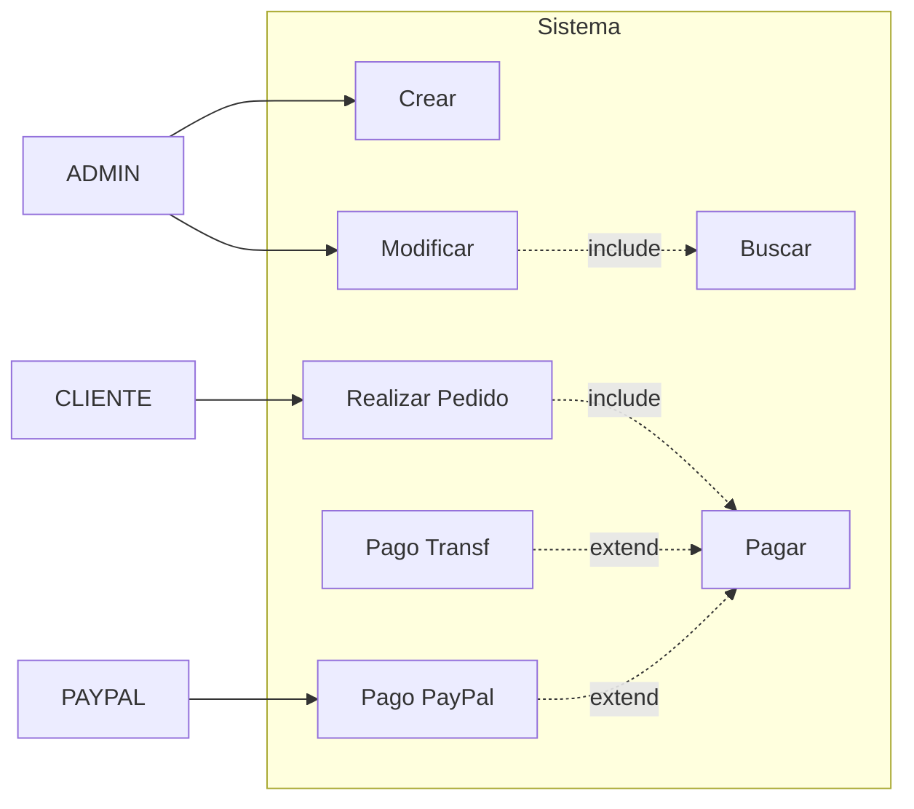

- [2. Diagramas de Casos de Uso (UML Use Case)](#2-diagramas-de-casos-de-uso-uml-use-case)
  - [2.1. Simbología y Notación UML](#21-simbología-y-notación-uml)
    - [Elementos básicos:](#elementos-básicos)
  - [2.2. La frontera entre Análisis y Diseño: Los RF](#22-la-frontera-entre-análisis-y-diseño-los-rf)
  - [2.3. Tipos de Actores: ¿Quién interactúa con el sistema?](#23-tipos-de-actores-quién-interactúa-con-el-sistema)
    - [Actores Válidos](#actores-válidos)
    - [❌ Contraejemplos: Lo que NO es un Actor](#-contraejemplos-lo-que-no-es-un-actor)
  - [2.4. El "Anti-patrón Gestionar": Por qué ser específico](#24-el-anti-patrón-gestionar-por-qué-ser-específico)
  - [2.5. Relaciones Críticas: Include y Extend](#25-relaciones-críticas-include-y-extend)
    - [A) La relación `include` (Obligatoriedad)](#a-la-relación-include-obligatoriedad)
    - [B) La relación `extend` (Opcionalidad / Variante)](#b-la-relación-extend-opcionalidad--variante)
  - [2.6. Ejemplo Maestro Integrador: Sistema de Ventas](#26-ejemplo-maestro-integrador-sistema-de-ventas)
    - [Representación en ASCII (Referencia Original):](#representación-en-ascii-referencia-original)
    - [Diagrama en Mermaid (Alternativa Visual):](#diagrama-en-mermaid-alternativa-visual)
    - [Resumen de las Relaciones:](#resumen-de-las-relaciones)
  - [2.7. ❌ Contraejemplos: Lo que NO es un Caso de Uso](#27--contraejemplos-lo-que-no-es-un-caso-de-uso)

# 2. Diagramas de Casos de Uso (UML Use Case)

El Diagrama de Casos de Uso es el puente definitivo entre el **Análisis de Requisitos** y el **Diseño del Sistema**. Es la herramienta que nos permite visualizar **qué** hará el sistema sin entrar todavía en **cómo** lo programaremos.

> 🧠 **Analogía del Hotel:** Imagina que diseñas un sistema de gestión hotelero. El diagrama de casos de uso es como el folleto del hotel para los clientes: muestra qué servicios ofrece (check-in, check-out, reserva de habitaciones, servicio de habitaciones) y quiénes pueden usarlos (huésped, recepcionista, servicio de limpieza). NO muestra cómo funciona internamente el programa.

> 📝 **Nota del Profesor:** El Diagrama de Casos de Uso es el único diagrama UML que se puede enseñar al cliente sin que se asuste. Es lenguaje de negocio, no técnico.

---

## 2.1. Simbología y Notación UML

Aunque en herramientas como **Mermaid** o **Rider** la representación se adapta al entorno digital, el estándar UML define símbolos específicos que todo analista debe conocer:

### Elementos básicos:

```
  ACTOR             ASOCIACIÓN          CASO DE USO           LÍMITE SISTEMA
    (o)               --->              (   )                    +----+
      |                               |                          |    |
      |                               v                          | CU |
      +------------------------------------------------>        +----+
```

| Elemento           | Símbolo | Descripción                               |
| ------------------ | ------- | ----------------------------------------- |
| **Actor**          | (o)     | Rol externo que interactúa con el sistema |
| **Asociación**     | --->    | Línea que conecta actor con caso de uso   |
| **Caso de Uso**    | (  )    | Función del sistema (verbo en infinitivo) |
| **Límite Sistema** | +--+    | Rectángulo que agrupa casos de uso        |

1. **El Actor (El "muñeco de palo" o Stick Man):** Representa un rol externo al sistema. No es una persona física, sino una entidad que interactúa con el software.
2. **El Caso de Uso (El Óvalo):** Representa una función o unidad de trabajo que el sistema realiza para un actor. Siempre se nombra con un **verbo en infinitivo** (ej: *Pagar*, *Validar Usuario*).
3. **El Límite del Sistema (El Rectángulo):** Define qué está dentro de nuestra aplicación y qué es externo. Los Casos de Uso van dentro; los Actores van fuera.
4. **Línea de Asociación:** Una línea sólida que conecta al Actor con el Caso de Uso, indicando interacción.

> ⚠️ **Error Común:** Poner el actor DENTRO del límite del sistema. ¡Los actores son EXTERNOS por definición!

---

## 2.2. La frontera entre Análisis y Diseño: Los RF

Los **Requisitos Funcionales (RF)** son los servicios que el cliente pide ("El sistema debe permitir pagar con PayPal"). El Diagrama de Casos de Uso toma esos RF y los organiza en un mapa de acciones.

> 📝 **Dato Clave:** El análisis identifica QUÉ quiere el usuario. El diseño decide CÓMO se agrupan esas acciones para luego crear los métodos en nuestras clases.

* **Análisis:** Identificamos qué quiere el usuario.
* **Diseño:** Decidimos cómo se agrupan esas acciones para luego crear los métodos en nuestras clases.

> 💡 **Analogía del Cliente-Restaurante:** Cuando vas a un restaurante, le dices al camarero "quiero una paella" (requisito funcional = caso de uso). No le dices "coge la olla, pon agua, enciende el fuego..." (eso es código). El camarero traduce tu solicitud al equipo de cocina.

---

## 2.3. Tipos de Actores: ¿Quién interactúa con el sistema?

### Actores Válidos

* **Humanos:** Usuarios que desempeñan un rol (*Administrador, Cliente, Alumno*).
* **Sistemas Externos:** Aplicaciones que nuestro software necesita. **PayPal** es el ejemplo perfecto: es un actor externo porque nuestro sistema no lo controla, solo le envía datos y espera una respuesta.
* **Dispositivos:** Un sensor de temperatura o un lector de huellas.

> 🧠 **Analogía del Teatro:** Los actores en UML son como los personajes de una obra. Pueden ser:
> - **Humanos:** El protagonista, el antagonista
> - **Sistemas externos:** "El gobierno" que aparece en la trama para sellar documentos
> - **Dispositivos:** "El detector de humo" que suena en el tercer acto
> Todos son personajes que interactúan con la historia, aunque no sean personas de carne y hueso.

### ❌ Contraejemplos: Lo que NO es un Actor

* **La Base de Datos propia:** La DB está *dentro* del sistema. No es un actor externo.
* **El "Teclado" o el "Ratón":** Son medios físicos, no roles. El actor es el Usuario.
* **El Programador:** A menos que el sistema sea para programadores, ellos no interactúan con el software en producción.

> ⚠️ **Advertencia del Examinador:** La Base de Datos NO es un actor. Si la pones como actor, estás diciendo que tu base de datos toma decisiones por sí misma, lo cual es un error de diseño conceptual.

> 💡 **Regla del Pulgar:** Si algo está DENTRO de tu aplicación (clases que tú programas), NO es actor. Si algo está FUERA (servicios externos, usuarios, dispositivos), SÍ puede ser actor.

---

## 2.4. El "Anti-patrón Gestionar": Por qué ser específico

Es un error grave dibujar un óvalo que diga **"Gestionar Productos"**.

> 📝 **Nota del Profesor:** He visto cientos de exámenes donde aparece "Gestionar X". ¡Es demasiado vago! Un caso de uso debe ser una acción específica que el usuario puede explicar en una frase.

* **El problema:** ¿Qué significa gestionar? ¿Incluye borrar? ¿Incluye cambiar el precio? "Gestionar" no es un requisito funcional atómico.
* **La solución:** Descomponerlo en acciones reales. Si el usuario ve un botón de "Eliminar", el caso de uso es **"Eliminar Producto"**.

> ⚠️ **Anti-patrón a Evitar:**
> ```
> ❌ "Gestionar Productos"
> ❌ "Administrar Usuarios"  
> ❌ "Controlar Inventario"
> ```

> ✅ **Correcto:**
> ```
> ✅ "Crear Producto"
> ✅ "Modificar Producto"
> ✅ "Eliminar Producto"
> ✅ "Buscar Producto"
> ```

> 💡 **Tip del Analista:** Pregúntate "¿Puede el usuario describir esta acción en una frase simple?". Si la respuesta es "más o menos", probablemente esté demasiado abstracto.

---

## 2.5. Relaciones Críticas: Include y Extend

En UML, la precisión en las flechas define la lógica de tu código futuro.

### A) La relación `include` (Obligatoriedad)

Se usa cuando un caso de uso **no puede existir** sin llamar a otro.

> 🧠 **Analogía del Carné de Conducir:** Para "Conducir" necesitas obligatoriamente "Obtener Carné". No puedes conducir legalmente sin tener el carné. Es una relación INCLUDE.

* **Dirección de la flecha:** Del caso de uso base al incluido.
* **Lógica:** "Para A, necesito obligatoriamente B".
* **Ejemplo:** *Modificar Producto* `--<<include>>-->` *Buscar Producto*. (Si no lo encuentro, no puedo modificarlo).

### B) La relación `extend` (Opcionalidad / Variante)

Se usa para añadir funcionalidades solo si se cumple una condición o para modelar variantes.

> 🧠 **Analogía del Menu del Restaurante:** El "Plato Principal" es el caso de uso base. "Añadir bebida" es un EXTEND opcional. Puedes pedir solo el plato, o plato+bebida, o plato+bebida+postre. Las extensiones son opcionales.

* **Dirección de la flecha:** Del caso de uso opcional al caso de uso base. **(Flecha hacia atrás)**.
* **Lógica:** "B puede extender a A si el usuario lo elige".
* **Ejemplo:** *Pago por PayPal* `--<<extend>>-->` *Pagar*. (El pago general existe, PayPal es solo una opción).

> ⚠️ **Error Común:** Invertir la dirección de las flechas. Recuerda:
> - **INCLUDE:** Base → Incluido (obligatorio)
> - **EXTEND:** Extensor → Base (opcional)

> 💡 **Regla Nemotécnica INCLUDE:** "I" de Include = "I" de Imprescindible (obligatorio)
> **Regla Nemotécnica EXTEND:** "E" de Extender = "E" de Extra (opcional)

---

## 2.6. Ejemplo Maestro Integrador: Sistema de Ventas

Vamos a modelar una tienda donde el Administrador mantiene el catálogo y el Cliente realiza pedidos pagando con diferentes métodos, interactuando con el sistema externo de PayPal.


### Representación en ASCII (Referencia Original):

```text
  ACTOR ADMIN                      SISTEMA                                      ACTOR EXTERNO
 (Stick Man)                      (Boundary)                                     (Sistema API)
      |         /----------\
      +-------> |  Crear   |
      |         \----------/
      |                                              /----------\
      |         /----------\       <<include>>       |  BUSCAR  |
      +-------> |Modificar | ----------------------> | (Común)  |
                \----------/         (flecha a)      \----------/


  ACTOR CLIENTE
      |         /----------\       <<include>>       /----------\
      +-------> | REALIZAR | ----------------------> |  PAGAR   |
                |  PEDIDO  |                         \----------/
                \----------/                              ^
                                                          |
                                            <<extend>>    | (flecha al base)
                                           /--------------+-------------\
                                           |                            |
                                    /--------------\             /--------------\
                                    | PAGO TRANSF. |             | PAGO PAYPAL  | <---> [ PAYPAL ]
                                    \--------------/             \--------------/

```

### Diagrama en Mermaid (Alternativa Visual):



### Resumen de las Relaciones:

| Actor         | Caso de Uso Base   | Incluye         | Extiende                        |
| ------------- | ------------------ | --------------- | ------------------------------- |
| Administrador | Crear Producto     | -               | -                               |
| Administrador | Modificar Producto | Buscar Producto | -                               |
| Cliente       | Realizar Pedido    | Pagar           | -                               |
| -             | Pagar              | -               | Pago PayPal, Pago Transferencia |
| Pago PayPal   | -                  | -               | Pagar                           |

> 📝 **Nota del Profesor:** Fíjate cómo el Administrador solo puede Crear y Modificar productos (eliminarlos también sería correcto añadirlo). El Cliente puede Realizar Pedidos. El caso de uso Pagar está "incluido" dentro de Realizar Pedido porque no tiene sentido pedir sin pagar. Los diferentes métodos de pago (PayPal, Transferencia) EXTienden el caso de uso base Pagar.

---

## 2.7. ❌ Contraejemplos: Lo que NO es un Caso de Uso

* **"Introducir Password":** Esto no es un objetivo del usuario, es un paso dentro de un caso de uso mayor como "Login".
* **"Hacer un bucle FOR":** Esto es implementación técnica, no un caso de uso.
* **"Enviar datos a la base de datos":** Los casos de uso hablan de objetivos de negocio, no de movimientos técnicos de bits.

> ⚠️ **Advertencia Final:** Si tu diagrama muestra un mapa claro de todas las acciones (RF) que el sistema permite, con sus actores correctamente identificados y las flechas de `include` y `extend` apuntando en la dirección legal, tienes la base perfecta para diseñar los **Diagramas de Secuencia** y escribir tu código.

> 💡 **Resumen del Tema:** Los Casos de Uso son el "mapa" de funcionalidades. Si lo haces bien:
> - Sabes **QUÉ** debe hacer el sistema
> - Conoces **QUIÉN** interactúa con él
> - Entiendes **QUÉ** es opcional y **QUÉ** es obligatorio
> - Tienes la base para crear los diagramas de secuencia
