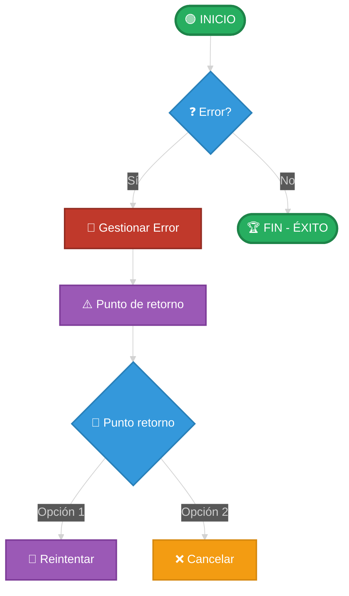

- [3. Documentación Narrativa: La Plantilla de Caso de Uso](#3-documentación-narrativa-la-plantilla-de-caso-de-uso)
  - [3.1. La Abstracción del Caso de Uso: Independencia de la Interfaz](#31-la-abstracción-del-caso-de-uso-independencia-de-la-interfaz)
  - [3.2. Importancia de las Pre y Post condiciones](#32-importancia-de-las-pre-y-post-condiciones)
    - [🛠️ Tutorial: Estructura Temporal de un Caso de Uso](#️-tutorial-estructura-temporal-de-un-caso-de-uso)
  - [3.3. Control de Flujo en Excepciones y Alternativos](#33-control-de-flujo-en-excepciones-y-alternativos)
    - [🛠️ Tutorial: Ramificaciones en Mermaid](#️-tutorial-ramificaciones-en-mermaid)
  - [3.4. Plantilla Oficial de Caso de Uso](#34-plantilla-oficial-de-caso-de-uso)
  - [3.5. Ejemplo 1: CU-007 "Pagar con PayPal" (Con Actor Externo)](#35-ejemplo-1-cu-007-pagar-con-paypal-con-actor-externo)
  - [3.6. Ejemplo 2: CU-002 "Actualizar Producto" (Inclusión Obligatoria)](#36-ejemplo-2-cu-002-actualizar-producto-inclusión-obligatoria)
  - [3.7. Ejemplo 3: CU-010 "Aplicar Cupón Descuento" (Extensión Opcional)](#37-ejemplo-3-cu-010-aplicar-cupón-descuento-extensión-opcional)

# 3. Documentación Narrativa: La Plantilla de Caso de Uso

Si el diagrama de Casos de Uso es el "mapa", la **Documentación Narrativa** es el "manual de instrucciones". Un error crítico en el desarrollo es pensar que con los óvalos basta; sin embargo, el código no se escribe basándose en un dibujo, sino en la lógica detallada de la interacción.

> 🧠 **Analogía del Instrucciones de Montaje:** El diagrama de casos de uso es como la imagen de la caja de IKEA (muestra el resultado final). La documentación narrativa es como el folleto de instrucciones paso a paso (explica cómo montaje cada pieza y qué pasa si te equivocas).

> 📝 **Nota del Profesor:** He visto proyectos donde el diagrama de casos de uso estaba perfecto, pero al llegar al código nadie sabía QUÉ hacer exactamente. La documentación narrativa es el "contrato" entre el analista y el programador.

---

## 3.1. La Abstracción del Caso de Uso: Independencia de la Interfaz

Un principio fundamental que el alumnado debe grabar a fuego es que **el Caso de Uso es agnóstico a la interfaz**.

> ⚠️ **Error Grave:** Describir elementos de interfaz de usuario en la documentación narrativa.

* **No es UI (User Interface):** En la narrativa **jamás** debemos mencionar elementos como "hacer clic en el botón rojo", "hacer scroll" o "seleccionar del menú desplegable".
* **Por qué:** Un mismo caso de uso (ej. "Realizar Pedido") debe ser válido tanto para una página web, una aplicación móvil, una terminal de comandos (CLI) o un sistema de voz.
* **Cómo escribirlo:** debemos usar términos lógicos y universales como "El actor solicita realizar...", "El actor introduce la información...", "El sistema muestra los resultados...".

> 💡 **Analogía del Teléfono:** Cuando llamas a atención al cliente y dices "quiero darme de baja", no especificas si pulsaste el botón "1" o "2" en el menú de voz. El caso de uso es "Solicitar Baja", independientemente del canal (teléfono, web, app).

> 📝 **Dato Importante:** La independencia de la interfaz permite que el mismo caso de uso sirva para:
> - Web
> - App móvil
> - API para otros sistemas
> - Voz (asistentes)
> - Cualquier futuro canal que inventen

---

## 3.2. Importancia de las Pre y Post condiciones

Para que un caso de uso sea riguroso a nivel de ingeniería, debemos definir los estados estancos del sistema:

### 🛠️ Tutorial: Estructura Temporal de un Caso de Uso

```mermaid
%%{init: {'theme': 'dark'}}%%
graph LR
    subgraph PRE ["⏱️ PRECONDICIONES<br/>(Lo que debe existir ANTES)"]
        P1["Usuario autenticado"]
        P2["Carrito creado"]
    end
    
    subgraph FLUJO ["▶️ FLUJO PRINCIPAL<br/>(Pasos del caso de uso)"]
        F1["Paso 1"]
        F2["Paso 2"]
        F3["Paso 3"]
    end
    
    subgraph POST ["✅ POSTCONDICIONES<br/>(Lo que existe DESPUÉS)"]
        Po1["Pedido creado"]
        Po2["Estado: Pagado"]
    end
    
    PRE --> FLUJO --> POST
    
    style PRE fill:#c0392b,stroke:#922b21,color:#ffffff,stroke-width:2px
    style FLUJO fill:#27ae60,stroke:#1e8449,color:#ffffff,stroke-width:2px
    style POST fill:#2980b9,stroke:#1f618d,color:#ffffff,stroke-width:2px
    style P1 fill:#2d2d2d,stroke:#666666,color:#ffffff
    style P2 fill:#2d2d2d,stroke:#666666,color:#ffffff
    style F1 fill:#2d2d2d,stroke:#666666,color:#ffffff
    style F2 fill:#2d2d2d,stroke:#666666,color:#ffffff
    style F3 fill:#2d2d2d,stroke:#666666,color:#ffffff
    style Po1 fill:#2d2d2d,stroke:#666666,color:#ffffff
    style Po2 fill:#2d2d2d,stroke:#666666,color:#ffffff
```

* **Precondiciones:** Son los requisitos que deben cumplirse para que el flujo pueda comenzar. **Se redactan siempre en pasado**, indicando que ya han sucedido.
* *Ejemplo:* "El administrador se ha autenticado con privilegios de edición".

* **Postcondiciones:** Es la garantía de éxito. Cómo queda el mundo tras la acción. También **se redactan en pasado**.
* *Ejemplo:* "Los datos del producto han sido persistidos en el sistema".

> 💡 **Tip del Examinador:** Las precondiciones y postcondiciones son OBLIGATORIAS en cualquier documentación profesional. Si no las pones, el sistema no sabe en qué estado está antes y después de la acción.

---

## 3.3. Control de Flujo en Excepciones y Alternativos

En las secciones de **Excepciones** o **Flujos Alternativos**, no basta con decir "ocurre un error". Como diseñadores, debemos indicar qué sucede con el hilo de ejecución del caso de uso. Existen dos opciones principales:

### 🛠️ Tutorial: Ramificaciones en Mermaid

1. **Retorno al Flujo Principal:** Se indica a qué paso exacto del flujo principal debe volver el actor una vez corregido el error.
* *Ejemplo:* "E1: Los datos son inválidos. El sistema informa del error y **regresa al paso 3**".

2. **Terminación del Caso de Uso:** Si el error es insalvable (un "showstopper"), se indica que el proceso finaliza sin alcanzar la postcondición.
* *Ejemplo:* "E2: El producto no existe. El sistema informa del error y **fin del caso de uso**".

> ⚠️ **Advertencia Crítica:** Un caso de uso sin definir los puntos de retorno es inútil para el programador. No puedes escribir código si no sabes qué hacer cuando falla.

> 💡 **Analogía del Restaurante:** Cuando pides un plato y te dicen "no tenemos", hay dos opciones:
> - Volver al paso de "elegir otro plato" (retorno al flujo)
> - Irte del restaurante sin comer (fin del caso de uso)
> Ambas son válidas, pero el cliente necesita saber qué pasa.

---

## 3.4. Plantilla Oficial de Caso de Uso

> ### &#128221; PLANTILLA DE CASO DE USO
>
> | Campo | Descripción | Ejemplo |
> | --- | --- | --- |
> | **ID** | Código identificador único | CU-001, CU-002... |
> | **Nombre** | Verbo en infinitivo + Objeto | "Crear Usuario" |
> | **Actores** | **Principal:** El que inicia. **Secundarios:** Sistemas externos | Cliente (Principal), PayPal (Secundario) |
> | **Descripción** | Objetivo que busca el actor | "Permite al cliente..." |
> | **Precondiciones** | Estado necesario previo (**Pasado**) | "El usuario se ha autenticado" |
> | **Flujo Principal** | Pasos numerados Actor <-> Sistema | 1. El actor introduce... |
> | **Excepciones** | Definición del error + punto de retorno | "E1: Error. Regresa al paso 3" |
> | **Postcondiciones** | Estado final tras el éxito (**Pasado**) | "El usuario ha sido creado" |

> 📝 **Nota del Profesor:** Esta plantilla es la estándar de la industria. En entornos profesionales, NUNCA se aprueba un caso de uso sin todos los campos completos. Es tu "contrato" con el cliente.

---

## 3.5. Ejemplo 1: CU-007 "Pagar con PayPal" (Con Actor Externo)

| Campo               | Detalle Narrativo                                                                                                                                                                                                                                                                                                                                              |
| ------------------- | -------------------------------------------------------------------------------------------------------------------------------------------------------------------------------------------------------------------------------------------------------------------------------------------------------------------------------------------------------------- |
| **ID**              | CU-007                                                                                                                                                                                                                                                                                                                                                         |
| **Nombre**          | Pagar con PayPal                                                                                                                                                                                                                                                                                                                                               |
| **Actores**         | Cliente (Principal), PayPal API (Sistema Externo)                                                                                                                                                                                                                                                                                                              |
| **Precondiciones**  | El cliente se ha autenticado. El carrito de compra ha sido confirmado.                                                                                                                                                                                                                                                                                         |
| **Flujo Principal** | 1. El cliente selecciona PayPal como forma de pago. 2. El sistema solicita la autorización a la plataforma de PayPal. 3. El cliente se identifica y autoriza el cargo en la plataforma externa. 4. La plataforma externa notifica la confirmación de la transferencia al sistema. 5. El sistema registra el pago y actualiza el estado del pedido. |
| **Excepciones**     | **E1:** La plataforma externa deniega la transacción por falta de fondos. El sistema notifica el fallo y **el flujo regresa al paso 1** para elegir otro método. **E2:** El cliente cancela la operación en la plataforma externa. **Fin del caso de uso**.                                                                                                 |
| **Postcondiciones** | El pedido ha pasado al estado "Pagado".                                                                                                                                                                                                                                                                                                                        |

> 🧠 **Analogía del Taxi:** Es como llamar a un taxi:
> 1. Pides el taxi (seleccionas PayPal)
> 2. Eltaxi llega (solicitud al sistema externo)
> 3. Le dices a dónde vas y pagas (autorización)
> 4. Eltaxi confirma que te lleva (notificación)
> 5. Llegas a tu destino (pedido pagado)
> Si no hay taxi disponible (E1), vuelves a llamar. Si cambias de opinión (E2), te vas andando.

---

## 3.6. Ejemplo 2: CU-002 "Actualizar Producto" (Inclusión Obligatoria)

| Campo               | Detalle Narrativo                                                                                                                                                                                                                                                                                    |
| ------------------- | ---------------------------------------------------------------------------------------------------------------------------------------------------------------------------------------------------------------------------------------------------------------------------------------------------- |
| **ID**              | CU-002                                                                                                                                                                                                                                                                                               |
| **Nombre**          | Actualizar Producto                                                                                                                                                                                                                                                                                  |
| **Actores**         | Administrador de Inventario                                                                                                                                                                                                                                                                          |
| **Precondiciones**  | El administrador se ha autenticado.                                                                                                                                                                                                                                                                  |
| **Flujo Principal** | 1. El administrador solicita modificar un producto. 2. **El sistema ejecuta el CU-003 (Buscar Producto)**. 3. El sistema muestra los datos actuales del producto. 4. El administrador introduce los nuevos valores. 5. El sistema valida los datos. 6. El sistema guarda los cambios. |
| **Excepciones**     | **E1:** El producto no es encontrado en el paso 2. El sistema informa y **fin del caso de uso**. **E2:** Los datos introducidos en el paso 4 son inválidos. El sistema indica los errores y **regresa al paso 4**.                                                                                |
| **Postcondiciones** | La información del producto ha sido actualizada en la base de datos.                                                                                                                                                                                                                                 |

> 📝 **Nota del Profesor:** Fíjate en el paso 2: se menciona explícitamente otro caso de uso (CU-003 Buscar Producto). Esto es una relación `<<include>>` en el diagrama. Si no puedes modificar un producto que no has buscado antes, la búsqueda es INCLUIDA obligatoriamente.

---

## 3.7. Ejemplo 3: CU-010 "Aplicar Cupón Descuento" (Extensión Opcional)

| Campo               | Detalle Narrativo                                                                                                                                                                                                                                                                                                              |
| ------------------- | ------------------------------------------------------------------------------------------------------------------------------------------------------------------------------------------------------------------------------------------------------------------------------------------------------------------------------ |
| **ID**              | CU-010                                                                                                                                                                                                                                                                                                                         |
| **Nombre**          | Aplicar Cupón Descuento                                                                                                                                                                                                                                                                                                        |
| **Actores**         | Cliente                                                                                                                                                                                                                                                                                                                        |
| **Descripción**     | Permite reducir el importe total. **Extiende al CU-004 (Realizar Pedido).**                                                                                                                                                                                                                                                    |
| **Precondiciones**  | El cliente se encuentra en el proceso de "Realizar Pedido". El sistema ha calculado el subtotal.                                                                                                                                                                                                                               |
| **Flujo Principal** | 1. El cliente solicita aplicar un descuento. 2. El sistema pide el código del cupón. 3. El cliente introduce el código. 4. El sistema valida el cupón. 5. El sistema recalcula el total de la compra.                                                                                                              |
| **Excepciones**     | **E1:** El código introducido no existe. El sistema informa del error y **regresa al paso 2** para reintentar o permitir al cliente cancelar la extensión y seguir con el flujo base. **E2:** El cupón ha caducado. El sistema informa y **fin del flujo de extensión** (vuelve al flujo de realizar pedido sin descuento). |
| **Postcondiciones** | El importe total del pedido ha sido actualizado a la baja.                                                                                                                                                                                                                                                                     |

> ⚠️ **Advertencia Importante:** Este caso de uso es una **EXTENSIÓN** del caso "Realizar Pedido". NO puede existir independientemente. Si el cliente NO quiere aplicar cupón, el caso de uso "Realizar Pedido" sigue funcionando perfectamente sin él.

> 💡 **Resumen del Tema:** La narrativa es el "contrato". Si defines bien los puntos de retorno en las excepciones, el programador sabrá exactamente si debe mostrar un mensaje de error y limpiar el formulario o si debe redirigir al usuario a otra pantalla. Es el paso previo e indispensable para el **Diagrama de Secuencia**.
