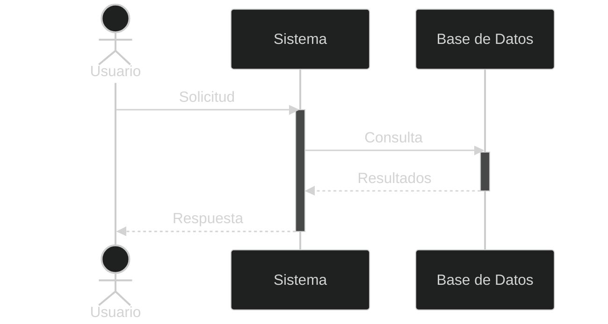
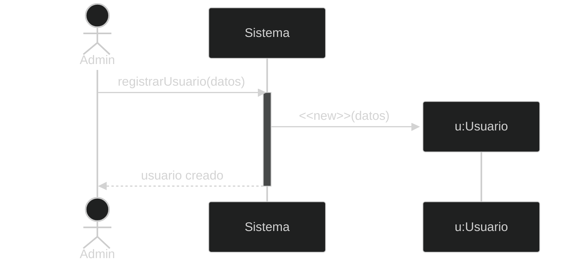
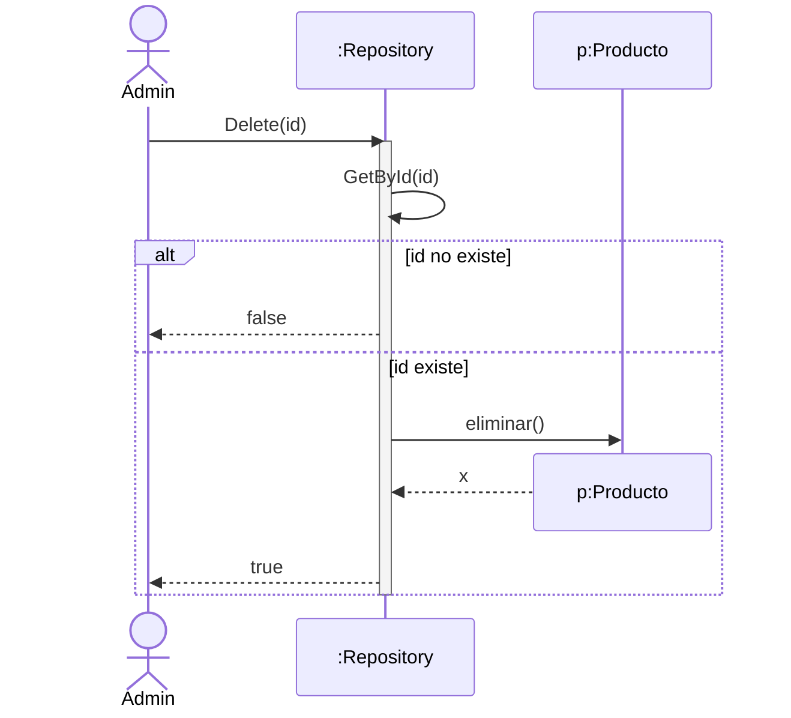
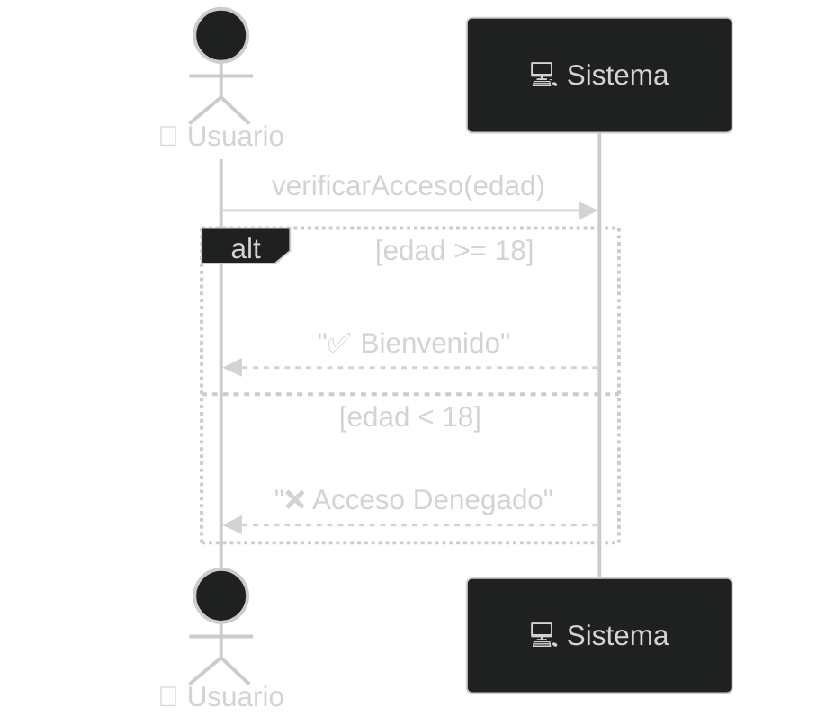
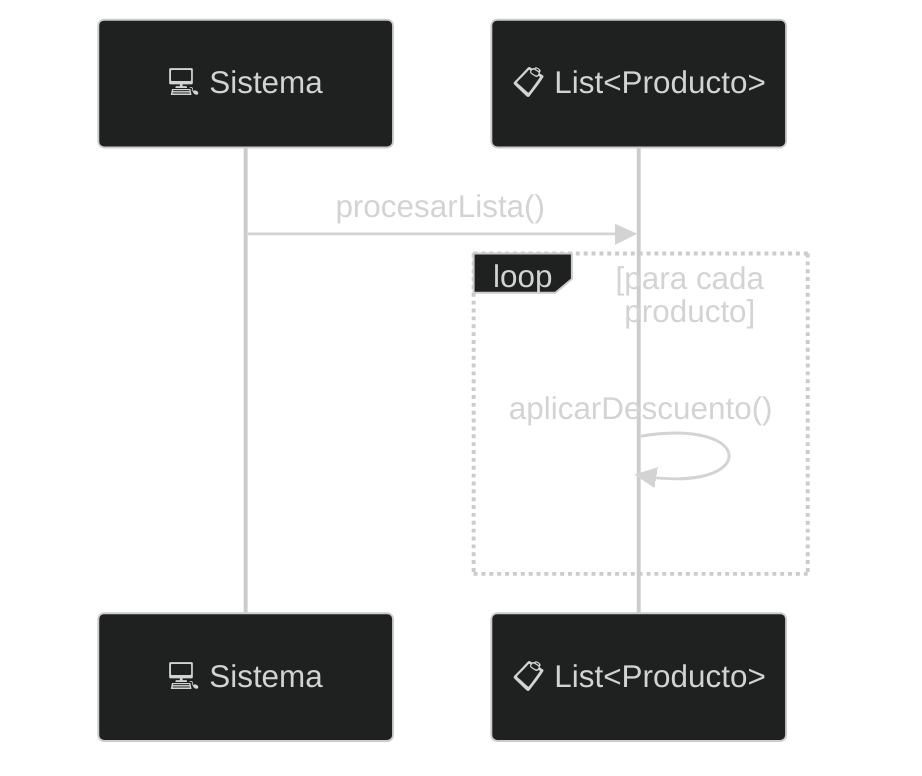
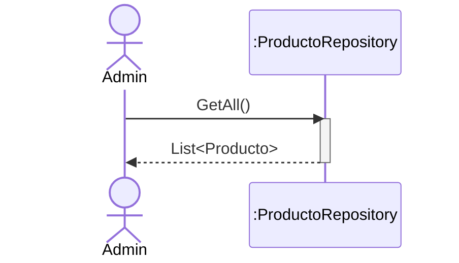
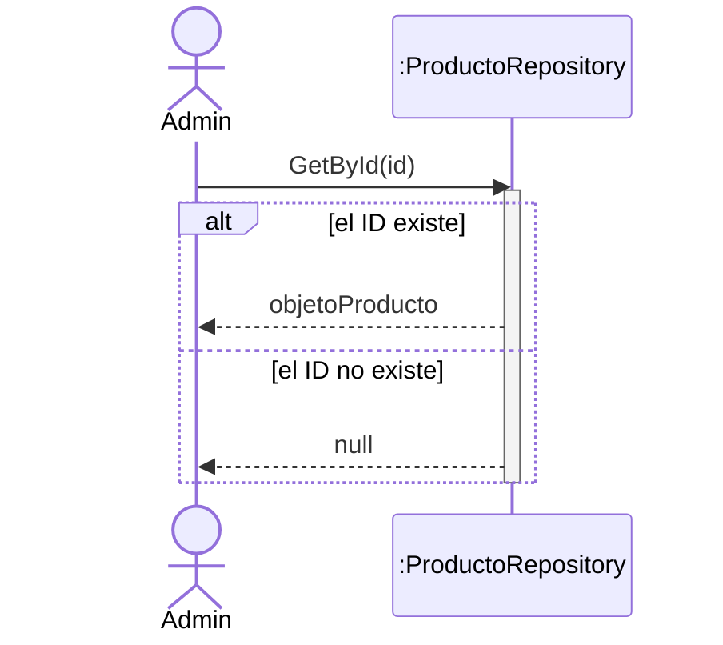
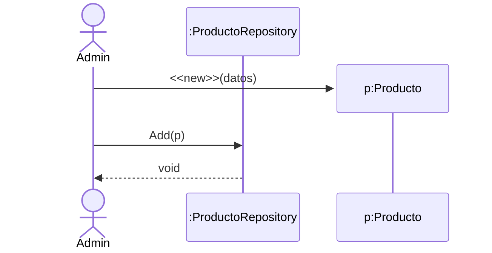
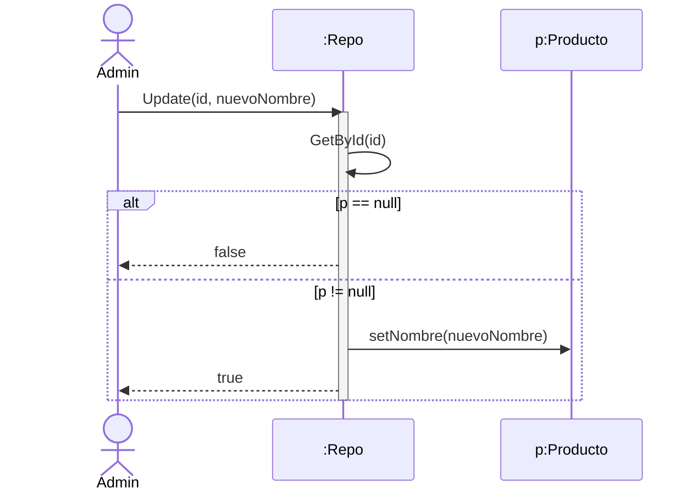
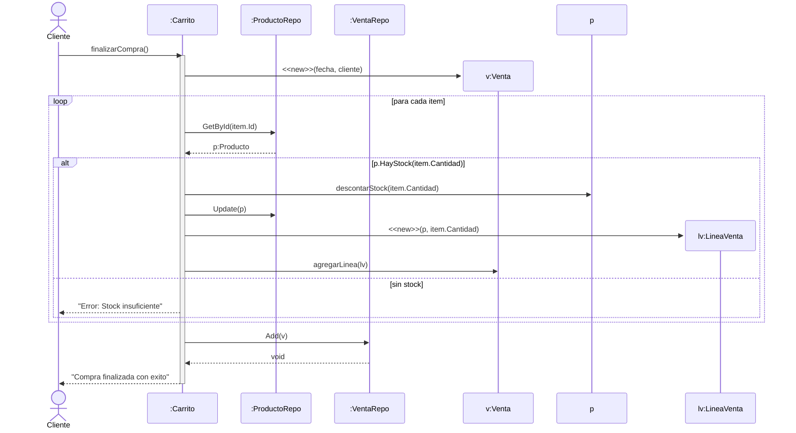

- [4. Diagramas de Interacción: Secuencia (Sequence Diagram)](#4-diagramas-de-interacción-secuencia-sequence-diagram)
  - [4.1. Elementos y Simbología Técnica](#41-elementos-y-simbología-técnica)
    - [🛠️ Tutorial: Componentes del Diagrama de Secuencia en Mermaid](#️-tutorial-componentes-del-diagrama-de-secuencia-en-mermaid)
  - [4.2. Creación y Destrucción de Objetos](#42-creación-y-destrucción-de-objetos)
    - [A) Creación (`<<new>>`)](#a-creación-new)
      - [Diagrama Mermaid:](#diagrama-mermaid)
      - [Diagrama ASCII:](#diagrama-ascii)
      - [Código C#:](#código-c)
    - [B) Destrucción (`X`)](#b-destrucción-x)
      - [Diagrama Mermaid:](#diagrama-mermaid-1)
      - [Diagrama ASCII:](#diagrama-ascii-1)
      - [Código C#:](#código-c-1)
  - [4.3. Condicional con Alt (if-else)](#43-condicional-con-alt-if-else)
      - [Diagrama Mermaid:](#diagrama-mermaid-2)
      - [Diagrama ASCII:](#diagrama-ascii-2)
      - [Código C#:](#código-c-2)
  - [4.4. Bucles (loop / foreach)](#44-bucles-loop--foreach)
      - [Diagrama Mermaid:](#diagrama-mermaid-3)
      - [Diagrama ASCII:](#diagrama-ascii-3)
      - [Código C#:](#código-c-3)
  - [4.5. Operaciones del Repositorio (CRUD Completo)](#45-operaciones-del-repositorio-crud-completo)
    - [1. GetAll (Obtener todos)](#1-getall-obtener-todos)
      - [Diagrama Mermaid:](#diagrama-mermaid-4)
      - [Diagrama ASCII:](#diagrama-ascii-4)
      - [Código C#:](#código-c-4)
    - [2. GetById (Obtener por ID con ALT)](#2-getbyid-obtener-por-id-con-alt)
      - [Diagrama Mermaid:](#diagrama-mermaid-5)
      - [Diagrama ASCII:](#diagrama-ascii-5)
      - [Código C#:](#código-c-5)
    - [3. Create (Crear con NEW)](#3-create-crear-con-new)
      - [Diagrama Mermaid:](#diagrama-mermaid-6)
      - [Diagrama ASCII:](#diagrama-ascii-6)
      - [Código C#:](#código-c-6)
    - [4. Update (Actualizar con ALT)](#4-update-actualizar-con-alt)
      - [Diagrama Mermaid:](#diagrama-mermaid-7)
      - [Diagrama ASCII:](#diagrama-ascii-7)
      - [Código C#:](#código-c-7)
    - [5. Delete (Borrar con ALT y Destrucción)](#5-delete-borrar-con-alt-y-destrucción)
      - [Diagrama Mermaid:](#diagrama-mermaid-8)
      - [Diagrama ASCII:](#diagrama-ascii-8)
      - [Código C#:](#código-c-8)
    - [6. Codigo en C#: Clase ProductoRepository Completa](#6-codigo-en-c-clase-productorepository-completa)
  - [4.6. Ejemplo de Carrito de Compra](#46-ejemplo-de-carrito-de-compra)
    - [A) Diagrama Mermaid](#a-diagrama-mermaid)
    - [B) Diagrama ASCII](#b-diagrama-ascii)
    - [C) Código C# (Clase Carrito)](#c-código-c-clase-carrito)

# 4. Diagramas de Interacción: Secuencia (Sequence Diagram)

El **Diagrama de Secuencia** modela la lógica de ejecución. Representa cómo los objetos se envían mensajes entre sí en un orden temporal específico. Es la guía técnica para que el programador sepa qué métodos llamar y qué condiciones controlar.

> 🧠 **Analogía Cinematográfica:** El diagrama de secuencia es como el "storyboard" de una película. Muestra cada escena (objeto), qué personajes aparecen, qué diálogos se intercambian (mensajes) y en qué orden temporal ocurren. Especificamente, es como ver una película con marcas de tiempo en cada fotograma.

> 📝 **Nota del Profesor:** Si el diagrama de clases es el "reparto de actores" (quiénes hay), el diagrama de secuencia es el "guión técnico" (qué se dicen y cuándo). Ninguna película se filma sin guion, ningún proyecto serio se codifica sin diagrama de secuencia.

---

## 4.1. Elementos y Simbología Técnica

Antes de realizar los diagramas, debemos conocer los componentes básicos:

### 🛠️ Tutorial: Componentes del Diagrama de Secuencia en Mermaid



| Elemento                 | Símbolo/Notación    | Mermaid                  | Descripción                            |
| ------------------------ | ------------------- | ------------------------ | -------------------------------------- |
| **Actor**                | 🥷                   | `actor`                  | Entidad externa que inicia el flujo    |
| **Participante/Sistema** | ⬜                   | `participant`            | Objeto o clase en el sistema           |
| **Línea de Vida**        | &#12494;            | `rectángulo/discontinua` | Existencia del objeto en el tiempo     |
| **Activación**           | ⬛                   | `activate/deactivate`    | Período donde el objeto ejecuta código |
| **Mensaje Síncrono**     | &#8594; sólida      | `->>`                    | El emisor espera respuesta             |
| **Mensaje de Retorno**   | &#8592; discontinua | `-->>`                   | Valor devuelto                         |
| **Mensaje Asíncrono**    | &#8594; con &#8623; | `-->>`                   | El emisor NO espera                    |

> 💡 **Tip del Examinador:** En Mermaid, `activate` y `deactivate` crean las "barras de activación" que indican cuándo un objeto está "trabajando". Úsalas siempre que un objeto ejecute lógica.

> ⚠️ **Error Común:** Olvidar las activaciones. Sin ellas, no sabes qué objeto está procesando en cada momento.

---

## 4.2. Creación y Destrucción de Objetos

### A) Creación (`<<new>>`)

Se representa con una flecha que apunta directamente al **rectángulo del objeto** que nace.

#### Diagrama Mermaid:



#### Diagrama ASCII:

```text
  [ ADMIN ]            [ SISTEMA ]             [ u:USUARIO ]
      |                     |                       |
      |--- registrar() ---->|                       |
      |                     |------- <<new>> ------>[ ]
      |                     |                       |
```

#### Código C#:

```csharp
public void RegistrarUsuario(string nombre) {
    // La instanciación de la clase es el mensaje <<new>>
    Usuario u = new Usuario(nombre); 
}
```

> 🧠 **Analogía del Nacimiento:** Crear un objeto es como el nacimiento de una persona. El hospital (sistema) recibe la solicitud, y el bebé (objeto nuevo) viene al mundo. Antes no existía, después de `new` existe.

> 📝 **Nota Técnica:** En Mermaid, `create participant` debe aparecer ANTES del primer mensaje al objeto. Especifica el orden de creación.

### B) Destrucción (`X`)

Representa el fin de la vida de un objeto. Se marca con una **X** al final de la línea de vida.

#### Diagrama Mermaid:



#### Diagrama ASCII:

```text
  [ REPOSITORIO ]          [ p:PRODUCTO ]
         |                       |
         |------- Remove() ----->|
         |                       X  <-- Destrucción (Fin de vida)
```

#### Código C#:

```csharp
public void Eliminar(Producto p) {
    _db.Remove(p); // El objeto deja de estar referenciado y el recolector de basura lo destruye (X)
}
```

> ⚠️ **Advertencia del Profesional:** En C# la destrucción real no es inmediata (recolector de basura), pero en el diagrama marcamos la "destrucción lógica" cuando el objeto ya no se usa más en nuestro flujo.

> 💡 **Analogía de la Despedida:** Destruir un objeto es como когда alguien se va de una fiesta. La línea de vida llega a su fin y se marca con una X. Esa persona (objeto) ya no participará más en la conversación.

---

## 4.3. Condicional con Alt (if-else)

El fragmento **ALT** representa una decisión lógica donde solo una de las opciones se ejecuta.

#### Diagrama Mermaid:



#### Diagrama ASCII:

```text
  +---------------------------------------+
  | alt [edad >= 18]                        |
  | --------------------------------------- |
  | Sistema -> Usuario: "Bienvenido"        |
  | --------------------------------------- |
  | [else]                                  |
  | Sistema -> Usuario: "Acceso Denegado"   |
  +---------------------------------------+
```

#### Código C#:

```csharp
public string VerificarAcceso(int edad) {
    if (edad >= 18) { // Bloque ALT principal
        return "Bienvenido";
    } else { // Bloque ELSE del ALT
        return "Acceso Denegado";
    }
}
```

> 🧠 **Analogía del Portero de Discoteca:** El portero (sistema) evalúa la edad (condición). Si tiene 18 o más, entra (rama true). Si no, no entra (rama false). Solo una opción se ejecuta, nunca ambas.

> 📝 **Dato Clave:** `alt` significa que SOLO UNA de las ramas se ejecutará. Si necesitas que se ejecuten ambas, usa `par` (paralelo).

---

## 4.4. Bucles (loop / foreach)

El fragmento **LOOP** representa la repetición de una serie de mensajes.

#### Diagrama Mermaid:



#### Diagrama ASCII:

```text
  +---------------------------------------+
  | loop [para cada producto en lista]      |
  | --------------------------------------- |
  | Sistema -> Producto: AplicarDescuento() |
  +---------------------------------------+
```

#### Código C#:

```csharp
public void ProcesarLista(List<Producto> lista) {
    foreach (var p in lista) { // El bloque loop
        p.AplicarDescuento(); // Mensaje síncrono
    }
}
```

> 💡 **Tip del Programador:** El loop en el diagrama debe indicar la condición o el rango, ej: "para cada producto" o "mientras stock > 0".

> 🧠 **Analogía de la Fábrica:** Imagina una cadena de montaje donde cada producto pasa por la misma máquina (mensaje). El loop representa esa repetición: cada uno de los 1000 productos fabricados hoy pasa por la misma estación de trabajo.

---

## 4.5. Operaciones del Repositorio (CRUD Completo)

### 1. GetAll (Obtener todos)

Obtiene la lista completa de objetos sin condiciones.

#### Diagrama Mermaid:



#### Diagrama ASCII:

```text
  [ ADMIN ]            [ :REPO ]
      |                    |
      |----- GetAll() ---->|
      |<-- List<Producto> -|
```

#### Código C#:

```csharp
public List<Producto> GetAll() {
    return _db; // Retorna la colección completa
}
```

### 2. GetById (Obtener por ID con ALT)

Busca un objeto específico y maneja el caso de que no exista.

#### Diagrama Mermaid:



#### Diagrama ASCII:

```text
  [ ADMIN ]               [ :REPO ]
      |                       |
      |----- GetById(id) ---->|
      |      +----------------|------------------+
      |      | alt [encontrado]                  |
      |      |<--- return objetoProducto --------|
      |      |-----------------------------------|
      |      | [else]                            |
      |      |<--- return null ------------------|
      |      +-----------------------------------+
```

#### Código C#:

```csharp
public Producto? GetById(int id) {
    return _db.FirstOrDefault(p => p.Id == id);
}
```

### 3. Create (Crear con NEW)

Instanciación de un nuevo objeto y su persistencia.

#### Diagrama Mermaid:



#### Diagrama ASCII:

```text
  [ ADMIN ]          [ p:PRODUCTO ]          [ :REPO ]
      |                   |                      |
      |---- <<new>> ---->[ ]                     |
      |     |     |
      | --- | --- |Add(p) ------>|
```

#### Código C#:

```csharp
public void Add(Producto p) {
    _db.Add(p);
}
```

### 4. Update (Actualizar con ALT)

Busca primero el objeto; si existe, modifica sus propiedades.

#### Diagrama Mermaid:



#### Diagrama ASCII:

```text
  [ ADMIN ]               [ :REPO ]              [ p:PRODUCTO ]
      |                       |                       |
      |--- Update(id) ------->|                       |
      |      +----------------|-----------------------|-----------+
      |      | alt [p == null]|                       |           |
      |      |<-- return false|                       |           |
      |      |----------------|-----------------------|-----------|
      |      | [else]         |                       |           |
      |      |                |----- setNombre() ---->|           |
      |      |<-- return true |                       |           |
      |      +----------------|-----------------------|-----------+
```

#### Código C#:

```csharp
public bool Update(int id, string nuevoNombre) {
    var p = GetById(id); 
    if (p == null) return false; // Bloque ALT
    // Rama [else]
    p.Nombre = nuevoNombre;
    return true; // Bloque ELSE
}
```

### 5. Delete (Borrar con ALT y Destrucción)

Busca el objeto y lo elimina de la colección.

#### Diagrama Mermaid:


#### Diagrama ASCII:

```text
   [ ADMIN ]               [ : REPO ]              [ p: PRODUCTO ]
      |                       |                       |
      |--- Delete(id) ------->|                       |
      |                       +--- GetById(id)        |
      |      +----------------|-----------------------------------+
      |      | alt [p == null]|                       |           |
      |      |                |                       |           |
      |      |<-- false ------|                       |           |
      |      |----------------|-----------------------------------+
      |      | [else]         |                       |           |
      |      |                |---- eliminar() ------>|           |
      |      |                |                       X (destroy) |
      |      |                |<------ x -------------|           |
      |      |<-- true -------|                       |           |
      |      +----------------|-----------------------------------+
      |                       |                       |
```

#### Código C#:

```csharp
public bool Delete(int id) {
    var p = GetById(id);
    if (p == null) return false;
    _db.Remove(p);
    return true;
}
```

### 6. Codigo en C#: Clase ProductoRepository Completa

```csharp
using System;
using System.Collections.Generic;
using System.Linq;

namespace SistemaVentas.Persistencia
{
    public class ProductoRepository
    {
        private List<Producto> _db = new List<Producto>();

        public List<Producto> GetAll() 
        {
            return _db; 
        }

        public Producto? GetById(int id) 
        {
            return _db.FirstOrDefault(p => p.Id == id);
        }

        public void Add(Producto p) 
        {
            _db.Add(p);
        }

        public bool Update(int id, string nuevoNombre) 
        {
            var p = GetById(id); 
            if (p == null) return false;
            p.Nombre = nuevoNombre;
            return true;
        }

        public bool Delete(int id) 
        {
            var p = GetById(id);
            if (p == null) return false;
            _db.Remove(p);
            return true;
        }
    }

    public class Producto 
    {
        public int Id { get; set; }
        public string Nombre { get; set; }
        public int Stock { get; set; }

        public bool HayStock(int cantidad) => Stock >= cantidad;
        public void DescontarStock(int cantidad) => Stock -= cantidad;
    }
}
```

---

## 4.6. Ejemplo de Carrito de Compra

Entendido. Vamos a corregir el caso del Carrito de Compra para que refleje una arquitectura real con dos repositorios y la lógica de negocio distribuida correctamente: validación en el Repositorio de Productos, creación de objetos de Venta y persistencia en el Repositorio de Ventas.

### A) Diagrama Mermaid



### B) Diagrama ASCII

```text
 [ CLIENTE ]      [ :CARRITO ]      [ :PROD_REPO ]      [ :VENTA_REPO ]      [ v:VENTA ]
      |                |                  |                   |                   |
      |-- finalizar()->|                  |                   |                   |
      |                |------- <<new>> ---------------------------------------->[ ]
      |                |                  |                   |                   |
      |          +-----|------------------|-------------------|-------------------|-----+
      |          | loop [cada item]       |                   |                   |     |
      |          |     |                  |                   |                   |     |
      |          |     |--- GetById() --->|                   |                   |     |
      |          |     |<--- p:Producto --|                   |                   |     |
      |          |     |                  |                   |                   |     |
      |          |   +-|------------------|-------------------|-------------------|--+  |
      |          |   | alt [HayStock]     |                   |                   |  |  |
      |          |   | |--- descontar() --------------------->[p:Producto]        |  |  |
      |          |   | |--- Update(p) --->|                   |                   |  |  |
      |          |   | |                  |                   |                   |  |  |
      |          |   | |------- <<new LineaVenta>> ---------->[lv]                |  |  |
      |          |   | |--- agregarLinea(lv) ------------------------------------>|  |  |
      |          |   |--------------------|-------------------|-------------------|--|  |
      |          |   | [else]             |                   |                   |  |  |
      |          |   |<-- "Error stock"-|                   |                   |  |  |
      |          |   +-|------------------|-------------------|-------------------|--+  |
      |          +-----|------------------|-------------------|-------------------|-----+
      |                |                  |                   |                   |
      |                |------------------------- Add(v) ---->|                   |
      |                |<--- void ----------------------------|                   |
      | <--- "OK" -----|                                                          |
```

### C) Código C# (Clase Carrito)

```csharp
public class Carrito 
{
    private List<ItemCarrito> _items = new List<ItemCarrito>();
    private ProductoRepository _prodRepo;
    private VentaRepository _ventaRepo;

    public void FinalizarCompra(Cliente cliente) 
    {
        Venta nuevaVenta = new Venta(DateTime.Now, cliente);

        foreach (var item in _items) 
        {
            Producto p = _prodRepo.GetById(item.ProductoId);

            if (p != null && p.HayStock(item.Cantidad)) 
            {
                p.DescontarStock(item.Cantidad);
                _prodRepo.Update(p.Id, p.Nombre);
                LineaVenta linea = new LineaVenta(p, item.Cantidad);
                nuevaVenta.AgregarLinea(linea);
            } 
            else 
            {
                Console.WriteLine("Error: No hay stock suficiente para " + item.Nombre);
                return;
            }
        }

        _ventaRepo.Add(nuevaVenta);
        _items.Clear();
    }
}
```

> 💡 **Resumen del Tema:** El diagrama de secuencia es la "partitura" de tu sistema. Indica QUÉ objetos participan, QUÉ mensajes se envían, en QUÉ orden y bajo QUÉ condiciones. Si lo tienes claro antes de programar, el código sale solo.
