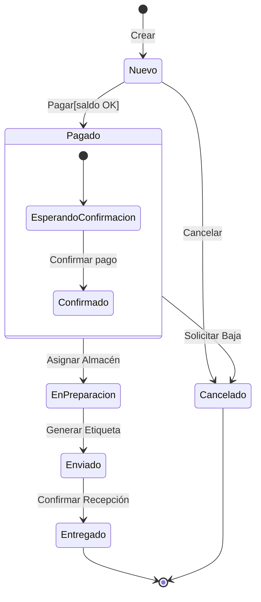
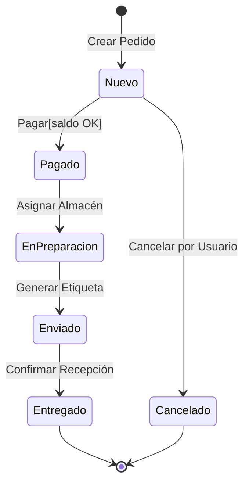
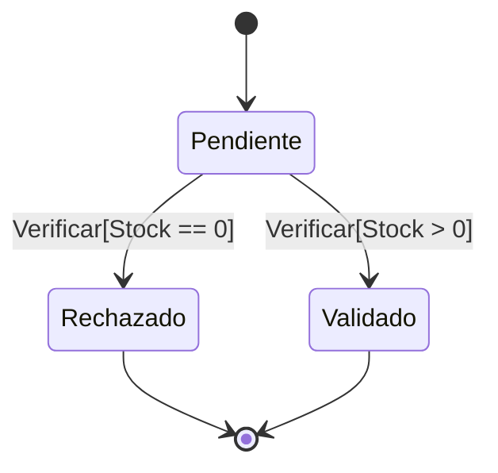
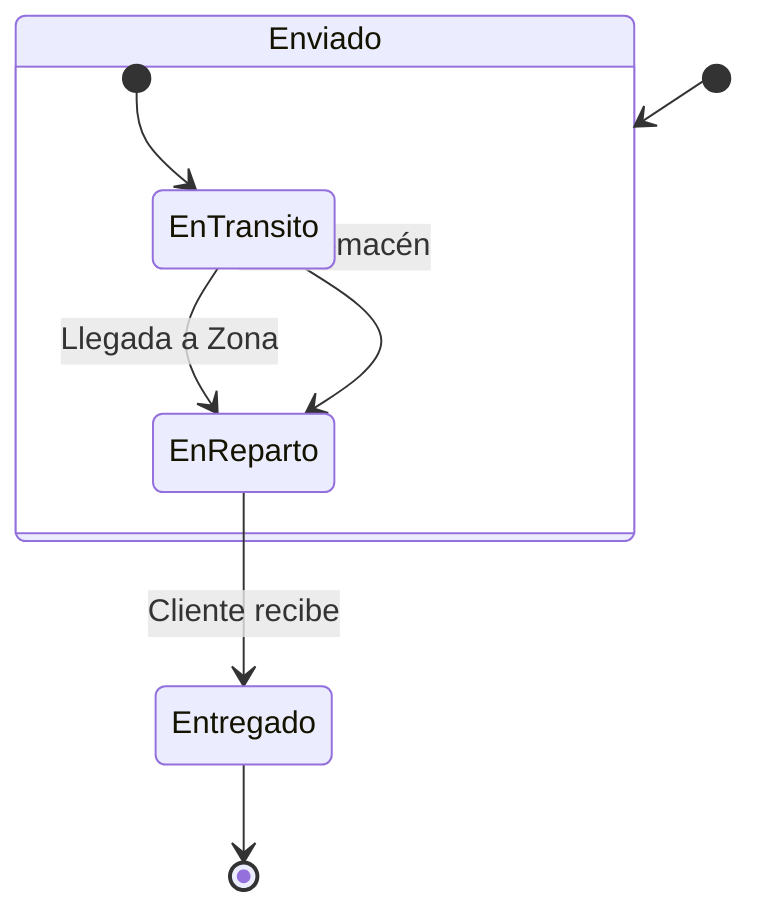

- [5. Diagramas de Comportamiento: Estados (State Machine)](#5-diagramas-de-comportamiento-estados-state-machine)
  - [5.1. Simbología y Conceptos Clave](#51-simbología-y-conceptos-clave)
    - [🛠️ Tutorial: Componentes del Diagrama de Estados en Mermaid](#️-tutorial-componentes-del-diagrama-de-estados-en-mermaid)
  - [5.2. Ejemplo Maestro: El Ciclo de Vida de un Pedido](#52-ejemplo-maestro-el-ciclo-de-vida-de-un-pedido)
    - [A) Diagrama Mermaid](#a-diagrama-mermaid)
    - [B) Diagrama ASCII](#b-diagrama-ascii)
  - [5.3. Implementación en C# (Patrón State / Enumerados)](#53-implementación-en-c-patrón-state--enumerados)
    - [Código C# (Clase Pedido con lógica de estados)](#código-c-clase-pedido-con-lógica-de-estados)
  - [5.4. Guardas y Acciones en las Transiciones](#54-guardas-y-acciones-en-las-transiciones)
    - [Diagrama Mermaid (con guardas):](#diagrama-mermaid-con-guardas)
    - [Código C# (Guarda):](#código-c-guarda)
  - [5.5. Estados Compuestos (Sub-estados)](#55-estados-compuestos-sub-estados)
    - [Diagrama Mermaid (estados compuestos):](#diagrama-mermaid-estados-compuestos)
    - [Diagrama ASCII (Sub-estados):](#diagrama-ascii-sub-estados)

# 5. Diagramas de Comportamiento: Estados (State Machine)

El Diagrama de Estados describe los estados por los que pasa un objeto (como un `Pedido`) y las transiciones que permiten cambiar de un estado a otro. Es la "biografía" del objeto a lo largo de su vida.

> 🧠 **Analogía de la Vida:** El diagrama de estados es como el currículum vitae de un objeto. Un empleado pasa por estados: "Candidato" → "Entrevistado" → "Contratado" → "En Proyecto" → "Promovido" → "Jubilado". Cada estado tiene condiciones para entrar y acciones que ocurren al entrar o salir.

> 📝 **Nota del Profesor:** Los diagramas de estados son esenciales para objetos que tienen un "ciclo de vida" complejo. Un `Pedido`, una `Factura`, un `Usuario` en proceso de verificación... todos necesitan estados. Un objeto sin estados es "estático" y no necesita este diagrama.

---

## 5.1. Simbología y Conceptos Clave

### 🛠️ Tutorial: Componentes del Diagrama de Estados en Mermaid



| Elemento           | Símbolo UML               | Mermaid                         | Descripción                 |
| ------------------ | ------------------------- | ------------------------------- | --------------------------- |
| **Estado Inicial** | &#9679; (círculo relleno) | `[*] -->`                       | Punto de partida del objeto |
| **Estado**         | ⬜ redondeado              | `NombreEstado`                  | Condición del objeto        |
| **Estado Final**   | &#9675; con borde         | `--> [*]`                       | Fin del ciclo de vida       |
| **Transición**     | &#8594; (flecha)          | `EstadoA --> EstadoB: evento()` | Cambio de estado            |
| **Evento**         | texto en flecha           | `: evento()`                    | Qué dispara el cambio       |
| **Guarda**         | corchetes                 | `[condición]`                   | Requisito para el cambio    |
| **Acción**         | slash                     | `/acción()`                     | Qué pasa durante el cambio  |

> 💡 **Tip del Examinador:** En Mermaid stateDiagram-v2:
> - Los estados se escriben como texto normal
> - Las transiciones usan `-->`
> - El estado inicial es `[*]`
> - El estado final es `--> [*]`

> ⚠️ **Error Común:** Confundir "evento" con "acción". El evento es lo que OCURRE (el usuario paga), la acción es lo que HACEMOS cuando ocurre (registrar fecha de pago).

---

## 5.2. Ejemplo Maestro: El Ciclo de Vida de un Pedido

Modelaremos un sistema donde un pedido pasa por las fases de pago, preparación y envío.

### A) Diagrama Mermaid



### B) Diagrama ASCII

```text
   (O) --> [ NUEVO ] --(pagar)--> [ PAGADO ] --(preparar)--> [ EN_PREPARACION ]
            |                       |                               |
       (cancelar)               (cancelar)                      (enviar)
            |                       |                               |
            V                       V                               V
       [ CANCELADO ] <--------- [ REEMBOLSADO ] <----------- [ ENVIADO ]
            |                                                       |
            +----------------------> ( (X) ) <-------(entregar)-----+
```

> 📝 **Nota del Profesor:** Observa las diferentes formas de llegar al estado final:
> - Por éxito: El pedido llega a "Entregado" y luego termina.
> - Por cancelación: El pedido se cancela en cualquier momento.
> - Por reembolso: Si ya estaba pagado, la cancelación implica reembolso.

> 🧠 **Analogía del Paquete:** Es como rastrear un paquete en una tienda online:
> - "Pedido recibido" (Nuevo)
> - "Pagado" (Pagado)
> - "En preparación" (EnPreparacion)
> - "Enviado" (Enviado)
> - "Entregado" (Entregado)
> En cada etapa, el paquete (objeto) está en un estado diferente.

---

## 5.3. Implementación en C# (Patrón State / Enumerados)

Para implementar estados de forma profesional, solemos usar un `enum` para representar el estado y lógica condicional (o el patrón State) para controlar las transiciones.

### Código C# (Clase Pedido con lógica de estados)

```csharp
public enum EstadoPedido {
    Nuevo,
    Pagado,
    EnPreparacion,
    Enviado,
    Entregado,
    Cancelado
}

public class Pedido {
    public int Id { get; private set; }
    public EstadoPedido EstadoActual { get; private set; }

    public Pedido(int id) {
        Id = id;
        EstadoActual = EstadoPedido.Nuevo; // Estado Inicial
    }

    // Transición: Nuevo -> Pagado
    public void Pagar() {
        if (EstadoActual == EstadoPedido.Nuevo) {
            EstadoActual = EstadoPedido.Pagado;
            Console.WriteLine("Pedido pagado con éxito.");
        } else {
            Console.WriteLine("Error: No se puede pagar un pedido en estado " + EstadoActual);
        }
    }

    // Transición: Pagado -> EnPreparacion
    public void Preparar() {
        if (EstadoActual == EstadoPedido.Pagado) {
            EstadoActual = EstadoPedido.EnPreparacion;
            Console.WriteLine("El pedido está ahora en almacén.");
        }
    }

    // Transición: EnPreparacion -> Enviado
    public void Enviar() {
        if (EstadoActual == EstadoPedido.EnPreparacion) {
            EstadoActual = EstadoPedido.Enviado;
            Console.WriteLine("Pedido enviado.");
        }
    }

    // Transición: Cualquier estado inicial -> Cancelado
    public void Cancelar() {
        if (EstadoActual == EstadoPedido.Nuevo || EstadoActual == EstadoPedido.Pagado) {
            EstadoActual = EstadoPedido.Cancelado;
            Console.WriteLine("Pedido cancelado.");
        }
    }
}
```

> 💡 **Tip del Programador:** Observa que CADA método de transición comprueba si el objeto está en el estado correcto ANTES de cambiar. Esto evita transiciones ilegales (no puedes enviar algo que no está preparado).

> ⚠️ **Advertencia Profesional:** Si no compruebas el estado actual antes de cambiar, puedes tener estados inválidos como "PedidoCanceladoYEntregado". ¡Eso es un bug grave!

---

## 5.4. Guardas y Acciones en las Transiciones

A veces, para pasar de un estado a otro, necesitamos una **Guarda** (una condición lógica).

### Diagrama Mermaid (con guardas):



### Código C# (Guarda):

```csharp
public void VerificarStock(int stockDisponible) {
    if (stockDisponible > 0) { // Esta es la Guarda [Stock > 0]
        EstadoActual = EstadoPedido.Validado;
    } else {
        EstadoActual = EstadoPedido.Rechazado;
    }
}
```

> 📝 **Nota del Profesor:** Las guardas son como los "filtros" de las transiciones. La transición SOLO ocurre si la condición se cumple. Es la diferencia entre:
> - "Pagar" (siempre puedes intentar pagar)
> - "Pagar[saldo OK]" (solo si hay saldo suficiente)

> 🧠 **Analogía del Ascensor:** El ascensor tiene guardas:
> - "Cerrar puertas" solo funciona si las puertas están ABIERTAS
> - "Ir al piso 5" solo funciona si el ascensor no está OCUPADO
> Sin estas guardas, el sistema se volvería loco.

---

## 5.5. Estados Compuestos (Sub-estados)

Un estado puede contener otros estados. Por ejemplo, el estado `Enviado` podría dividirse en `En Tránsito` y `En Reparto local`.

### Diagrama Mermaid (estados compuestos):



### Diagrama ASCII (Sub-estados):

```text
  +-- [ ENVIADO ] ---------------------------+
  |                                          |
  |  (O) --> [ EN_TRANSITO ] --(llegada)--> [ EN_REPARO ] --+
  |                                          |              |
  +------------------------------------------+              |
                                                             V
                                                       [ ENTREGADO ]
```

> 💡 **Tip del Examinador:** Los estados compuestos se usan cuando un estado principal tiene "sub-fases" claramente diferenciadas. En el ejemplo, "Enviado" no es un estado simple, sino un contenedor de "EnTransito" y "EnReparto".

> 📝 **Nota del Profesor:** Los estados compuestos son opcionales pero muy útiles para modelar ciclos de vida complejos. Un pedido "Enviado" puede pasar días en tránsito y horas en reparto. Ambas son fases de "enviado" pero con características diferentes.

> 🧠 **Analogía del Viaje:** "Viaje a Madrid" es un estado compuesto:
> - "En tren" (primera fase)
> - "En metro" (segunda fase)
> - "Caminando al hotel" (tercera fase)
> Todo junto es "Viaje a Madrid", pero internamente tiene sub-estados.

> 💡 **Resumen del Tema:** El diagrama de estados es la "biografía" de tu objeto. Define:
> - Por qué estados pasa
> - Qué eventos disparan los cambios
> - Qué condiciones (guardas) se necesitan
> - Qué acciones ocurren en cada transición
