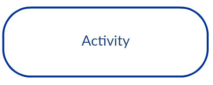
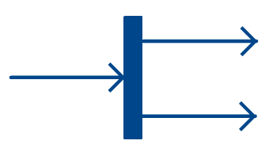
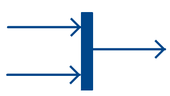
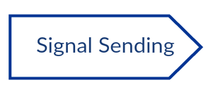
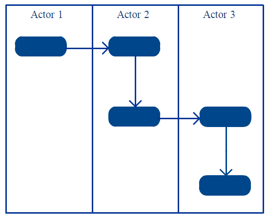
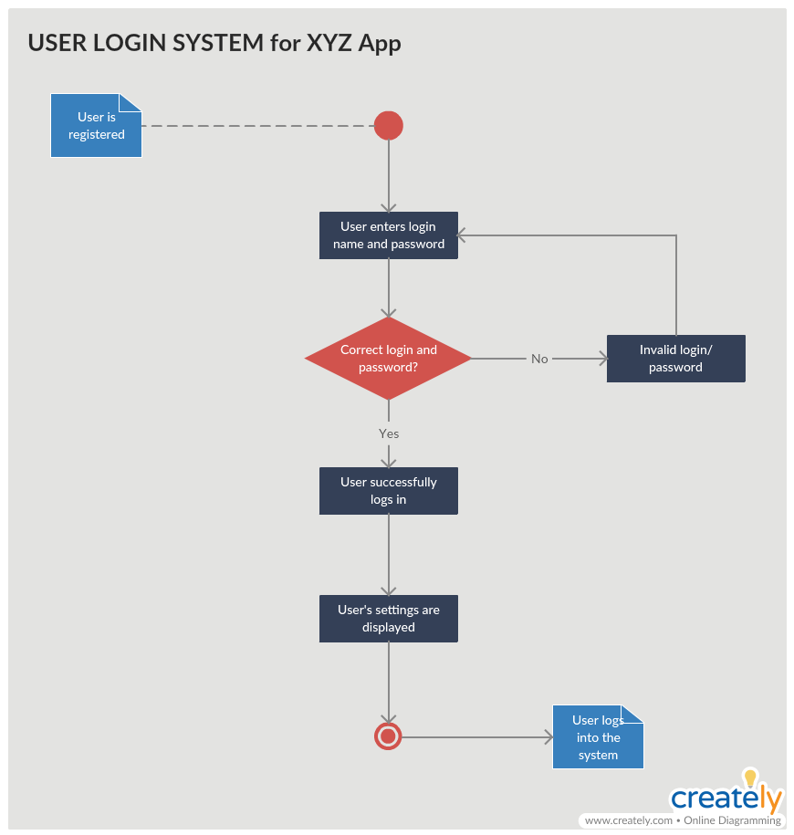
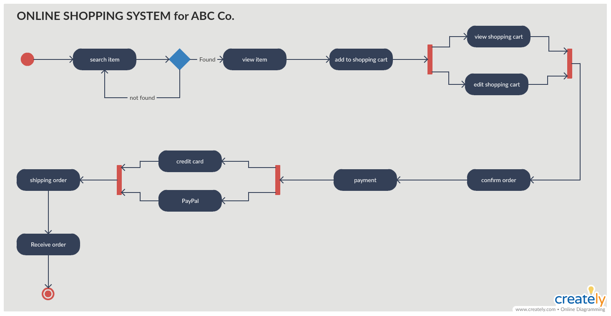
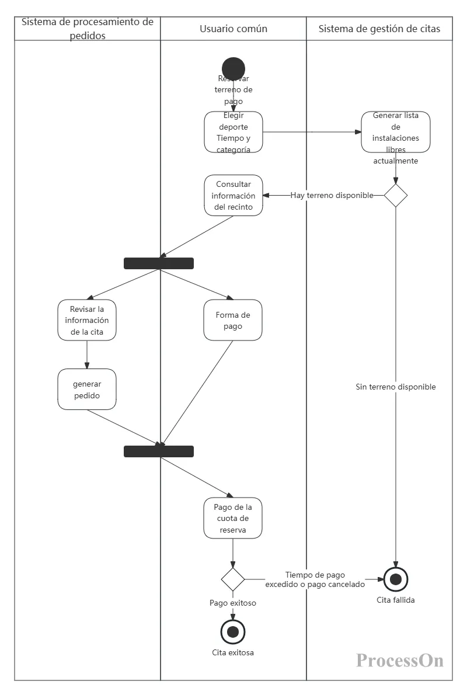
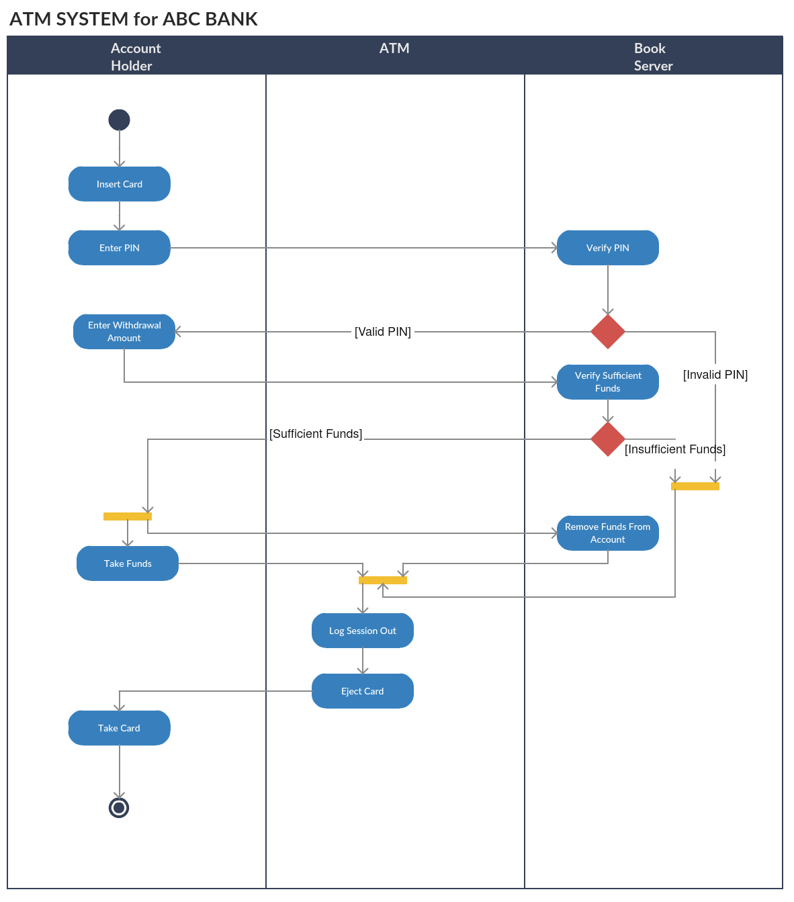

# 6. Diagramas de Actividad (Activity Diagram)

- [6. Diagramas de Actividad (Activity Diagram)](#6-diagramas-de-actividad-activity-diagram)
  - [6.1. ¿Qué es un Diagrama de Actividad?](#61-qué-es-un-diagrama-de-actividad)
    - [Diferencia con Diagramas de Flujo](#diferencia-con-diagramas-de-flujo)
  - [6.2. Elementos Básicos del Diagrama de Actividad](#62-elementos-básicos-del-diagrama-de-actividad)
    - [Nodos Fundamentales](#nodos-fundamentales)
    - [Nodos de Acción y Actividad](#nodos-de-acción-y-actividad)
    - [Flujos](#flujos)
  - [6.3. Nodos de Decisión y Fusión](#63-nodos-de-decisión-y-fusión)
    - [Nodo de Decisión](#nodo-de-decisión)
    - [Nodo de Fusión](#nodo-de-fusión)
  - [6.4. Bifurcaciones y Convergencias (Fork/Join)](#64-bifurcaciones-y-convergencias-forkjoin)
    - [Nodo de Bifurcación (Fork)](#nodo-de-bifurcación-fork)
    - [Nodo de Convergencia (Join)](#nodo-de-convergencia-join)
  - [6.5. Señales (Signals)](#65-señales-signals)
  - [6.6. Particiones (Swimlanes)](#66-particiones-swimlanes)
    - [¿Por qué usar swimlanes?](#por-qué-usar-swimlanes)
    - [Consejos de uso:](#consejos-de-uso)
  - [6.7. Cómo Dibujar un Diagrama de Actividad](#67-cómo-dibujar-un-diagrama-de-actividad)
    - [Paso 1: Identificar las actividades](#paso-1-identificar-las-actividades)
    - [Paso 2: Identificar a los actores](#paso-2-identificar-a-los-actores)
    - [Paso 3: Encontrar el flujo](#paso-3-encontrar-el-flujo)
    - [Paso 4: Asignar swimlanes](#paso-4-asignar-swimlanes)
  - [6.8. Ejemplo 1: Proceso de Login](#68-ejemplo-1-proceso-de-login)
    - [Explicación del diagrama:](#explicación-del-diagrama)
    - [Elementos UML utilizados:](#elementos-uml-utilizados)
  - [6.9. Ejemplo 2: Sistema de Compras Online](#69-ejemplo-2-sistema-de-compras-online)
    - [Explicación del diagrama:](#explicación-del-diagrama-1)
    - [Elementos UML utilizados:](#elementos-uml-utilizados-1)
  - [6.10. Ejemplo 3: Reserva y Pago de Lugar (Con Swimlanes)](#610-ejemplo-3-reserva-y-pago-de-lugar-con-swimlanes)
    - [Explicación del diagrama:](#explicación-del-diagrama-2)
    - [¿Por qué usar swimlanes aquí?](#por-qué-usar-swimlanes-aquí)
    - [Elementos UML utilizados:](#elementos-uml-utilizados-2)
  - [6.11. Ejemplo 4: Cajero Automático (ATM)](#611-ejemplo-4-cajero-automático-atm)
    - [Explicación del diagrama:](#explicación-del-diagrama-3)
    - [Elementos UML utilizados:](#elementos-uml-utilizados-3)
    - [Casos de uso del mundo real que ilustra:](#casos-de-uso-del-mundo-real-que-ilustra)
  - [6.12. Diferencia con Diagramas de Secuencia](#612-diferencia-con-diagramas-de-secuencia)
  - [6.13. Implementación en Código](#613-implementación-en-código)
  - [6.14. Resumen: Cuándo Usar Diagramas de Actividad](#614-resumen-cuándo-usar-diagramas-de-actividad)
  - [Recursos Adicionales](#recursos-adicionales)


Los Diagramas de Actividad UML son una herramienta fundamental para modelar el comportamiento dinámico de un sistema. Representan el flujo de trabajo (workflow) de un proceso o algoritmo, mostrando las actividades y acciones que se realizan, las decisiones que se toman y los caminos alternativos que pueden seguirse.

A diferencia de los diagramas de clases (que muestran la estructura estática), los diagramas de actividad muestran el sistema "en movimiento", siendo especialmente útiles para:
- Modelar procesos de negocio
- Representar flujos de decisión
- Mostrar operaciones paralelas
- Detallar la lógica de algoritmos

> **📝 Nota del Profesor:** Los diagramas de actividad son muy similares a los diagramas de flujo tradicionales, pero con la ventaja de estar orientados a objetos y soportar elementos como swimlanes (particiones) y flujos paralelos.

---

## 6.1. ¿Qué es un Diagrama de Actividad?

Un diagrama de actividad UML ayuda a visualizar un determinado caso de uso a un nivel más detallado. Es un diagrama de comportamiento que ilustra el flujo de actividades a través de un sistema. Los diagramas de actividad UML también pueden utilizarse para representar un flujo de eventos en un proceso comercial.

### Diferencia con Diagramas de Flujo

| Aspecto          | Diagrama de Flujo                | Diagrama de Actividad         |
| ---------------- | -------------------------------- | ----------------------------- |
| **Historia**     | Larga historia, muchas variantes | Estándar UML claro y definido |
| **Orientación**  | Procesos                         | Objetos                       |
| **Concurrencia** | No soporta                       | Soporta flujos paralelos      |
| **Swimlanes**    | No tiene                         | Soporta particiones           |

> **💡 Analogía del Día a Día:** Si el diagrama de clases es el "plano de una cocina" (qué elementos hay), el diagrama de actividad es la "receta de cocina" (qué pasos sigues y en qué orden).

---

## 6.2. Elementos Básicos del Diagrama de Actividad

### Nodos Fundamentales

| Elemento                    | Símbolo                          | Descripción                                                                                                                      |
| --------------------------- | -------------------------------- | -------------------------------------------------------------------------------------------------------------------------------- |
| **Nodo Inicial**            |       | Punto de inicio del flujo. Representado por un círculo sólido negro. Es el punto de partida sin entradas.                        |
| **Nodo Final de Actividad** |   | Marca el final de TODOS los flujos de control dentro de la actividad. Representado por un círculo sólido dentro de otro círculo. |
| **Nodo Final de Flujo**     |  | Marca el final de un flujo de control único. No detiene toda la actividad, solo ese camino específico.                           |

### Nodos de Acción y Actividad

| Elemento      | Símbolo                        | Descripción                                                                                        |
| ------------- | ------------------------------ | -------------------------------------------------------------------------------------------------- |
| **Actividad** |  | Representa una acción o tarea completa que se realiza. Se representa con un rectángulo redondeado. |
| **Acción**    |     | Representa una subárea ejecutable dentro de una actividad. Es más específica que la actividad.     |

> **🧠 Analogía:** Una "Actividad" sería "Hacer la comida", mientras que una "Acción" sería "Picar las verduras" o "Freír el arroz".

### Flujos

| Elemento             | Símbolo                            | Descripción                                                                      |
| -------------------- | ---------------------------------- | -------------------------------------------------------------------------------- |
| **Flujo de Control** |  | Flecha sólida que conecta actividades y representa el orden de ejecución.        |
| **Flujo de Objetos** |  | Flecha discontinua que representa la transferencia de objetos entre actividades. |

---

## 6.3. Nodos de Decisión y Fusión

### Nodo de Decisión


- **Propósito:** Representa un punto de ramificación condicional
- **Características:** Tiene una entrada y múltiples salidas, cada una asociada a una condición
- **Uso:** Se usa cuando hay diferentes caminos a seguir según una condición (Sí/No, >, <, etc.)

### Nodo de Fusión


- **Propósito:** Fusionar múltiples flujos alternativos en uno solo
- **Características:** Tiene varias entradas pero una sola salida
- **Diferencia clave:** No espera a que terminen todos los flujos (relación OR), basta con que llegue uno

> **⚠️ Error Común:** Confundir nodo de fusión con nodo de convergencia. La fusión es para flujos alternativos (solo necesito uno), la convergencia es para flujos paralelos (necesito todos).

---

## 6.4. Bifurcaciones y Convergencias (Fork/Join)

### Nodo de Bifurcación (Fork)



- **Propósito:** Dividir un flujo en múltiples flujos paralelos
- **Características:** Una entrada, múltiples salidas que se ejecutan simultáneamente
- **Uso:** Cuando varias actividades pueden ejecutarse al mismo tiempo

### Nodo de Convergencia (Join)



- **Propósito:** Unir múltiples flujos paralelos en uno solo
- **Características:** Múltiples entradas, una salida
- **Importante:** SOLO continúa cuando TODAS las entradas han llegado (sincronización)

> **💡 Tip del Examinador:** Fork y Join van siempre en pareja. Si abres un fork, debes cerrar con un join para asegurar que las tareas paralelas terminan antes de continuar.

---

## 6.5. Señales (Signals)

Los diagramas de actividad también pueden representar comunicación asíncrona:

| Elemento               | Símbolo                              | Descripción                                         |
| ---------------------- | ------------------------------------ | --------------------------------------------------- |
| **Envío de Señal**     |      | Acción de enviar una señal a otro proceso o sistema |
| **Recepción de Señal** |  | Acción de esperar y recibir una señal               |

> **📝 Nota del Profesor:** Las señales son útiles para modelar procesos que se comunican de forma asíncrona, como sistemas de mensajería o eventos.

---

## 6.6. Particiones (Swimlanes)

Las particiones (también llamadas **swimlanes** o carriles de nado) dividen el diagrama en zonas de responsabilidad, mostrando quién realiza cada actividad. Es uno de los elementos más poderosos de los diagramas de actividad UML.



### ¿Por qué usar swimlanes?

Los swimlanes resuelven un problema fundamental: en un proceso de negocio, frecuentemente diferentes actores o departamentos realizan diferentes tareas. Sin swimlanes, perdemos esta información de responsabilidad.

**Beneficios:**
- **Claridad sobre responsabilidades:** Cada actor sabe exactamente qué tiene que hacer
- **Identificación de huecos:** Facilita ver qué tareas no tienen responsable asignado
- **Comunicación cross-department:** Ideal para procesos que involucran múltiples departamentos
- **Análisis de procesos:** Permite identificar cuellos de botella y redundancias

### Consejos de uso:
- Máximo 5-6 carriles para mantener legibilidad
- Organizar los carriles de forma lógica (izquierda a derecha o arriba abajo según el flujo)
- Cada actividad debe pertenecer a un único carril
- Usa nombres claros para cada swimlane (Actor, Sistema, Departamento, etc.)

---

## 6.7. Cómo Dibujar un Diagrama de Actividad

### Paso 1: Identificar las actividades
Analiza el proceso y identifica todas las actividades y acciones que lo componen.

### Paso 2: Identificar a los actores
Determina qué actores o sistemas participan en el proceso.

### Paso 3: Encontrar el flujo
Establece el orden de las actividades. Identifica:
- Cuáles deben ejecutarse secuencialmente
- Dónde hay decisiones (condiciones)
- Dónde hay operaciones paralelas
- Dónde hay caminos alternativos

### Paso 4: Asignar swimlanes
Agrupa las actividades por responsable (actor, sistema, departamento).

---

## 6.8. Ejemplo 1: Proceso de Login



### Explicación del diagrama:

Este ejemplo muestra el flujo de inicio de sesión utilizando **swimlanes** (particiones) para diferenciar las responsabilidades:

**Carril 1 - Usuario:**
- El usuario introduce sus credenciales
- El usuario recibe la validación del sistema
- Si es exitoso, accede al sistema
- Si falla, puede reintentar o el sistema lo bloquea

**Carril 2 - Sistema:**
- El sistema valida las credenciales
- El sistema verifica si el usuario está activo
- El sistema decide si permitir acceso o bloquear

### Elementos UML utilizados:
- **Nodos de decisión:** Para verificar credenciales válidas y usuario activo
- **Flujos alternativos:** Reintentar o bloquear según el caso
- **Swimlanes:** Para separar responsabilidades Usuario vs Sistema

---

## 6.9. Ejemplo 2: Sistema de Compras Online



### Explicación del diagrama:

Este es un ejemplo completo de un proceso de compra online. No utiliza swimlanes explícitos en la imagen, pero el flujo muestra claramente las diferentes etapas:

**Fase 1 - Selección:**
- El cliente selecciona productos
- El sistema verifica el stock
- Si no hay stock, vuelve a seleccionar productos
- Si hay stock, continúa al carrito

**Fase 2 - Pago:**
- El cliente confirma la compra
- Selecciona método de pago (tarjeta, PayPal, etc.)
- El sistema procesa el pago

**Fase 3 - Confirmación:**
- Se genera el pedido
- Se confirma al cliente
- El proceso termina

### Elementos UML utilizados:
- **Decisiones:** Stock disponible, confirmación de compra
- **Flujos alternativos:** Volver a seleccionar si no hay stock
- **Flujo secuencial:** Selección → Carrito → Pago → Confirmación

---

## 6.10. Ejemplo 3: Reserva y Pago de Lugar (Con Swimlanes)



### Explicación del diagrama:

Este es el ejemplo más completo porque utiliza **swimlanes** (particiones) para mostrar las responsabilidades de cada actor:

**Carril 1 - Cliente:**
- El cliente hace la reserva
- El cliente recibe confirmación
- El cliente realiza el pago

**Carril 2 - Sistema:**
- El sistema procesa la reserva
- El sistema verifica disponibilidad
- El sistema confirma la reserva
- El sistema procesa el pago
- El sistema envía notificación

**Carril 3 - Restaurante:**
- El restaurante recibe la reserva
- El restaurante confirma disponibilidad

### ¿Por qué usar swimlanes aquí?

Este proceso involucra a **tres actores diferentes** (Cliente, Sistema, Restaurante). Sin swimlanes, sería muy difícil entender:
1. Quién hace cada tarea
2. Dónde hay huecos en el proceso
3. Cuándo hay comunicación entre actores

### Elementos UML utilizados:
- **Swimlanes:** Tres carriles para tres actores
- **Decisiones:** Disponibilidad del lugar
- **Flujos de objeto:** La reserva que pasa de un actor a otro
- **Confirmaciones:** Notificaciones entre carriles

---

## 6.11. Ejemplo 4: Cajero Automático (ATM)



### Explicación del diagrama:

Este es uno de los ejemplos más completos y clásicos de diagrama de actividad. Muestra el flujo completo de un Cajero Automático (ATM) con múltiples operaciones y decisiones:

**Operaciones disponibles:**
- Consulta de saldo
- Retirada de efectivo
- Depósito
- Transferencia

### Elementos UML utilizados:

- **Nodos de decisión:** 
  - ¿Tarjeta válida?
  - ¿PIN correcto?
  - ¿Operación válida?
  - ¿Saldo suficiente?

- **Flujos alternativos:**
  - Tarjeta retenida si es inválida
  - PIN bloqueado tras 3 intentos
  - Distintas opciones según el tipo de operación

- **Flujos paralelos (fork/join):**
  - En la fase de operación, se pueden realizar múltiples acciones simultáneas

- **Swimlanes (implícitos):**
  - Cliente (introducir tarjeta, seleccionar operación)
  - ATM (validar, procesar)
  - Banco (verificar cuenta, autorizar operaciones)

### Casos de uso del mundo real que ilustra:

1. **Seguridad:** Validación de tarjeta y PIN con intentos limitados
2. **Decisiones:** Cada operación tiene su propio flujo (consulta vs retirada)
3. **Excepciones:** Qué hacer cuando el saldo es insuficiente o la tarjeta está bloqueada
4. **Confirmaciones:** Mostrar comprobantes y actualizar saldo

> **💡 ¿Por qué es importante este ejemplo?** Porque un cajero automático es un sistema del mundo real donde la claridad del flujo es crítica. Un error en el diagrama significaría dinero perdido o clientes insatisfechos.

---

## 6.12. Diferencia con Diagramas de Secuencia

| Aspecto               | Diagrama de Actividad          | Diagrama de Secuencia            |
| --------------------- | ------------------------------ | -------------------------------- |
| **Énfasis**           | Flujo de trabajo               | Interacción entre objetos        |
| **Tiempo**            | Orden general                  | Orden cronológico exacto         |
| **Objetos**           | No muestra objetos específicos | Muestra objetos y líneas de vida |
| **Uso principal**     | Procesos de negocio            | Diseño de métodos/clases         |
| **Responsabilidades** | Por swimlanes                  | Por actor/objeto                 |

> **💡 Tip del Examinador:** Usa diagramas de actividad cuando necesites mostrar el flujo de un proceso de negocio completo. Usa diagramas de secuencia cuando necesites mostrar la interacción exacta entre objetos específicos en el tiempo.

---

## 6.13. Implementación en Código

Los diagramas de actividad se traducen frecuentemente a código de control:

```csharp
public void ProcesarPedido(Pedido pedido)
{
    // Inicio
    if (!VerificarStock(pedido))
    {
        MostrarError("Stock insuficiente");
        return;
    }

    // Decisión: método de pago
    var pago = SeleccionarMetodoPago(pedido);
    if (!pago.Procesar())
    {
        MostrarError("Pago fallido");
        return;
    }

    // Flujo paralelo (ejemplo)
    Task.Run(() => EnviarEmailConfirmacion(pedido));
    Task.Run(() => GenerarFactura(pedido));
    Task.Run(() => ActualizarInventario(pedido));

    ConfirmarPedido(pedido);
    // Fin
}
```

---

## 6.14. Resumen: Cuándo Usar Diagramas de Actividad

✅ **Usa diagramas de actividad cuando:**
- Modeles procesos de negocio
- Necesites mostrar flujos de decisión simples
- Quieras identificar responsabilidades por actor
- Modeles operaciones que pueden ejecutarse en paralelo
- Necesites documentar algoritmos o flujos de trabajo

❌ **Usa diagramas de secuencia cuando:**
- Modeles interacción entre objetos específicos
- Necesites mostrar el orden exacto de mensajes
- Diseñes métodos o clases
- Quieras mostrar el ciclo de vida de objetos

---

> **💡 Tip del Examinador:** En un examen, si te piden "modelar el comportamiento", considera usar ambos tipos de diagramas. El diagrama de actividad muestra la visión general del proceso, y el diagrama de secuencia muestra los detalles técnicos de la interacción.

> **📝 Nota del Profesor:** Los diagramas de actividad son ideales para complementar los casos de uso, mostrando el "cómo" del flujo de trabajo. Antes de programar, es mucho más fácil detectar errores lógicos en un diagrama que en el código.

---

## Recursos Adicionales

- **Mermaid:** Los diagramas de actividad pueden crearse con Mermaid usando `flowchart TD` o `stateDiagram-v2`
- **Draw.io:** Herramienta gratuita para diagramas UML
- **StarUML:** Herramienta CASE profesional con generación de código
