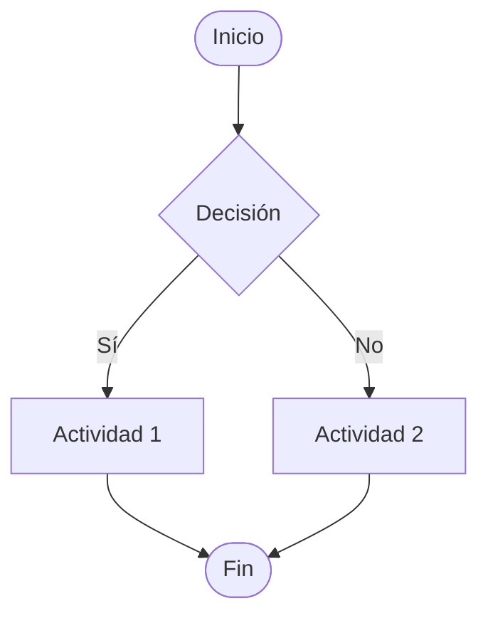
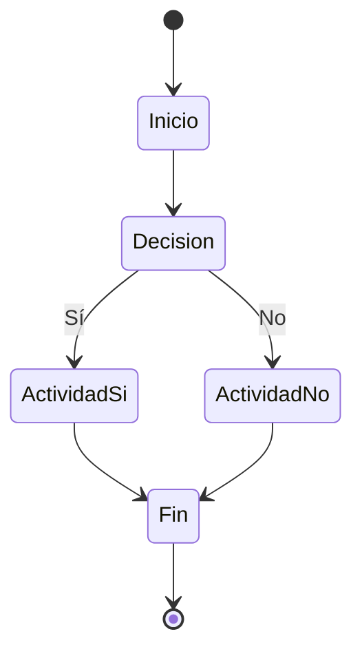
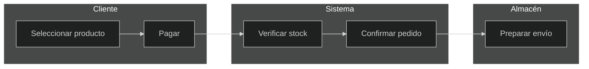
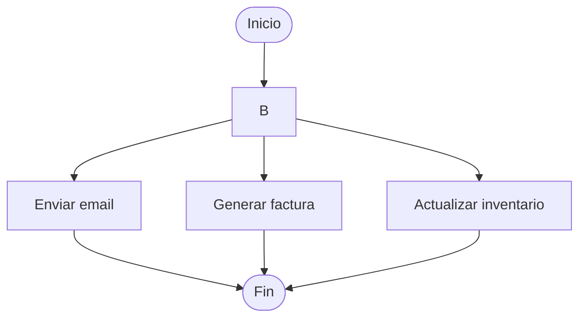
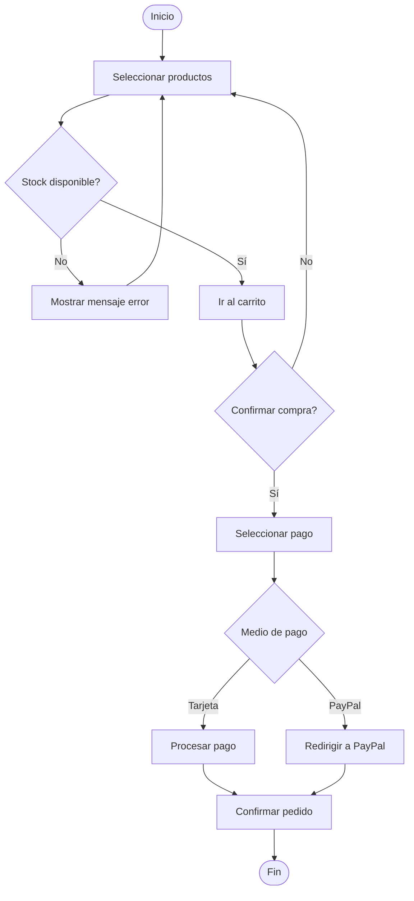

# 6. Diagramas de Actividad (Activity Diagram)

Los Diagramas de Actividad representan el flujo de trabajo (workflow) de un proceso o algoritmo. Son especialmente útiles para modelar procesos de negocio, flujos de decisión y paralelismo.

---

## 6.1. Elementos Básicos del Diagrama de Actividad

### Nodos de Flujo

| Elemento | Símbolo | Descripción |
|----------|---------|-------------|
| **Nodo Inicial** | Inicio | Punto de inicio del flujo |
| **Nodo Final** | Fin | Punto de fin del flujo |
| **Actividad** | Rectángulo redondeado | Una acción o tarea |
| **Decisión** | Rombo | Punto de bifurcación condicional |
| **Unión** | Rombo | Reunión de flujos alternativos |

### Flechas

- **Flecha sólida**: Flujo de control normal
- **Flecha discontinua**: Flujo de objeto (datos)

---

## 6.2. Sintaxis en Mermaid


```mermaid
flowchart TD
    A([Inicio]) --> B{Decisión}
    B -->|Sí| C[Actividad 1]
    B -->|No| D[Actividad 2]
    C --> E([Fin])
    D --> E
```

### Notación alternativa con stateDiagram:


```mermaid
stateDiagram-v2
    [*] --> Inicio
    Inicio --> Decision
    Decision --> ActividadSi: Sí
    Decision --> ActividadNo: No
    ActividadSi --> Fin
    ActividadNo --> Fin
    Fin --> [*]
```

---

## 6.3. Particiones (Swimlanes)

Las particiones dividen el diagrama en zonas de responsabilidad:


```mermaid
%%{init: {'theme': 'dark'}}%%
flowchart LR
    subgraph Cliente
        A[Seleccionar producto] --> B[Pagar]
    end
    subgraph Sistema
        B --> C[Verificar stock]
        C --> D[Confirmar pedido]
    end
    subgraph Almacén
        D --> E[Preparar envío]
    end
```

---

## 6.4. Flujos Paralelos (Fork/Join)

Para representar operaciones que ocurren simultáneamente:


```mermaid
flowchart TD
    A([Inicio]) --> B
    B --> C[Enviar email]
    B --> D[Generar factura]
    B --> E[Actualizar inventario]
    C --> F
    D --> F
    E --> F
    F([Fin])
```

---

## 6.5. Ejemplo: Proceso de Compra Online


```mermaid
flowchart TD
    A([Inicio]) --> B[Seleccionar productos]
    B --> C{Stock disponible?}
    C -->|No| D[Mostrar mensaje error]
    D --> B
    C -->|Sí| E[Ir al carrito]
    E --> F{Confirmar compra?}
    F -->|No| B
    F -->|Sí| G[Seleccionar pago]
    G --> H{Medio de pago}
    H -->|Tarjeta| I[Procesar pago]
    H -->|PayPal| J[Redirigir a PayPal]
    I --> K[Confirmar pedido]
    J --> K
    K --> L([Fin])
```

---

## 6.6. Diferencia con Diagramas de Secuencia

| Aspecto | Diagrama de Actividad | Diagrama de Secuencia |
|---------|----------------------|----------------------|
| **Énfasis** | Flujo de trabajo | Interacción entre objetos |
| **Tiempo** | Orden general | Orden cronológico exacto |
| **Objetos** | No muestra objetos específicos | Muestra objetos y líneas de vida |
| **Uso** | Procesos de negocio | Diseño de métodos/clases |

---

## 6.7. Implementación en C#

Los diagramas de actividad se traducen frecuentemente a código de control:

```csharp
public void ProcesarPedido(Pedido pedido)
{
    // Inicio
    if (!VerificarStock(pedido))
    {
        MostrarError("Stock insuficiente");
        return;
    }

    // Flujo principal
    var pago =SeleccionarMetodoPago(pedido);
    if (!pago.Procesar())
    {
        MostrarError("Pago fallido");
        return;
    }

    ConfirmarPedido(pedido);
    // Fin
}
```

---

> **💡 Tip del Examinador:** Usa diagramas de actividad cuando necesites mostrar el flujo de un proceso de negocio completo. Usa diagramas de secuencia cuando necesites mostrar la interacción entre objetos específicos.

> **📝 Nota del Profesor:** Los diagramas de actividad son ideales para complementar los casos de uso, mostrando el "cómo" del flujo de trabajo.
