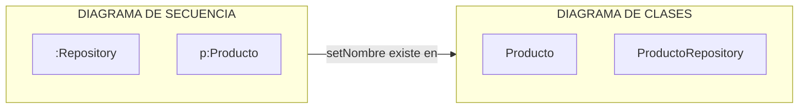
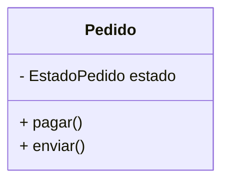
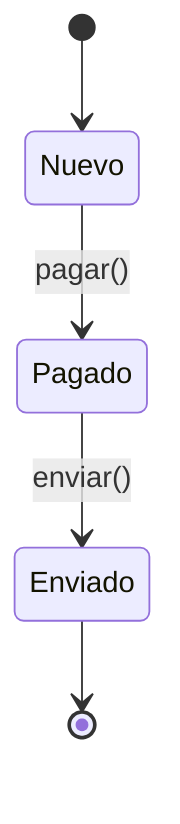
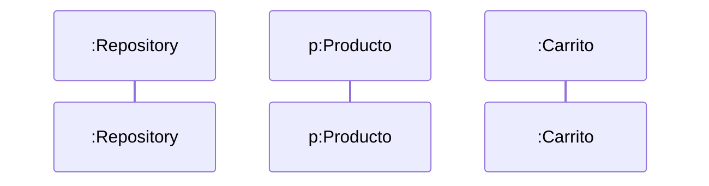
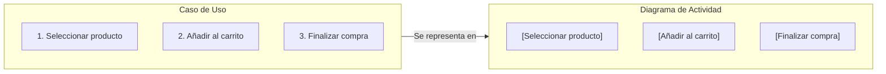
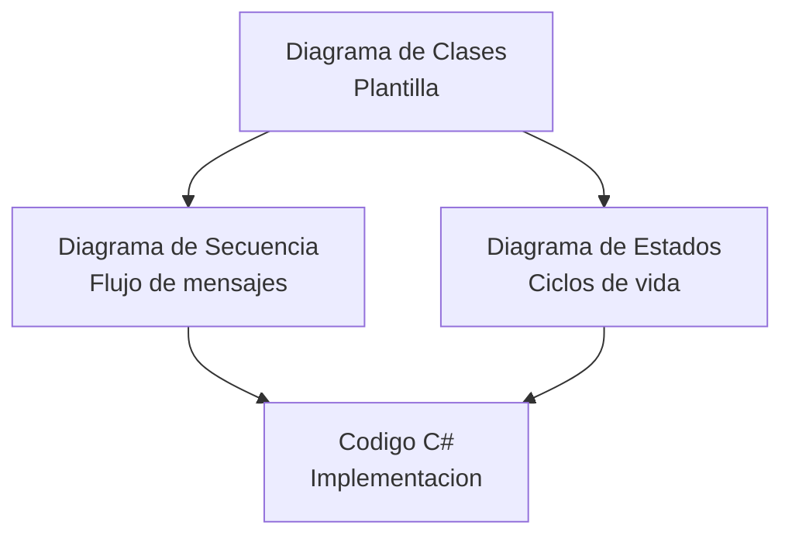

- [7. Trazabilidad y Coherencia entre Diagramas](#7-trazabilidad-y-coherencia-entre-diagramas)
  - [7.1. Las 3 Reglas de Oro de la Coherencia](#71-las-3-reglas-de-oro-de-la-coherencia)
    - [Regla 1: La Regla de la Existencia (Clases ↔ Secuencia)](#regla-1-la-regla-de-la-existencia-clases--secuencia)
    - [Regla 2: La Regla del Estado (Estados ↔ Clases)](#regla-2-la-regla-del-estado-estados--clases)
    - [Regla 3: La Regla de la Participación (Clases ↔ Secuencia)](#regla-3-la-regla-de-la-participación-clases--secuencia)
  - [7.2. Implementación de la Trazabilidad en C#](#72-implementación-de-la-trazabilidad-en-c)
  - [7.3. Matriz de Verificación (Checklist Final)](#73-matriz-de-verificación-checklist-final)

# 7. Trazabilidad y Coherencia entre Diagramas

La trazabilidad garantiza que el diseño sea un bloque sólido. Si los diagramas no coinciden, el código final fallará. Los diagramas UML no son independientes; forman un sistema interconectado donde cada uno refleja y complementa a los demás.

> 🧠 **Analogía del Puzzle:** Los diferentes diagramas UML son como las piezas de un puzzle. El diagrama de clases muestra la imagen general. El diagrama de secuencia muestra los movimientos. El diagrama de estados muestra los cambios de color. Si las piezas no encajan, la imagen final no tiene sentido.

> 📝 **Nota del Profesor:** He visto proyectos donde el diagrama de clases dice que existe un método, el diagrama de secuencia lo usa, pero en el código no está implementado. ¡Eso es un bug! La trazabilidad asegura que TODO esté conectado.

---

## 7.1. Las 3 Reglas de Oro de la Coherencia

### Regla 1: La Regla de la Existencia (Clases ↔ Secuencia)

Cualquier mensaje (flecha) en el diagrama de secuencia debe existir como método en el de clases.



**Diagrama ASCII de Coherencia:**

```text
  DIAGRAMA DE CLASES           DIAGRAMA DE SECUENCIA
 +--------------------+       [ :REPOSITORIO ]    [ p:PRODUCTO ]
 |     Producto       |              |                  |
 +--------------------+              |-- setNombre() -->|  <-- OK! (Existe en Clase)
 | + setNombre(str)   |              |                  |
 +--------------------+              |-- calcular() ---->|  <-- ERROR! (No está en Clase)
```

> 💡 **Tip del Examinador:** Antes de entregar un diseño, verifica CADA mensaje del diagrama de secuencia contra el diagrama de clases. Si falta un método, el código no compilará.

> ⚠️ **Error Fatal:** Inventar mensajes que no existen en las clases. El diagrama de secuencia NO puede inventar funcionalidad; solo describe cómo se USA lo que ya existe.

### Regla 2: La Regla del Estado (Estados ↔ Clases)

Cualquier cambio de estado en el **Diagrama de Estados** debe estar respaldado por un atributo (normalmente un `enum`) y métodos de acción en el **Diagrama de Clases**.

**Representación en Clases:**



**Representación en Estados (Corregido):**



> 💡 **Analogía del Termostato:** El estado (temperatura) es un atributo. Las transiciones (subir/bajar temperatura) son métodos. El diagrama de estados muestra el "qué", el diagrama de clases muestra el "cómo".

> 📝 **Nota del Profesor:** Si tienes un estado "Pagado", DEBE haber:
> 1. Un atributo que almacene ese estado (`private EstadoPedido _estado`)
> 2. Un método que permita llegar a ese estado (`public void Pagar()`)
> 3. Lógica que valide si la transición es posible

### Regla 3: La Regla de la Participación (Clases ↔ Secuencia)

Cada "Línea de Vida" en el diagrama de secuencia es una instancia física de una clase definida en el diagrama de clases. No pueden aparecer objetos de clases que no hayas diseñado previamente.



**Validación:**

| Si en SECUENCIA veo... | DEBE existir en CLASES...  |
| ---------------------- | -------------------------- |
| `:ProductoRepository`  | `class ProductoRepository` |
| `p:Producto`           | `class Producto`           |
| `:Carrito`             | `class Carrito`            |

> ⚠️ **Advertencia Crítica:** NUNCA uses un objeto de una clase que no exista en tu diagrama de clases. Es como llamar a un actor que no está en el reparto.

### Regla 4: La Regla del Flujo (Actividad ↔ Casos de Uso)

El **Diagrama de Actividad** debe ser una representación visual del flujo descrito en el **Caso de Uso** (narrativa). Cada paso del flujo principal debe corresponder a una actividad en el diagrama.

**Relación:**



**Validación:**

| En el CASO DE USO veo... | En el DIAGRAMA DE ACTIVIDAD debe haber... |
| ------------------------ | ----------------------------------------- |
| Flujo principal (A→B→C) | Secuencia de actividades en orden         |
| Decisión (Si/No)        | Nodo de decisión (rombo)                 |
| Include/Extend          | Particiones o flujos alternativos         |
| Actor que interviene    | Partición (Swimlane) del actor            |

> ⚠️ **Error Común:** El diagrama de actividad no coincide con el caso de uso. Si el caso de uso dice "Primero verificar stock" y luego "Procesar pago", el diagrama debe seguir ese mismo orden.

---

## 7.2. Implementación de la Trazabilidad en C#

Para que el código sea trazable, unimos los tres diagramas en una sola estructura lógica:

```csharp
// 1. Trazabilidad con Diagrama de ESTADOS (Valores de los estados)
public enum EstadoVenta { Borrador, Procesada, Cancelada }

// 2. Trazabilidad con Diagrama de CLASES (Estructura y Métodos)
public class Venta {
    public int Id { get; set; }
    public EstadoVenta Estado { get; private set; } // Atributo de estado

    public Venta() {
        Estado = EstadoVenta.Borrador; // Estado inicial del diagrama
    }

    // 3. Trazabilidad con Diagrama de SECUENCIA (Acción invocada)
    public void Procesar() {
        // La "Guarda" del diagrama de secuencia/estados
        if (Estado == EstadoVenta.Borrador) { 
            Estado = EstadoVenta.Procesada; // Transición de estado
            Console.WriteLine("La venta ha pasado a estado Procesada.");
        }
    }
}
```

> 📝 **Mapa de Trazabilidad:**



> 💡 **Tip del Programador:** Cada vez que escribas código, pregúntate:
> - "¿Este método está en el diagrama de clases?"
> - "¿Esta transición está en el diagrama de estados?"
> - "¿Este mensaje está en el diagrama de secuencia?"
> - "¿Este flujo coincide con el caso de uso?"
> Si la respuesta es "no", estás diseñando sobre la marcha (y eso es peligroso).

---

## 7.3. Matriz de Verificación (Checklist Final)

Antes de dar por finalizado un diseño, revisa esta tabla de coherencia:

| Si ves esto en SECUENCIA...  | DEBE estar en CLASES...                | DEBE estar en ESTADOS...             |
| ---------------------------- | -------------------------------------- | ------------------------------------ |
| Una flecha `-> metodo()`     | Como un método `+ metodo()`            | Como un disparador de transición     |
| Un objeto `p:Producto`       | Como una clase `class Producto`        | N/A                                  |
| Una guarda `[stock > 0]`     | Como un atributo o lógica en el método | Como una condición de flecha         |
| Un retorno `false` por error | Como un tipo de retorno (bool/null)    | Como una transición a estado fallido |

| Si ves esto en ACTIVIDAD... | DEBE estar en CASO DE USO...           |
| --------------------------- | -------------------------------------- |
| Secuencia de actividades    | Flujo principal (pasos en orden)       |
| Nodo de decisión (rombo)   | Condiciones Si/No en el flujo          |
| Particiones (Swimlanes)     | Actores que intervienen                 |
| Flujos paralelos           | Acciones simultáneas en el caso de uso |

> 📝 **Checklist Final del Diseñador:**

```markdown
## &#9989; Lista de Verificación UML

### &#128196; Diagrama de Clases
- [ ] Todas las clases tienen atributos correctamente tipados
- [ ] Todos los métodos están definidos
- [ ] Las relaciones (asociaciones, cardinalidad) están claras
- [ ] Los modificadores de acceso son correctos (private/protected/public)

### &#128337; Diagrama de Secuencia
- [ ] Cada mensaje tiene un método correspondiente en Clases
- [ ] Los bucles (loop) tienen condición clara
- [ ] Los condicionales (alt) cubren todos los casos
- [ ] Las activaciones están correctamente abiertas/cerradas
- [ ] La creación (`<<new>>`) y destrucción (`X`) están marcadas

### &#128202; Diagrama de Estados
- [ ] El estado inicial está definido
- [ ] El estado final está definido (si aplica)
- [ ] Cada transición tiene evento disparador
- [ ] Las guardas cubren todos los casos
- [ ] No hay estados huérfanos (inaccesibles)
- [ ] No hay transiciones cruzadas imposibles

### &#128274; Coherencia General
- [ ] Cada objeto en Secuencia existe en Clases
- [ ] Cada método en Secuencia existe en Clases
- [ ] Cada estado en Estados tiene atributo en Clases
- [ ] El código compila mentalmente con los diagramas
```

> 💡 **Resumen del Tema:** La trazabilidad es lo que separa un diseño PROFESIONAL de un dibujo bonito. Si tus diagramas no se hablan entre sí, el código será un caos. Sigue las 3 reglas de oro y usa el checklist antes de entregar.

> ⚠️ **Advertencia Final:** Un diseño sin coherencia es peor que no tener diseño. Genera falsa confianza y errores difíciles de rastrear. Siempre verifica, siempre conecta, siempre coherente.
