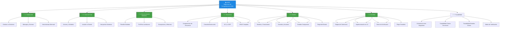

# 8. Resumen y Checklist de Evaluación

---

## 8.1. Resumen Ejecutivo

La **Unidad 05: Diagramas de Comportamiento UML** complementa la Unidad 04 (Diseño OO y Diagrama de Clases) añadiendo la dimensión temporal y funcional al diseño de software. Mientras que los diagramas de clases muestran la **estructura estática** del sistema (qué clases existen, qué atributos tienen y cómo se relacionan), los diagramas de comportamiento muestran la **dinámica** (qué sucede cuando el sistema está en funcionamiento).

### 📚 Conceptos Clave Aprendidos

| Diagrama         | Propósito                | Pregunta que Responde                |
| ---------------- | ------------------------ | ------------------------------------ |
| **Casos de Uso** | Requisitos funcionales   | ¿Qué puede hacer el sistema?         |
| **Secuencia**    | Interacciones temporales | ¿Cómo colaboran los objetos?         |
| **Estados**      | Ciclo de vida de objetos | ¿Cómo cambia un objeto en el tiempo? |
| **Actividad**    | Flujo de trabajo        | ¿Cuál es el proceso de negocio?      |

### &#128161; Las 3 Reglas de Oro de la Coherencia

1. **Regla de la Existencia:** Todo mensaje en secuencia debe existir como método en clases.
2. **Regla del Estado:** Todo cambio de estado debe tener respaldo en atributos y transiciones.
3. **Regla de la Participación:** Todo objeto en secuencia debe existir en clases.

---

## 8.2. Mapa Mental de la Unidad

```mermaid
graph TD
    A["📚 UD05<br/>Diagramas de<br/>Comportamiento UML"] --> B["📖 1. Introducción"]
    A --> C["📖 2. Casos de Uso"]
    A --> D["📖 3. Documentación<br/>Narrativa"]
    A --> E["📖 4. Secuencia"]
    A --> F["📖 5. Estados"]
    A --> G["📖 6. Actividad"]
    A --> H["📖 7. Trazabilidad"]
    
    B --> B1["Estático vs Dinámico"]
    B --> B2["Mensajes y Eventos"]
    B --> B3["Herramientas Mermaid"]
    
    C --> C1["Actores y Símbolos"]
    C --> C2["Include vs Extend"]
    C --> C3["Anti-patrón Gestionar"]
    
    D --> D1["Plantilla Estándar"]
    D --> D2["Pre/Post condiciones"]
    D --> D3["Excepciones y Retornos"]
    
    E --> E1["Componentes de Secuencia"]
    E --> E2["Creación/Destrucción"]
    E --> E3["ALT y LOOP"]
    E --> E4["Regla de la Existencia"]
    
    F --> F1["Estados y Transiciones"]
    F --> F2["Eventos y Guardas"]
    F --> F3["Estado Inicial/Final"]
    F --> F4["Regla del Estado"]
    
    G --> G1["Nodos y Flujo"]
    G --> G2["Decisiones y Bifurcaciones"]
    G --> G3["Particiones/Swimlanes"]
    G --> G4["Flujos Paralelos"]
    
    H --> H1["Coherencia entre Diagramas"]
    H --> H2["Trazabilidad Clases-Secuencia"]
    H --> H3["Trazabilidad Estados-Clases"]
    H --> H4["Matriz de Verificación"]
    
    E --> E4["CRUD Completo"]
    
    F --> F1["Estados y Transiciones"]
    F --> F2["Guardas y Acciones"]
    F --> F3["Estados Compuestos"]
    
    G --> G1["Reglas de Coherencia"]
    G --> G2["Implementación en C#"]
    G --> G3["Matriz de Verificación"]
    
    style A fill:#1e88e5,stroke:#1565c0,color:#fff
    style B fill:#43a047,stroke:#2e7d32,color:#fff
    style C fill:#43a047,stroke:#2e7d32,color:#fff
    style D fill:#43a047,stroke:#2e7d32,color:#fff
    style E fill:#43a047,stroke:#2e7d32,color:#fff
    style F fill:#43a047,stroke:#2e7d32,color:#fff
    style G fill:#43a047,stroke:#2e7d32,color:#fff
```

---

## 8.3. Checklist de Evaluación por Competencias

### &#128221; 1. Diagramas de Casos de Uso

| Criterio                            | Peso | Indicador                                                         | &#9989;/&#10060; |
| ----------------------------------- | ---- | ----------------------------------------------------------------- | ---------------- |
| Identifica actores correctamente    | 20%  | Distingue entre actores humanos, sistemas externos y dispositivos |                  |
| Usa verbos en infinitivo            | 15%  | Los casos de uso son acciones específicas                         |                  |
| Aplica include/extend correctamente | 25%  | Las flechas apuntan en la dirección correcta                      |                  |
| Evita el anti-patrón "Gestionar"    | 15%  | Descompone en acciones atómicas                                   |                  |
| Documenta con narrativa             | 25%  | Usa la plantilla con pre/postcondiciones                          |                  |

### &#128337; 2. Diagramas de Secuencia

| Criterio                       | Peso | Indicador                                    | &#9989;/&#10060; |
| ------------------------------ | ---- | -------------------------------------------- | ---------------- |
| Usa participantes correctos    | 20%  | Los objetos corresponden a clases existentes |                  |
| Representa condiciones (ALT)   | 20%  | Cubre flujos principales y alternativos      |                  |
| Representa bucles (LOOP)       | 15%  | Indica condición de repetición               |                  |
| Marca creación/destrucción     | 15%  | Usa `<<new>>` y `X` correctamente            |                  |
| Mantiene coherencia con clases | 30%  | Cada mensaje tiene un método对应             |                  |

### 📊 3. Diagramas de Estados

| Criterio                       | Peso | Indicador                         | ✔️/❌ |
| ------------------------------ | ---- | --------------------------------- | ----- |
| Define estado inicial          | 15%  | Indica el punto de partida        |       |
| Define transiciones correctas  | 25%  | Cada flecha tiene evento y guarda |       |
| Usa guardas apropiadas         | 20%  | Las condiciones evitan ambigüedad  |       |
| Coherencia con atributos       | 20%  | Los estados existen como enum/atr   |       |
| Estados compuestos (si aplica) | 20%  | Agrupa sub-estados lógicamente    |       |

### ⚡ 4. Diagramas de Actividad

| Criterio                       | Peso | Indicador                           | ✔️/❌ |
| ------------------------------ | ---- | ----------------------------------- | ----- |
| Usa nodo inicial correcto      | 10%  | ◯ círculo hueco (no ●)              |       |
| Usa nodo final correcto       | 10%  | ⊙ círculo con punto negro           |       |
| Representa decisiones          | 20%  | Usa rombo para bifurcaciones        |       |
| Flujos paralelos (si aplica)  | 20%  | Usa fork/join para simultaneidad    |       |
| Particiones/Swimlanes         | 20%  | Divide por responsabilidades        |       |
| Coherencia con casos de uso   | 20%  | El flujo refleja el caso de uso     |       |

### 🔗 5. Coherencia General

| Criterio                       | Peso | Indicador                       | ✔️/❌ |
| ------------------------------ | ---- | ------------------------------- | ----- |
| Trazabilidad clases-secuencia  | 25%  | Cada mensaje existe en clases   |       |
| Trazabilidad estados-clases    | 25%  | Cada estado tiene respaldo      |       |
| Trazabilidad actividades-CU   | 25%  | El flujo refleja el caso de uso |       |
| Documentación completa        | 25%  | Usa checklists de verificación |       |

---

## 8.4. Recursos Adicionales

### &#128218; Documentación Oficial
- [Documentación Mermaid - Sequence Diagrams](https://mermaid.js.org/syntax/sequenceDiagram.html)
- [Documentación Mermaid - State Diagrams](https://mermaid.js.org/syntax/stateDiagram.html)
- [Documentación Mermaid - Flowcharts](https://mermaid.js.org/syntax/flowchart.html)

### &#128187; Herramientas Recomendadas
- **Mermaid Live Editor:** https://mermaid.live/
- **Draw.io:** https://app.diagrams.net/
- **StarUML:** https://staruml.io/

---

## 8.5. Glosario de Términos

| Término               | Definición                                           |
| --------------------- | ---------------------------------------------------- |
| **Actor**             | Entidad externa que interactúa con el sistema        |
| **Caso de Uso**       | Función del sistema desde la perspectiva del usuario |
| **Include**           | Relación obligatoria entre casos de uso              |
| **Extend**            | Relación opcional que añade funcionalidad            |
| **Línea de Vida**     | Representación temporal de un objeto                 |
| **Mensaje Síncrono**  | El emisor espera respuesta antes de continuar        |
| **Mensaje Asíncrono** | El emisor continúa sin esperar respuesta             |
| **Guarda**            | Condición que debe cumplirse para una transición     |
| **Estado Compuesto**  | Estado que contiene sub-estados internos             |
| **Trazabilidad**      | Conexión coherente entre todos los diagramas         |

---

> &#128218; **Consejo Final:** La práctica hace al maestro. Dibuja diagramas para problemas reales, compáralos con soluciones de otros, y siempre verifica la coherencia entre ellos. Los diagramas son tu mapa; el código es el territorio.
