# Entornos de Desarrollo - 05 Desarrollo OO y UML:  Diagramas de Comportamiento
Tema 05. Diseño OO: Desarrollo OO y UML:  Diagramas de Comportamiento. 1DAW. Curso 2025-2026


- [Entornos de Desarrollo - 05 Desarrollo OO y UML:  Diagramas de Comportamiento](#entornos-de-desarrollo---05-desarrollo-oo-y-uml--diagramas-de-comportamiento)
- [Contenido en Youtube](#contenido-en-youtube)
- [1. Introducción: El Sistema en Movimiento](#1-introducción-el-sistema-en-movimiento)
  - [1.1. Del "Qué es" (Clases) al "Cómo funciona" (Comportamiento)](#11-del-qué-es-clases-al-cómo-funciona-comportamiento)
  - [1.2. Clasificación de Diagramas de Comportamiento](#12-clasificación-de-diagramas-de-comportamiento)
  - [1.3. Importancia del modelado dinámico: Evitando el "Código Espagueti"](#13-importancia-del-modelado-dinámico-evitando-el-código-espagueti)
  - [1.4. El concepto de Mensaje y Evento](#14-el-concepto-de-mensaje-y-evento)
    - [Ejemplo ASCII: Flujo de Login](#ejemplo-ascii-flujo-de-login)
  - [1.5. Herramientas: La potencia de Mermaid](#15-herramientas-la-potencia-de-mermaid)
  - [1.6. Otras herramientas](#16-otras-herramientas)
- [2. Diagramas de Casos de Uso (UML Use Case)](#2-diagramas-de-casos-de-uso-uml-use-case)
  - [2.1. Simbología y Notación UML](#21-simbología-y-notación-uml)
  - [2.2. La frontera entre Análisis y Diseño: Los RF](#22-la-frontera-entre-análisis-y-diseño-los-rf)
  - [2.3. Tipos de Actores: ¿Quién interactúa con el sistema?](#23-tipos-de-actores-quién-interactúa-con-el-sistema)
    - [Actores Válidos](#actores-válidos)
    - [❌ Contraejemplos: Lo que NO es un Actor](#-contraejemplos-lo-que-no-es-un-actor)
  - [2.4. El "Anti-patrón Gestionar": Por qué ser específico](#24-el-anti-patrón-gestionar-por-qué-ser-específico)
  - [2.5. Relaciones Críticas: Include y Extend](#25-relaciones-críticas-include-y-extend)
    - [A) La relación `<<include>>` (Obligatoriedad)](#a-la-relación-include-obligatoriedad)
    - [B) La relación `<<extend>>` (Opcionalidad / Variante)](#b-la-relación-extend-opcionalidad--variante)
  - [2.6. Ejemplo Maestro Integrador: Sistema de Ventas](#26-ejemplo-maestro-integrador-sistema-de-ventas)
  - [2.7. ❌ Contraejemplos: Lo que NO es un Caso de Uso](#27--contraejemplos-lo-que-no-es-un-caso-de-uso)
- [3. Documentación Narrativa: La Plantilla de Caso de Uso](#3-documentación-narrativa-la-plantilla-de-caso-de-uso)
  - [3.1. La Abstracción del Caso de Uso: Independencia de la Interfaz](#31-la-abstracción-del-caso-de-uso-independencia-de-la-interfaz)
  - [3.2. Importancia de las Pre y Post condiciones](#32-importancia-de-las-pre-y-post-condiciones)
  - [3.3. Control de Flujo en Excepciones y Alternativos](#33-control-de-flujo-en-excepciones-y-alternativos)
  - [3.4. Plantilla Oficial de Caso de Uso](#34-plantilla-oficial-de-caso-de-uso)
  - [3.5. Ejemplo 1: CU-007 "Pagar con PayPal" (Con Actor Externo)](#35-ejemplo-1-cu-007-pagar-con-paypal-con-actor-externo)
  - [3.6. Ejemplo 2: CU-002 "Actualizar Producto" (Inclusión Obligatoria)](#36-ejemplo-2-cu-002-actualizar-producto-inclusión-obligatoria)
  - [3.7. Ejemplo 3: CU-010 "Aplicar Cupón Descuento" (Extensión Opcional)](#37-ejemplo-3-cu-010-aplicar-cupón-descuento-extensión-opcional)
- [4. Diagramas de Interacción: Secuencia (Sequence Diagram)](#4-diagramas-de-interacción-secuencia-sequence-diagram)
  - [4.1. Elementos y Simbología Técnica](#41-elementos-y-simbología-técnica)
  - [4.2. Creación y Destrucción de Objetos](#42-creación-y-destrucción-de-objetos)
    - [A) Creación (`<<new>>`)](#a-creación-new)
    - [B) Destrucción (`X`)](#b-destrucción-x)
  - [4.3. Condicional con Alt (if-else)](#43-condicional-con-alt-if-else)
  - [4.4. Bucles (loop / foreach)](#44-bucles-loop--foreach)
  - [4.5. Operaciones del Repositorio (CRUD Completo)](#45-operaciones-del-repositorio-crud-completo)
    - [1. GetAll (Obtener todos)](#1-getall-obtener-todos)
    - [2. GetById (Obtener por ID con ALT)](#2-getbyid-obtener-por-id-con-alt)
    - [3. Create (Crear con NEW)](#3-create-crear-con-new)
    - [4. Update (Actualizar con ALT)](#4-update-actualizar-con-alt)
    - [5. Delete (Borrar con ALT y Destrucción)](#5-delete-borrar-con-alt-y-destrucción)
    - [6. Codigo en C#: Clase ProductoRepository Completa](#6-codigo-en-c-clase-productorepository-completa)
  - [4.6. Ejemplo de Carrito de Compra](#46-ejemplo-de-carrito-de-compra)
    - [A) Diagrama Mermaid](#a-diagrama-mermaid)
    - [B) Diagrama ASCII](#b-diagrama-ascii)
    - [C) Código C# (Clase Carrito)](#c-código-c-clase-carrito)
- [5. Diagramas de Comportamiento: Estados (State Machine)](#5-diagramas-de-comportamiento-estados-state-machine)
  - [5.1. Simbología y Conceptos Clave](#51-simbología-y-conceptos-clave)
  - [5.2. Ejemplo Maestro: El Ciclo de Vida de un Pedido](#52-ejemplo-maestro-el-ciclo-de-vida-de-un-pedido)
    - [A) Diagrama Mermaid](#a-diagrama-mermaid-1)
    - [B) Diagrama ASCII](#b-diagrama-ascii-1)
  - [5.3. Implementación en C# (Patrón State / Enumerados)](#53-implementación-en-c-patrón-state--enumerados)
    - [Código C# (Clase Pedido con lógica de estados)](#código-c-clase-pedido-con-lógica-de-estados)
  - [5.4. Guardas y Acciones en las Transiciones](#54-guardas-y-acciones-en-las-transiciones)
  - [5.5. Estados Compuestos (Sub-estados)](#55-estados-compuestos-sub-estados)
- [6. Trazabilidad y Coherencia entre Diagramas](#6-trazabilidad-y-coherencia-entre-diagramas)
  - [6.1. Las 3 Reglas de Oro de la Coherencia](#61-las-3-reglas-de-oro-de-la-coherencia)
    - [Regla 1: La Regla de la Existencia (Clases  Secuencia)](#regla-1-la-regla-de-la-existencia-clases--secuencia)
    - [Regla 2: La Regla del Estado (Estados  Clases)](#regla-2-la-regla-del-estado-estados--clases)
    - [Regla 3: La Regla de la Participación (Clases  Secuencia)](#regla-3-la-regla-de-la-participación-clases--secuencia)
  - [6.2. Implementación de la Trazabilidad en C#](#62-implementación-de-la-trazabilidad-en-c)
  - [6.3. Matriz de Verificación (Checklist Final)](#63-matriz-de-verificación-checklist-final)
  - [Autor](#autor)
    - [Contacto](#contacto)
  - [Licencia de uso](#licencia-de-uso)


# Contenido en Youtube
- [Podcast](#)
- [Resumen](#)
- [Lista de Reproducción](https://www.youtube.com/watch?v=VoamKywLez8&list=PLGIH-7eZDbVwCTLTEJ_yJJ3NWE0eKqqqH)


# 1. Introducción: El Sistema en Movimiento

En la unidad anterior aprendimos a diseñar la **estructura** del software (el "esqueleto"). Sabemos qué atributos tiene una clase y cómo se relaciona con otras. Sin embargo, un programa no es una foto fija; es un proceso vivo.

El **diseño dinámico** o de **comportamiento** responde a la pregunta: **¿Qué sucede cuando el usuario pulsa un botón?**. Aquí es donde modelamos la lógica, el orden de las llamadas y los cambios de estado.

---

## 1.1. Del "Qué es" (Clases) al "Cómo funciona" (Comportamiento)

Para entender la diferencia, usemos una analogía:

* **Diagrama de Clases (Estático):** Es el plano de un coche. Nos dice que tiene un motor, cuatro ruedas y un volante.
* **Diagramas de Comportamiento (Dinámico):** Es el manual de conducción. Nos dice que para arrancar hay que girar la llave (evento), que el motor pasa de *Apagado* a *Ralentí* (estado) y que el combustible fluye hacia los cilindros (interacción).

> **Regla de oro:** Si el diagrama de clases es el **sustantivo** (Coche, Usuario, Factura), el diagrama de comportamiento es el **verbo** (Arrancar, Login, Calcular Total).

---

## 1.2. Clasificación de Diagramas de Comportamiento

UML divide los diagramas de comportamiento en dos grandes familias que estudiaremos en esta unidad:

1. **Diagramas de Casos de Uso:** Modelan **QUÉ** hace el sistema desde el punto de vista del usuario (Requisitos).
2. **Diagramas de Interacción (Secuencia):** Modelan **CÓMO** colaboran los objetos entre sí para cumplir una tarea (Lógica temporal).
3. **Diagramas de Estados:** Modelan **CÓMO CAMBIA** un objeto específico a lo largo de su vida (Ciclo de vida).

---

## 1.3. Importancia del modelado dinámico: Evitando el "Código Espagueti"

Muchos programadores cometen el error de saltar directamente al código. El resultado suele ser lógica desordenada o casos de error no controlados. Modelar el comportamiento nos permite:

* **Identificar métodos ocultos:** Si en un diagrama de secuencia vemos que la clase `Pedido` necesita pedirle algo a `Almacen`, acabamos de descubrir un método que debe existir en nuestro diagrama de clases.
* **Detectar errores de flujo:** ¿Qué pasa si el pago falla? ¿Y si no hay stock? Estos "caminos alternativos" se ven claramente en los diagramas de comportamiento antes de escribir una sola línea de C#.
* **Sincronización técnica:** Aseguramos que el Analista (que mira Casos de Uso) y el Programador (que mira Secuencia) están construyendo lo mismo.

---

## 1.4. El concepto de Mensaje y Evento

En los diagramas de comportamiento, la comunicación es la clave.

* **Evento:** Algo que sucede (El usuario hace clic, llega un sensor de temperatura).
* **Mensaje:** Una llamada a un método entre dos objetos.

### Ejemplo ASCII: Flujo de Login

```text
  USUARIO              SISTEMA              BASE DE DATOS
    |                    |                        |
    |--- Introduce credenciales ---->             |
    |                    |                        |
    |                    |------- Consultar ----->|
    |                    |                        |
    |                    |<------ Retornar OK ----|
    |                    |                        |
    |<-- Mostrar Inicio -|                        |

```

---

## 1.5. Herramientas: La potencia de Mermaid

Para esta unidad, seguiremos utilizando **Mermaid**, ya que nos permite generar diagramas profesionales escribiendo código simple. Esto es especialmente útil en los diagramas de comportamiento, donde los cambios de lógica son frecuentes y mover cajas a mano en herramientas visuales es tedioso.

* `sequenceDiagram` para interacciones (https://mermaid.js.org/syntax/sequenceDiagram.html).
* `stateDiagram-v2` para ciclos de vida (https://mermaid.js.org/syntax/stateDiagram.html).
* `graph LR` para casos de uso (adaptado) (https://mermaid.js.org/syntax/flowchart.html).

## 1.6. Otras herramientas
Aunque Mermaid es nuestra herramienta principal, existen otras opciones:
- Draw.io (diagrams.net): Herramienta gratuita perfecta para bocetos rápidos. Permite exportar en XML. Puedes integrarla en VS Code, GitHub y otras plataformas. https://app.diagrams.net/
- StarUML.io: Herramienta CASE (Computer Aided Software Engineering). No solo dibuja, genera código C# real a partir de tus diagramas. Es la herramienta que se usa cuando el diseño debe ser 100% riguroso. https://staruml.io/


---

# 2. Diagramas de Casos de Uso (UML Use Case)

El Diagrama de Casos de Uso es el puente definitivo entre el **Análisis de Requisitos** y el **Diseño del Sistema**. Es la herramienta que nos permite visualizar **qué** hará el sistema sin entrar todavía en **cómo** lo programaremos.

## 2.1. Simbología y Notación UML

Aunque en herramientas como **Mermaid** o **Rider** la representación se adapta al entorno digital, el estándar UML define símbolos específicos que todo analista debe conocer:

1. **El Actor (El "muñeco de palo" o Stick Man):** Representa un rol externo al sistema. No es una persona física, sino una entidad que interactúa con el software.
2. **El Caso de Uso (El Óvalo):** Representa una función o unidad de trabajo que el sistema realiza para un actor. Siempre se nombra con un **verbo en infinitivo** (ej: *Pagar*, *Validar Usuario*).
3. **El Límite del Sistema (El Rectángulo):** Define qué está dentro de nuestra aplicación y qué es externo. Los Casos de Uso van dentro; los Actores van fuera.
4. **Línea de Asociación:** Una línea sólida que conecta al Actor con el Caso de Uso, indicando interacción.

---

## 2.2. La frontera entre Análisis y Diseño: Los RF

Los **Requisitos Funcionales (RF)** son los servicios que el cliente pide ("El sistema debe permitir pagar con PayPal"). El Diagrama de Casos de Uso toma esos RF y los organiza en un mapa de acciones.

* **Análisis:** Identificamos qué quiere el usuario.
* **Diseño:** Decidimos cómo se agrupan esas acciones para luego crear los métodos en nuestras clases.

---

## 2.3. Tipos de Actores: ¿Quién interactúa con el sistema?

### Actores Válidos

* **Humanos:** Usuarios que desempeñan un rol (*Administrador, Cliente, Alumno*).
* **Sistemas Externos:** Aplicaciones que nuestro software necesita. **PayPal** es el ejemplo perfecto: es un actor externo porque nuestro sistema no lo controla, solo le envía datos y espera una respuesta.
* **Dispositivos:** Un sensor de temperatura o un lector de huellas.

### ❌ Contraejemplos: Lo que NO es un Actor

* **La Base de Datos propia:** La DB está *dentro* del sistema. No es un actor externo.
* **El "Teclado" o el "Ratón":** Son medios físicos, no roles. El actor es el Usuario.
* **El Programador:** A menos que el sistema sea para programadores, ellos no interactúan con el software en producción.

---

## 2.4. El "Anti-patrón Gestionar": Por qué ser específico

Es un error grave dibujar un óvalo que diga **"Gestionar Productos"**.

* **El problema:** ¿Qué significa gestionar? ¿Incluye borrar? ¿Incluye cambiar el precio? "Gestionar" no es un requisito funcional atómico.
* **La solución:** Descomponerlo en acciones reales. Si el usuario ve un botón de "Eliminar", el caso de uso es **"Eliminar Producto"**.

---

## 2.5. Relaciones Críticas: Include y Extend

En UML, la precisión en las flechas define la lógica de tu código futuro.

### A) La relación `<<include>>` (Obligatoriedad)

Se usa cuando un caso de uso **no puede existir** sin llamar a otro.

* **Dirección de la flecha:** Del caso de uso base al incluido.
* **Lógica:** "Para A, necesito obligatoriamente B".
* **Ejemplo:** *Modificar Producto* `--<<include>>-->` *Buscar Producto*. (Si no lo encuentro, no puedo modificarlo).

### B) La relación `<<extend>>` (Opcionalidad / Variante)

Se usa para añadir funcionalidades solo si se cumple una condición o para modelar variantes.

* **Dirección de la flecha:** Del caso de uso opcional al caso de uso base. **(Flecha hacia atrás)**.
* **Lógica:** "B puede extender a A si el usuario lo elige".
* **Ejemplo:** *Pago por PayPal* `--<<extend>>-->` *Pagar*. (El pago general existe, PayPal es solo una opción).

---

## 2.6. Ejemplo Maestro Integrador: Sistema de Ventas

Vamos a modelar una tienda donde el Administrador mantiene el catálogo y el Cliente realiza pedidos pagando con diferentes métodos, interactuando con el sistema externo de PayPal.

**Representación en Mermaid (Lógica Visual):**

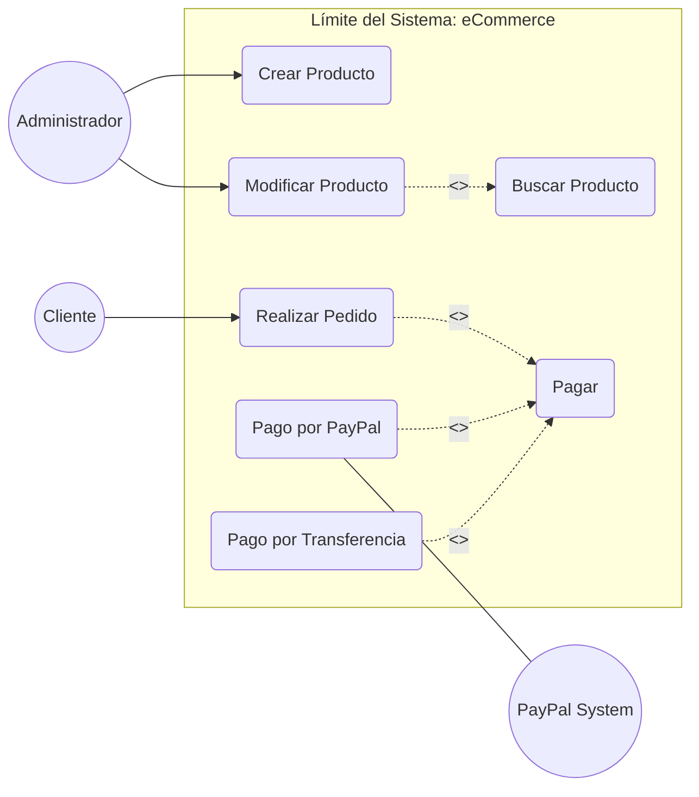

**Representación en ASCII (Guía de Flechas y Simbolismo):**

```text
  ACTOR ADMIN                      SISTEMA                                      ACTOR EXTERNO
 (Stick Man)                      (Boundary)                                     (Sistema API)
      |         /----------\
      +-------> |  Crear   |
      |         \----------/
      |                                              /----------\
      |         /----------\       <<include>>       |  BUSCAR  |
      +-------> |Modificar | ----------------------> | (Común)  |
                \----------/         (flecha a)      \----------/


  ACTOR CLIENTE
      |         /----------\       <<include>>       /----------\
      +-------> | REALIZAR | ----------------------> |  PAGAR   |
                |  PEDIDO  |                         \----------/
                \----------/                             ^
                                                         |
                                           <<extend>>    | (flecha al base)
                                          /--------------+-------------\
                                          |                            |
                                   /--------------\             /--------------\
                                   | PAGO TRANSF. |             | PAGO PAYPAL  | <---> [ PAYPAL ]
                                   \--------------/             \--------------/

```

---

## 2.7. ❌ Contraejemplos: Lo que NO es un Caso de Uso

* **"Introducir Password":** Esto no es un objetivo del usuario, es un paso dentro de un caso de uso mayor como "Login".
* **"Hacer un bucle FOR":** Esto es implementación técnica, no un caso de uso.
* **"Enviar datos a la base de datos":** Los casos de uso hablan de objetivos de negocio, no de movimientos técnicos de bits.

> **Resumen:** Si tu diagrama muestra un mapa claro de todas las acciones (RF) que el sistema permite, con sus actores correctamente identificados y las flechas de `include` y `extend` apuntando en la dirección legal, tienes la base perfecta para diseñar los **Diagramas de Secuencia** y escribir tu código.
>


---

# 3. Documentación Narrativa: La Plantilla de Caso de Uso

Si el diagrama de Casos de Uso es el "mapa", la **Documentación Narrativa** es el "manual de instrucciones". Un error crítico en el desarrollo es pensar que con los óvalos basta; sin embargo, el código no se escribe basándose en un dibujo, sino en la lógica detallada de la interacción.

---

## 3.1. La Abstracción del Caso de Uso: Independencia de la Interfaz

Un principio fundamental que el alumnado debe grabar a fuego es que **el Caso de Uso es agnóstico a la interfaz**.

* **No es UI (User Interface):** En la narrativa **jamás** debemos mencionar elementos como "hacer clic en el botón rojo", "hacer scroll" o "seleccionar del menú desplegable".
* **Por qué:** Un mismo caso de uso (ej. "Realizar Pedido") debe ser válido tanto para una página web, una aplicación móvil, una terminal de comandos (CLI) o un sistema de voz.
* **Cómo escribirlo:** Debemos usar términos lógicos y universales como "El actor solicita realizar...", "El actor introduce la información...", "El sistema muestra los resultados...".

---

## 3.2. Importancia de las Pre y Post condiciones

Para que un caso de uso sea riguroso a nivel de ingeniería, debemos definir los estados estancos del sistema:

* **Precondiciones:** Son los requisitos que deben cumplirse para que el flujo pueda comenzar. **Se redactan siempre en pasado**, indicando que ya han sucedido.
* *Ejemplo:* "El administrador se ha autenticado con privilegios de edición".


* **Postcondiciones:** Es la garantía de éxito. Cómo queda el mundo tras la acción. También **se redactan en pasado**.
* *Ejemplo:* "Los datos del producto han sido persistidos en el sistema".


---

## 3.3. Control de Flujo en Excepciones y Alternativos

En las secciones de **Excepciones** o **Flujos Alternativos**, no basta con decir "ocurre un error". Como diseñadores, debemos indicar qué sucede con el hilo de ejecución del caso de uso. Existen dos opciones principales:

1. **Retorno al Flujo Principal:** Se indica a qué paso exacto del flujo principal debe volver el actor una vez corregido el error.
* *Ejemplo:* "E1: Los datos son inválidos. El sistema informa del error y **regresa al paso 3**".


2. **Terminación del Caso de Uso:** Si el error es insalvable (un "showstopper"), se indica que el proceso finaliza sin alcanzar la postcondición.
* *Ejemplo:* "E2: El producto no existe. El sistema informa del error y **fin del caso de uso**".


---

## 3.4. Plantilla Oficial de Caso de Uso

> ### 📄 PLANTILLA DE CASO DE USO
> 
> 
> | Campo | Descripción Técnica |
> | --- | --- |
> | **ID** | Código identificador único (Ej: CU-01). |
> | **Nombre** | Verbo en infinitivo + Objeto (Ej: Actualizar Producto). |
> | **Actores** | **Principal:** El que inicia. **Secundarios:** Sistemas externos involucrados. |
> | **Descripción** | Qué objetivo busca el actor con esta acción. |
> | **Precondiciones** | Estado necesario previo (**Redactado en pasado**). |
> | **Flujo Principal** | Pasos numerados de la interacción lógica Actor <-> Sistema. |
> | **Excepciones** | Definición del error y **punto de retorno o fin**. |
> | **Postcondiciones** | Estado final tras el éxito del flujo (**Redactado en pasado**). |
> 
> 

---

## 3.5. Ejemplo 1: CU-007 "Pagar con PayPal" (Con Actor Externo)

| Campo               | Detalle Narrativo                                                      |
| ------------------- | ---------------------------------------------------------------------- |
| **ID**              | CU-007                                                                 |
| **Nombre**          | Pagar con PayPal                                                       |
| **Actores**         | Cliente (Principal), PayPal API (Sistema Externo)                      |
| **Precondiciones**  | El cliente se ha autenticado. El carrito de compra ha sido confirmado. |
| **Flujo Principal** | 1. El cliente selecciona PayPal como forma de pago.<br>                |

<br>2. El sistema solicita la autorización a la plataforma de PayPal.<br>

<br>3. El cliente se identifica y autoriza el cargo en la plataforma externa.<br>

<br>4. La plataforma externa notifica la confirmación de la transferencia al sistema.<br>

<br>5. El sistema registra el pago y actualiza el estado del pedido. |
| **Excepciones** | **E1:** La plataforma externa deniega la transacción por falta de fondos. El sistema notifica el fallo y **el flujo regresa al paso 1** para elegir otro método.<br>

<br>**E2:** El cliente cancela la operación en la plataforma externa. **Fin del caso de uso**. |
| **Postcondiciones** | El pedido ha pasado al estado "Pagado". |

---

## 3.6. Ejemplo 2: CU-002 "Actualizar Producto" (Inclusión Obligatoria)

| Campo               | Detalle Narrativo                                       |
| ------------------- | ------------------------------------------------------- |
| **ID**              | CU-002                                                  |
| **Nombre**          | Actualizar Producto                                     |
| **Actores**         | Administrador de Inventario                             |
| **Precondiciones**  | El administrador se ha autenticado.                     |
| **Flujo Principal** | 1. El administrador solicita modificar un producto.<br> |

<br>2. **El sistema ejecuta el CU-003 (Buscar Producto).**<br>

<br>3. El sistema muestra los datos actuales del producto.<br>

<br>4. El administrador introduce los nuevos valores.<br>

<br>5. El sistema valida los datos.<br>

<br>6. El sistema guarda los cambios. |
| **Excepciones** | **E1:** El producto no es encontrado en el paso 2. El sistema informa y **fin del caso de uso**.<br>

<br>**E2:** Los datos introducidos en el paso 4 son inválidos. El sistema indica los errores y **regresa al paso 4**. |
| **Postcondiciones** | La información del producto ha sido actualizada en la base de datos. |

---

## 3.7. Ejemplo 3: CU-010 "Aplicar Cupón Descuento" (Extensión Opcional)

| Campo               | Detalle Narrativo                                                                                |
| ------------------- | ------------------------------------------------------------------------------------------------ |
| **ID**              | CU-010                                                                                           |
| **Nombre**          | Aplicar Cupón Descuento                                                                          |
| **Actores**         | Cliente                                                                                          |
| **Descripción**     | Permite reducir el importe total. **Extiende al CU-004 (Realizar Pedido).**                      |
| **Precondiciones**  | El cliente se encuentra en el proceso de "Realizar Pedido". El sistema ha calculado el subtotal. |
| **Flujo Principal** | 1. El cliente solicita aplicar un descuento.<br>                                                 |

<br>2. El sistema pide el código del cupón.<br>

<br>3. El cliente introduce el código.<br>

<br>4. El sistema valida el cupón.<br>

<br>5. El sistema recalcula el total de la compra. |
| **Excepciones** | **E1:** El código introducido no existe. El sistema informa del error y **regresa al paso 2** para reintentar o permitir al cliente cancelar la extensión y seguir con el flujo base.<br>

<br>**E2:** El cupón ha caducado. El sistema informa y **fin del flujo de extensión** (vuelve al flujo de realizar pedido sin descuento). |
| **Postcondiciones** | El importe total del pedido ha sido actualizado a la baja. |

> **Resumen:** La narrativa es el "contrato". Si defines bien los puntos de retorno en las excepciones, el programador sabrá exactamente si debe mostrar un mensaje de error y limpiar el formulario o si debe redirigir al usuario a otra pantalla. Es el paso previo e indispensable para el **Diagrama de Secuencia**.


---

# 4. Diagramas de Interacción: Secuencia (Sequence Diagram)

El **Diagrama de Secuencia** modela la lógica de ejecución. Representa cómo los objetos se envían mensajes entre sí en un orden temporal específico. Es la guía técnica para que el programador sepa qué métodos llamar y qué condiciones controlar.

---

## 4.1. Elementos y Simbología Técnica

Antes de realizar los diagramas, debemos conocer los componentes básicos:

* **Actor:** Entidad externa que inicia el flujo.
* **Línea de Vida:** Línea vertical discontinua que representa la existencia del objeto.
* **Activación:** Rectángulo sobre la línea de vida que indica que el objeto está "activo" ejecutando código.
* **Mensaje Síncrono ():** Llamada a un método. El emisor se bloquea hasta que el receptor termina.
* **Mensaje de Retorno ():** El valor que devuelve el método.

---

## 4.2. Creación y Destrucción de Objetos

### A) Creación (`<<new>>`)

Se representa con una flecha que apunta directamente al **rectángulo del objeto** que nace.

**Diagrama Mermaid:**

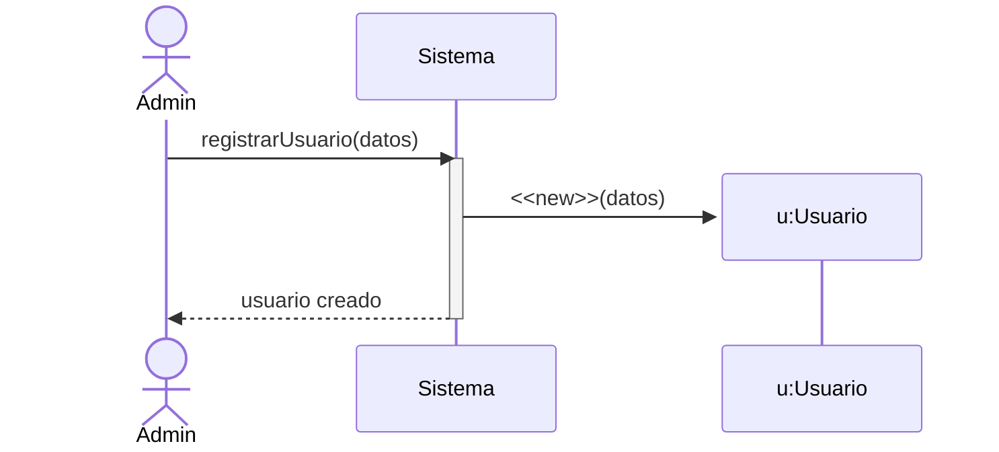

**Diagrama ASCII:**

```text
  [ ADMIN ]            [ SISTEMA ]             [ u:USUARIO ]
      |                     |                       |
      |--- registrar() ---->|                       |
      |                     |------- <<new>> ------>[ ]
      |                     |                       |

```

**Código C#:**

```csharp
public void RegistrarUsuario(string nombre) {
    // La instanciación de la clase es el mensaje <<new>>
    Usuario u = new Usuario(nombre); 
}

```

### B) Destrucción (`X`)

Representa el fin de la vida de un objeto. Se marca con una **X** al final de la línea de vida.

**Diagrama Mermaid:**

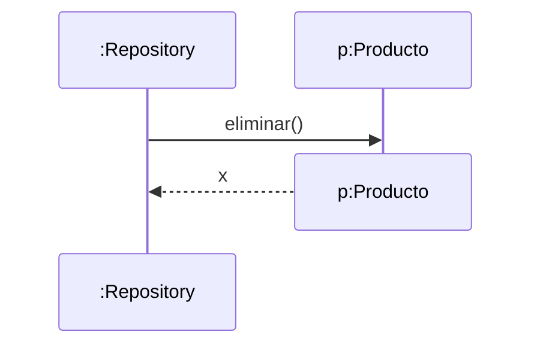

**Diagrama ASCII:**

```text
  [ REPOSITORIO ]          [ p:PRODUCTO ]
         |                       |
         |------- Remove() ----->|
         |                       X  <-- Destrucción (Fin de vida)

```

**Código C#:**

```csharp
public void Eliminar(Producto p) {
    _db.Remove(p); // El objeto deja de estar referenciado y el recolector de basura lo destruye (X)
}

```

---

## 4.3. Condicional con Alt (if-else)

El fragmento **ALT** representa una decisión lógica donde solo una de las opciones se ejecuta.

**Diagrama Mermaid:**

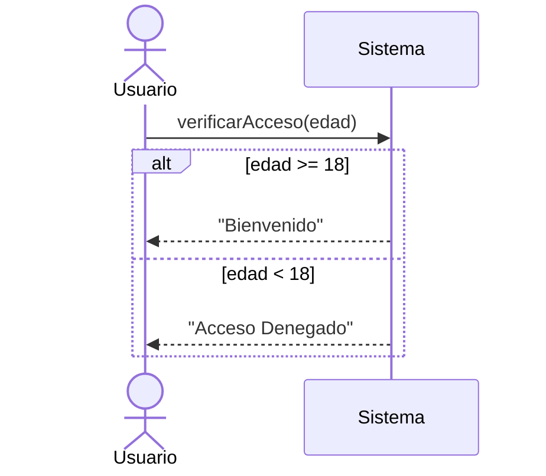

**Diagrama ASCII:**

```text
  +---------------------------------------+
  | alt [edad >= 18]                        |
  | --------------------------------------- |
  | Sistema -> Usuario: "Bienvenido"        |
  | --------------------------------------- |
  | [else]                                  |
  | Sistema -> Usuario: "Acceso Denegado"   |
  +---------------------------------------+

```

**Código C#:**

```csharp
public string VerificarAcceso(int edad) {
    if (edad >= 18) { // Bloque ALT principal
        return "Bienvenido";
    } else { // Bloque ELSE del ALT
        return "Acceso Denegado";
    }
}

```

---

## 4.4. Bucles (loop / foreach)

El fragmento **LOOP** representa la repetición de una serie de mensajes.

**Diagrama Mermaid:**

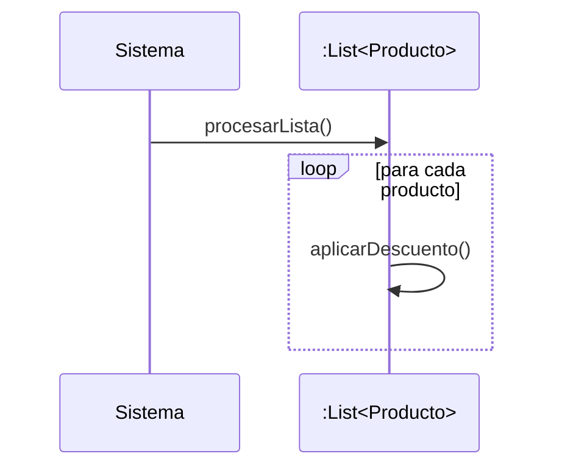

**Diagrama ASCII:**

```text
  +---------------------------------------+
  | loop [para cada producto en lista]      |
  | --------------------------------------- |
  | Sistema -> Producto: AplicarDescuento() |
  +---------------------------------------+

```

**Código C#:**

```csharp
public void ProcesarLista(List<Producto> lista) {
    foreach (var p in lista) { // El bloque loop
        p.AplicarDescuento(); // Mensaje síncrono
    }
}

```

---

## 4.5. Operaciones del Repositorio (CRUD Completo)

### 1. GetAll (Obtener todos)

Obtiene la lista completa de objetos sin condiciones.

**Diagrama Mermaid:**

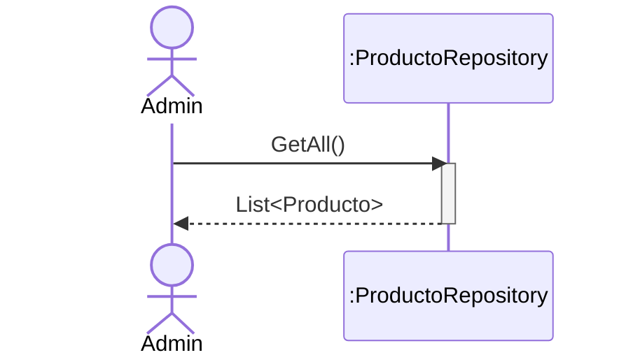

**Diagrama ASCII:**

```text
  [ ADMIN ]            [ :REPO ]
      |                    |
      |----- GetAll() ---->|
      |<-- List<Producto> -|

```

**Código C#:**

```csharp
public List<Producto> GetAll() {
    return _db; // Retorna la colección completa
}

```

### 2. GetById (Obtener por ID con ALT)

Busca un objeto específico y maneja el caso de que no exista.

**Diagrama Mermaid:**

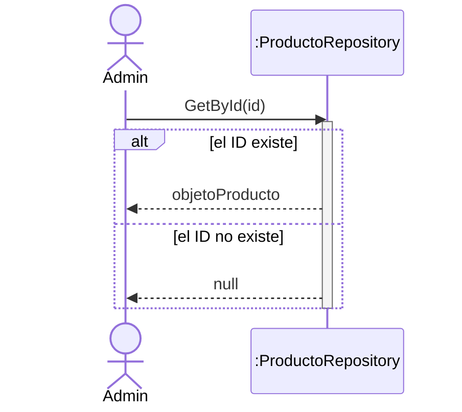

**Diagrama ASCII:**

```text
  [ ADMIN ]               [ :REPO ]
      |                       |
      |----- GetById(id) ---->|
      |      +----------------|------------------+
      |      | alt [encontrado]                  |
      |      |<--- return objetoProducto --------|
      |      |-----------------------------------|
      |      | [else]                            |
      |      |<--- return null ------------------|
      |      +-----------------------------------+

```

**Código C#:**

```csharp
public Producto? GetById(int id) {
    return _db.FirstOrDefault(p => p.Id == id);
}

```

### 3. Create (Crear con NEW)

Instanciación de un nuevo objeto y su persistencia.

**Diagrama Mermaid:**

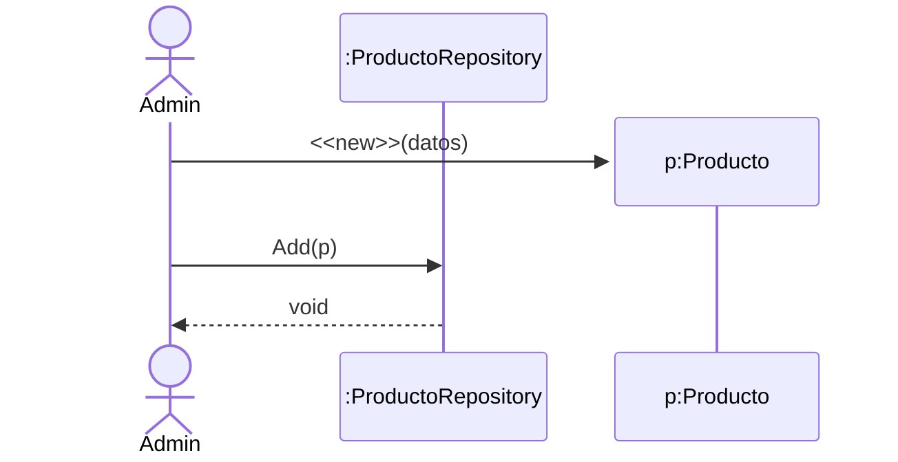

**Diagrama ASCII:**

```text
  [ ADMIN ]          [ p:PRODUCTO ]          [ :REPO ]
      |                   |                      |
      |---- <<new>> ---->[ ]                     |
      |     |     |
      | --- | --- |Add(p) ------>|

```

**Código C#:**

```csharp
public void Add(Producto p) {
    _db.Add(p);
}

```

### 4. Update (Actualizar con ALT)

Busca primero el objeto; si existe, modifica sus propiedades.

**Diagrama Mermaid:**

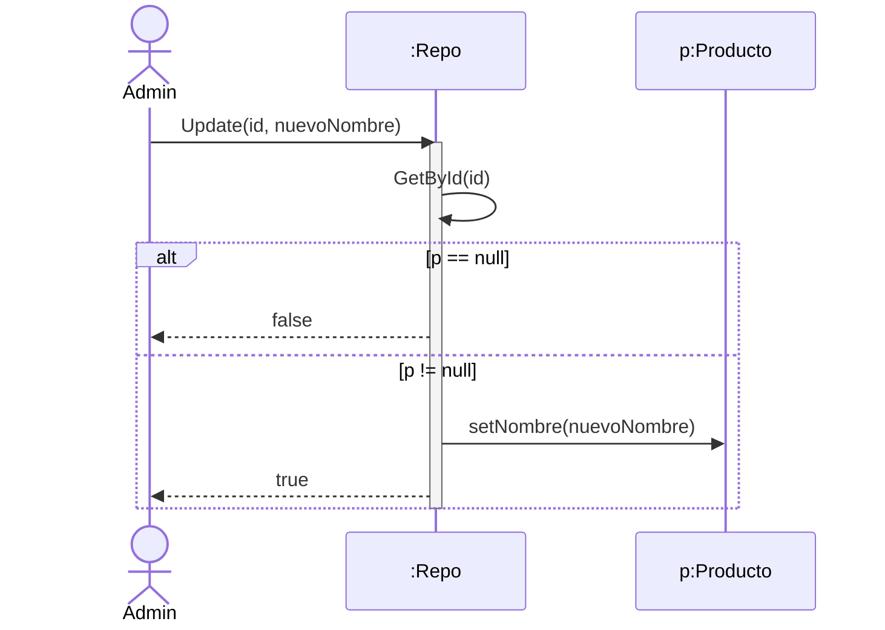

**Diagrama ASCII:**

```text
  [ ADMIN ]               [ :REPO ]              [ p:PRODUCTO ]
      |                       |                       |
      |--- Update(id) ------->|                       |
      |      +----------------|-----------------------|-----------+
      |      | alt [p == null]|                       |           |
      |      |<-- return false|                       |           |
      |      |----------------|-----------------------|-----------|
      |      | [else]         |                       |           |
      |      |                |----- setNombre() ---->|           |
      |      |<-- return true |                       |           |
      |      +----------------|-----------------------|-----------+

```

**Código C#:**

```csharp
public bool Update(int id, string nuevoNombre) {
    var p = GetById(id); 
    if (p == null) return false; // Bloque ALT
    // Rama [else]
    p.Nombre = nuevoNombre;
    return true; // Bloque ELSE
}

```

### 5. Delete (Borrar con ALT y Destrucción)

Busca el objeto y lo elimina de la colección.

**Diagrama Mermaid:**

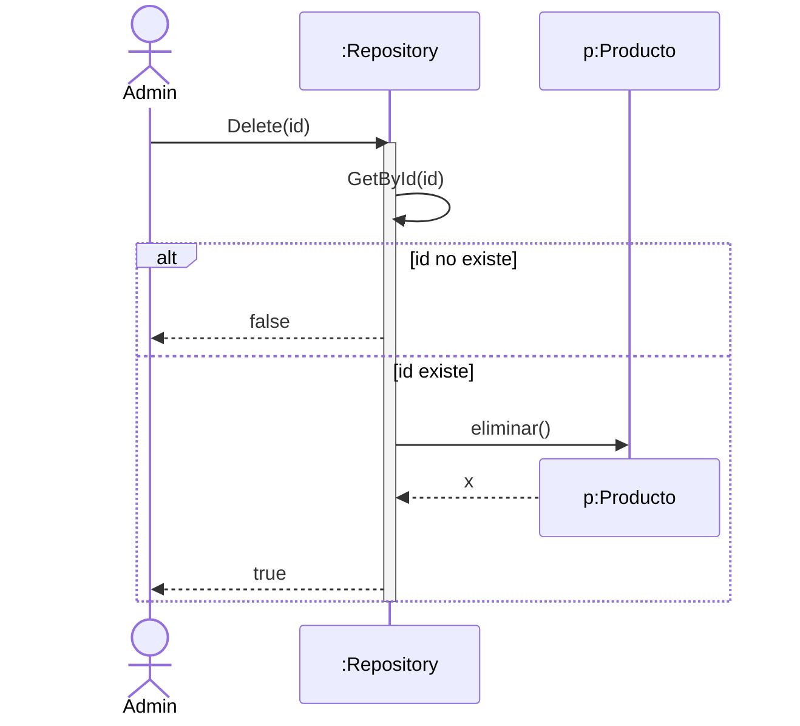

**Diagrama ASCII:**

```text
   [ ADMIN ]               [ : REPO ]              [ p: PRODUCTO ]
      |                       |                       |
      |--- Delete(id) ------->|                       |
      |                       +--- GetById(id)        |
      |      +----------------|-----------------------------------+
      |      | alt [p == null]|                       |           |
      |      |                |                       |           |
      |      |<-- false ------|                       |           |
      |      |----------------|-----------------------------------+
      |      | [else]         |                       |           |
      |      |                |---- eliminar() ------>|           |
      |      |                |                       X (destroy) |
      |      |                |<------ x -------------|           |
      |      |<-- true -------|                       |           |
      |      +----------------|-----------------------------------+
      |                       |                       |
```

**Código C#:**

```csharp
public bool Delete(int id) {
    // 1. Mensaje interno:  Buscamos el objeto
    var p = GetById(id);

    // 2. Fragmento ALT: Validamos existencia
    if (p == null) return false;
    // Rama [id existe]
    // 3. Mensaje de destrucción: eliminar()
    _db.Remove(p); 
    // El objeto 'p' es destruido lógicamente (marcado con X)
    return true;
    }
}

```

### 6. Codigo en C#: Clase ProductoRepository Completa

```csharp
using System;
using System.Collections.Generic;
using System.Linq;

namespace SistemaVentas.Persistencia
{
    public class ProductoRepository
    {
        // Multiobjeto: Representado en el diagrama como la línea de vida :List<Producto>
        private List<Producto> _db = new List<Producto>();

        // --- 4.5.1. GET ALL ---
        // Coincide con el diagrama donde Admin pide la lista y Repo la devuelve íntegra.
        public List<Producto> GetAll() 
        {
            return _db; 
        }

        // --- 4.5.2. GET BY ID ---
        // Refleja el fragmento ALT: 
        // Si lo encuentra, devuelve el objeto; si no, devuelve null.
        public Producto? GetById(int id) 
        {
            return _db.FirstOrDefault(p => p.Id == id);
        }

        // --- 4.5.3. CREATE ---
        // En el diagrama, Admin hace el <<new>> y Repo solo lo añade (Add).
        public void Add(Producto p) 
        {
            _db.Add(p); // El objeto p ya viene creado desde fuera según el diagrama
        }

        // --- 4.5.4. UPDATE ---
        // Sigue el diagrama: 1. Busca p -> 2. Fragmento ALT basado en si p es null.
        public bool Update(int id, string nuevoNombre) 
        {
            var p = GetById(id); // Mensaje interno: Repo llama a su propio GetById
            
            if (p == null) return false; // Fragmento ALT: [p == null]
            // Fragmento ALT: [else]
            p.Nombre = nuevoNombre; // Mensaje al objeto Producto: setNombre()
            return true;
            
        }

        // --- 4.5.5. DELETE ---
        // Sigue el diagrama: 1. Busca p -> 2. Fragmento ALT -> 3. Destrucción lógica (X).

        public bool Delete(int id) 
        {
            var p = GetById(id); // Mensaje interno: Repo llama a su propio GetById

            if (p == null) return false; // Fragmento ALT: [id no existe]
            // Fragmento ALT: [id existe]
            _db.Remove(p); // Mensaje de destrucción: eliminar()
            // El objeto 'p' es destruido lógicamente (marcado con X)
            return true;
        }
}

    // Entidad Producto: Representa los rectángulos de objeto en los diagramas
    public class Producto 
    {
        public int Id { get; set; }
        public string Nombre { get; set; }
        public int Stock { get; set; }

        // Método usado en el diagrama del Carrito de Compra
        public bool HayStock(int cantidad) => Stock >= cantidad;

        // Método usado en el diagrama del Carrito (Mensaje reducir())
        public void DescontarStock(int cantidad) => Stock -= cantidad;
    }
}
```

---

## 4.6. Ejemplo de Carrito de Compra

Entendido. Vamos a corregir el caso del Carrito de Compra para que refleje una arquitectura real con dos repositorios y la lógica de negocio distribuida correctamente: validación en el Repositorio de Productos, creación de objetos de Venta y persistencia en el Repositorio de Ventas. Este flujo es el más completo: utiliza un **LOOP** para recorrer los ítems, fragmentos **ALT** para validar stock, **creación** de nuevos objetos (Venta y Línea de Venta) y comunicación entre dos repositorios distintos (`ProductoRepository` y `VentaRepository`).

### A) Diagrama Mermaid

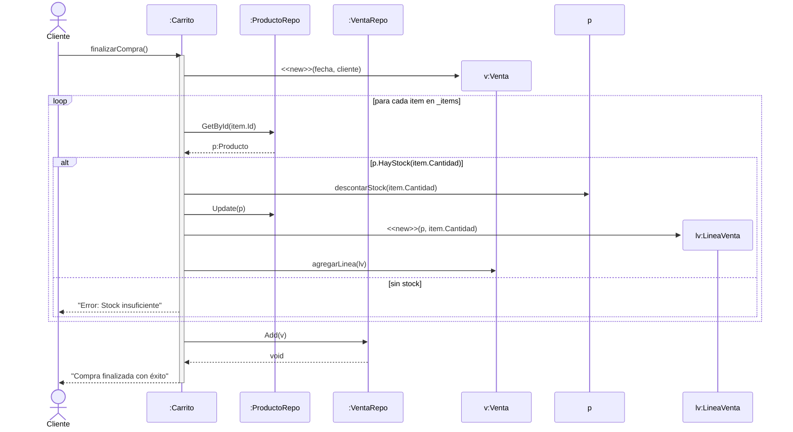

### B) Diagrama ASCII

```text
 [ CLIENTE ]      [ :CARRITO ]      [ :PROD_REPO ]      [ :VENTA_REPO ]      [ v:VENTA ]
      |                |                  |                   |                   |
      |-- finalizar()->|                  |                   |                   |
      |                |------- <<new>> ---------------------------------------->[ ]
      |                |                  |                   |                   |
      |          +-----|------------------|-------------------|-------------------|-----+
      |          | loop [cada item]       |                   |                   |     |
      |          |     |                  |                   |                   |     |
      |          |     |--- GetById() --->|                   |                   |     |
      |          |     |<--- p:Producto --|                   |                   |     |
      |          |     |                  |                   |                   |     |
      |          |   +-|------------------|-------------------|-------------------|--+  |
      |          |   | alt [HayStock]     |                   |                   |  |  |
      |          |   | |--- descontar() --------------------->[p:Producto]        |  |  |
      |          |   | |--- Update(p) --->|                   |                   |  |  |
      |          |   | |                  |                   |                   |  |  |
      |          |   | |------- <<new LineaVenta>> ---------->[lv]                |  |  |
      |          |   | |--- agregarLinea(lv) ------------------------------------>|  |  |
      |          |   |--------------------|-------------------|-------------------|--|  |
      |          |   | [else]             |                   |                   |  |  |
      |          |   | |<-- "Error stock"-|                   |                   |  |  |
      |          |   +-|------------------|-------------------|-------------------|--+  |
      |          +-----|------------------|-------------------|-------------------|-----+
      |                |                  |                   |                   |
      |                |------------------------- Add(v) ---->|                   |
      |                |<--- void ----------------------------|                   |
      | <--- "OK" -----|                                                          |

```

### C) Código C# (Clase Carrito)

```csharp
public class Carrito 
{
    private List<ItemCarrito> _items = new List<ItemCarrito>();
    private ProductoRepository _prodRepo; // Repositorio de Productos
    private VentaRepository _ventaRepo;     // Repositorio de Ventas

    public void FinalizarCompra(Cliente cliente) 
    {
        // 1. Creación del objeto principal de la Venta (Mensaje <<new>>)
        Venta nuevaVenta = new Venta(DateTime.Now, cliente);

        // 2. Fragmento LOOP: Recorrer los productos del carrito
        foreach (var item in _items) 
        {
            // 3. Buscar el producto en el repo de productos
            Producto p = _prodRepo.GetById(item.ProductoId);

            // 4. Fragmento ALT: Validar disponibilidad
            if (p != null && p.HayStock(item.Cantidad)) 
            {
                // A) Se descuenta stock del objeto
                p.DescontarStock(item.Cantidad);
                
                // B) Se actualiza el repositorio de productos (Persistencia)
                _prodRepo.Update(p.Id, p.Nombre); 

                // C) Creación de objeto detalle (Mensaje <<new>> LineaVenta)
                LineaVenta linea = new LineaVenta(p, item.Cantidad);
                
                // D) Se agrega la línea al objeto venta
                nuevaVenta.AgregarLinea(linea);
            } 
            else 
            {
                // ALT [else]: Manejo de error de stock
                Console.WriteLine("Error: No hay stock suficiente para " + item.Nombre);
                return; // Se aborta la operación
            }
        }

        // 5. Se almacena la venta completa en el repositorio de Ventas
        _ventaRepo.Add(nuevaVenta);

        // 6. Destrucción lógica: Se limpia el carrito tras la compra exitosa
        _items.Clear(); 
    }
}

```

---

# 5. Diagramas de Comportamiento: Estados (State Machine)

El Diagrama de Estados describe los estados por los que pasa un objeto (como un `Pedido`) y las transiciones que permiten cambiar de un estado a otro.

## 5.1. Simbología y Conceptos Clave

* **Estado (Rectángulo redondeado):** Una condición o situación en la vida de un objeto (ej. *Pendiente*).
* **Estado Inicial (Círculo sólido):** El punto de partida del objeto.
* **Estado Final (Círculo con borde):** El fin del ciclo de vida del objeto.
* **Transición (Flecha):** El paso de un estado a otro provocado por un **Evento**.
* **Acción / Guardas:** Condiciones que deben cumplirse para que la transición ocurra (ej. `[pago_confirmado]`).

---

## 5.2. Ejemplo Maestro: El Ciclo de Vida de un Pedido

Modelaremos un sistema donde un pedido pasa por las fases de pago, preparación y envío.

### A) Diagrama Mermaid

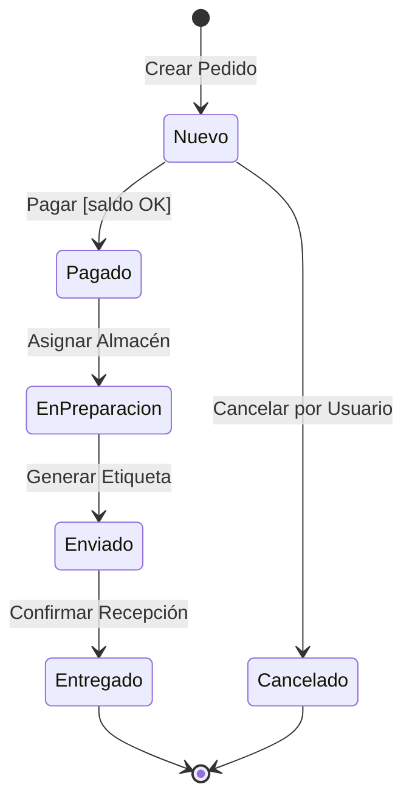

### B) Diagrama ASCII

```text
  (O) --> [ NUEVO ] --(pagar)--> [ PAGADO ] --(preparar)--> [ EN_PREPARACION ]
           |                       |                               |
      (cancelar)               (cancelar)                      (enviar)
           |                       |                               |
           V                       V                               V
      [ CANCELADO ] <--------- [ REEMBOLSADO ] <----------- [ ENVIADO ]
           |                                                       |
           +----------------------> ( (X) ) <-------(entregar)-----+

```

---

## 5.3. Implementación en C# (Patrón State / Enumerados)

Para implementar estados de forma profesional, solemos usar un `enum` para representar el estado y lógica condicional (o el patrón State) para controlar las transiciones.

### Código C# (Clase Pedido con lógica de estados)

```csharp
public enum EstadoPedido {
    Nuevo,
    Pagado,
    EnPreparacion,
    Enviado,
    Entregado,
    Cancelado
}

public class Pedido {
    public int Id { get; private set; }
    public EstadoPedido EstadoActual { get; private set; }

    public Pedido(int id) {
        Id = id;
        EstadoActual = EstadoPedido.Nuevo; // Estado Inicial
    }

    // Transición: Nuevo -> Pagado
    public void Pagar() {
        if (EstadoActual == EstadoPedido.Nuevo) {
            EstadoActual = EstadoPedido.Pagado;
            Console.WriteLine("Pedido pagado con éxito.");
        } else {
            Console.WriteLine("Error: No se puede pagar un pedido en estado " + EstadoActual);
        }
    }

    // Transición: Pagado -> EnPreparacion
    public void Preparar() {
        if (EstadoActual == EstadoPedido.Pagado) {
            EstadoActual = EstadoPedido.EnPreparacion;
            Console.WriteLine("El pedido está ahora en almacén.");
        }
    }

    // Transición: EnPreparacion -> Enviado
    public void Enviar() {
        if (EstadoActual == EstadoPedido.EnPreparacion) {
            EstadoActual = EstadoPedido.Enviado;
            Console.WriteLine("Pedido enviado.");
        }
    }

    // Transición: Cualquier estado inicial -> Cancelado
    public void Cancelar() {
        if (EstadoActual == EstadoPedido.Nuevo || EstadoActual == EstadoPedido.Pagado) {
            EstadoActual = EstadoPedido.Cancelado;
            Console.WriteLine("Pedido cancelado.");
        }
    }
}

```

---

## 5.4. Guardas y Acciones en las Transiciones

A veces, para pasar de un estado a otro, necesitamos una **Guarda** (una condición lógica).

**Diagrama Mermaid (con guardas):**

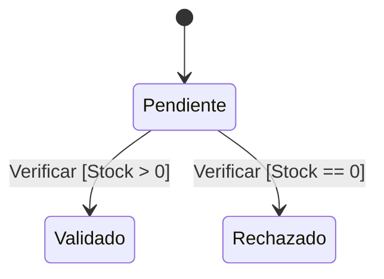

**Código C# (Guarda):**

```csharp
public void ValidarStock(int stockDisponible) {
    if (stockDisponible > 0) { // Esta es la Guarda [Stock > 0]
        EstadoActual = EstadoPedido.EnPreparacion;
    } else {
        EstadoActual = EstadoPedido.Cancelado;
    }
}

```

---

## 5.5. Estados Compuestos (Sub-estados)

Un estado puede contener otros estados. Por ejemplo, el estado `Enviado` podría dividirse en `En Tránsito` y `En Reparto local`.

**Diagrama ASCII (Sub-estados):**

```text
  +-- [ ENVIADO ] ---------------------------+
  |                                          |
  |  (O) --> [ EN_TRANSITO ] --(llegada)--> [ EN_REPARO ] --+
  |                                          |              |
  +------------------------------------------+              |
                                                            V
                                                      [ ENTREGADO ]

```

---

Tienes toda la razón. El error en el diagrama **Mermaid** se debe a que intenté mezclar un `classDiagram` con un `stateDiagram` en el mismo bloque de código, y Mermaid no permite combinar dos tipos de diagramas distintos bajo una misma declaración.

Para mantener la **trazabilidad**, debemos separar los diagramas pero mostrar cómo se conectan. Aquí tienes la corrección del apartado 6 con los diagramas corregidos y la explicación detallada.

---

# 6. Trazabilidad y Coherencia entre Diagramas

La trazabilidad garantiza que el diseño sea un bloque sólido. Si los diagramas no coinciden, el código final fallará.

## 6.1. Las 3 Reglas de Oro de la Coherencia

### Regla 1: La Regla de la Existencia (Clases  Secuencia)

Cualquier mensaje (flecha) en el diagrama de secuencia debe existir como método en el de clases.

**Diagrama ASCII de Coherencia:**

```text
  DIAGRAMA DE CLASES           DIAGRAMA DE SECUENCIA
 +--------------------+       [ :REPOSITORIO ]    [ p:PRODUCTO ]
 |     Producto       |              |                  |
 +--------------------+              |-- setNombre() -->|  <-- OK! (Existe en Clase)
 | + setNombre(str)   |              |                  |
 +--------------------+              |-- calcular() ---->|  <-- ERROR! (No está en Clase)

```

### Regla 2: La Regla del Estado (Estados  Clases)

Cualquier cambio de estado en el **Diagrama de Estados** debe estar respaldado por un atributo (normalmente un `enum`) y métodos de acción en el **Diagrama de Clases**.

**Representación en Clases:**

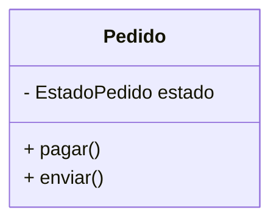

**Representación en Estados (Corregido):**

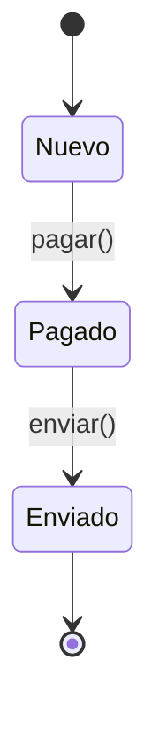

### Regla 3: La Regla de la Participación (Clases  Secuencia)

Cada "Línea de Vida" en el diagrama de secuencia es una instancia física de una clase definida en el diagrama de clases. No pueden aparecer objetos de clases que no hayas diseñado previamente.

---

## 6.2. Implementación de la Trazabilidad en C#

Para que el código sea trazable, unimos los tres diagramas en una sola estructura lógica:

```csharp
// 1. Trazabilidad con Diagrama de ESTADOS (Valores de los estados)
public enum EstadoVenta { Borrador, Procesada, Cancelada }

// 2. Trazabilidad con Diagrama de CLASES (Estructura y Métodos)
public class Venta {
    public int Id { get; set; }
    public EstadoVenta Estado { get; private set; } // Atributo de estado

    public Venta() {
        Estado = EstadoVenta.Borrador; // Estado inicial del diagrama
    }

    // 3. Trazabilidad con Diagrama de SECUENCIA (Acción invocada)
    public void Procesar() {
        // La "Guarda" del diagrama de secuencia/estados
        if (Estado == EstadoVenta.Borrador) { 
            Estado = EstadoVenta.Procesada; // Transición de estado
            Console.WriteLine("La venta ha pasado a estado Procesada.");
        }
    }
}

```

---

## 6.3. Matriz de Verificación (Checklist Final)

Antes de dar por finalizado un diseño, revisa esta tabla de coherencia:

| Si ves esto en SECUENCIA...  | DEBE estar en CLASES...                 | DEBE estar en ESTADOS...              |
| ---------------------------- | --------------------------------------- | ------------------------------------- |
| Una flecha `-> metodo()`     | Como un método `+ metodo()`             | Como un disparador de transición.     |
| Un objeto `p:Producto`       | Como una clase `class Producto`         | N/A                                   |
| Una guarda `[stock > 0]`     | Como un atributo o lógica en el método. | Como una condición de flecha.         |
| Un retorno `false` por error | Como un tipo de retorno (bool/null).    | Como una transición a estado fallido. |

---


## Autor

Codificado con :sparkling_heart: por [José Luis González Sánchez](https://twitter.com/JoseLuisGS_)

[](https://twitter.com/JoseLuisGS_)
[](https://github.com/joseluisgs)
[](https://github.com/joseluisgs)


### Contacto

<p>
  Cualquier cosa que necesites házmelo saber por si puedo ayudarte 💬.
</p>
<p>
 <a href="https://joseluisgs.dev" target="_blank">
        
    </a>  &nbsp;&nbsp;
    <a href="https://github.com/joseluisgs" target="_blank">
        
    </a> &nbsp;&nbsp;
        <a href="https://twitter.com/JoseLuisGS_" target="_blank">
        
    </a> &nbsp;&nbsp;
    <a href="https://www.linkedin.com/in/joseluisgonsan" target="_blank">
        
    </a>  &nbsp;&nbsp;
    <a href="https://g.dev/joseluisgs" target="_blank">
        
    </a>  &nbsp;&nbsp;
<a href="https://www.youtube.com/@joseluisgs" target="_blank">
        
    </a>  
</p>

## Licencia de uso

Este repositorio y todo su contenido está licenciado bajo licencia **Creative Commons**, si desea saber más, vea
la [LICENSE](https://joseluisgs.dev/docs/license/). Por favor si compartes, usas o modificas este proyecto cita a su
autor, y usa las mismas condiciones para su uso docente, formativo o educativo y no comercial.

<a rel="license" href="http://creativecommons.org/licenses/by-nc-sa/4.0/"></a><br /><span xmlns:dct="http://purl.org/dc/terms/" property="dct:title">
JoseLuisGS</span>
by <a xmlns:cc="http://creativecommons.org/ns#" href="https://joseluisgs.dev/" property="cc:attributionName" rel="cc:attributionURL">
José Luis González Sánchez</a> is licensed under
a <a rel="license" href="http://creativecommons.org/licenses/by-nc-sa/4.0/">Creative Commons
Reconocimiento-NoComercial-CompartirIgual 4.0 Internacional License</a>.<br />Creado a partir de la obra
en <a xmlns:dct="http://purl.org/dc/terms/" href="https://github.com/joseluisgs" rel="dct:source">https://github.com/joseluisgs</a>.
