# 🎓 Guía Maestra: Sistema de Gestión Académica (DAW)


---

## 1. El Problema y el Enunciado
El centro educativo "DAW Academy" requiere un sistema para gestionar su base de datos de **Estudiantes** y **Docentes**.

### El Reto Académico
No se trata solo de almacenar datos, sino de garantizar su **integridad** y permitir la toma de decisiones mediante **informes estadísticos**.
*   **Gestión de Entidades:** Manejo de jerarquías (Herencia) para evitar redundancia de datos.
*   **Validación de Dominio:** Los datos deben cumplir reglas estrictas (DNI válido, notas en rango, experiencia no negativa).
*   **Motor de Búsqueda:** Implementar filtrado dinámico y ordenación multiaxis (por Nota, por Experiencia, por DNI, etc.).
*   **Optimización:** Implementar una caché LRU para optimizar las lecturas repetidas por ID.
*   **Estructuras de Datos:** Se usa `Dictionary` para búsquedas O(1) en el Repository.

---

### Requisitos Funcionales del Sistema

Los requisitos funcionales describen las operaciones que el sistema debe realizar. Se organizan por actor y por categoría de funcionalidad.

#### 1.1 Gestión de Personas (General)

| Código   | Requisito       | Descripción                                                                                                                                                       |
| -------- | --------------- | ----------------------------------------------------------------------------------------------------------------------------------------------------------------- |
| RF-GP-01 | Listar Personal | El sistema deberá mostrar un listado completo de todo el personal (estudiantes y docentes) ordenado por diferentes criterios (ID, DNI, Apellidos, Nombre, Ciclo). |
| RF-GP-02 | Buscar por DNI  | El sistema deberá permitir buscar cualquier persona mediante su DNI, mostrando sus datos completos.                                                               |
| RF-GP-03 | Buscar por ID   | El sistema deberá permitir buscar cualquier persona mediante su identificador único (ID).                                                                         |

#### 1.2 Gestión de Estudiantes

| Código   | Requisito              | Descripción                                                                                                                                                                       |
| -------- | ---------------------- | --------------------------------------------------------------------------------------------------------------------------------------------------------------------------------- |
| RF-GE-01 | Listar Estudiantes     | El sistema deberá mostrar un listado de estudiantes ordenado por diferentes criterios (ID, DNI, Apellidos, Nombre, Nota, Curso, Ciclo).                                           |
| RF-GE-02 | Añadir Estudiante      | El sistema deberá permitir registrar nuevos estudiantes con validación completa (DNI válido, nombre, apellidos, nota 0-10, ciclo y curso).                                        |
| RF-GE-03 | Actualizar Estudiante  | El sistema deberá permitir modificar los datos de un estudiante existente tras verificar su existencia mediante DNI.                                                              |
| RF-GE-04 | Eliminar Estudiante    | El sistema deberá permitir eliminar físicamente un estudiante del sistema tras buscarlo por DNI.                                                                                  |
| RF-GE-05 | Informe de Rendimiento | El sistema deberá generar informes estadísticos de estudiantes con métricas (total, media, aprobados, suspensos) y filtrado por alcance (global, ciclo, curso, clase específica). |

#### 1.3 Gestión de Docentes

| Código   | Requisito              | Descripción                                                                                                                                   |
| -------- | ---------------------- | --------------------------------------------------------------------------------------------------------------------------------------------- |
| RF-GD-01 | Listar Docentes        | El sistema deberá mostrar un listado de docentes ordenado por diferentes criterios (ID, DNI, Apellidos, Nombre, Experiencia, Módulo, Ciclo).  |
| RF-GD-02 | Añadir Docente         | El sistema deberá permitir registrar nuevos docentes con validación completa (DNI válido, nombre, apellidos, experiencia ≥ 0, módulo, ciclo). |
| RF-GD-03 | Actualizar Docente     | El sistema deberá permitir modificar los datos de un docente existente tras verificar su existencia mediante DNI.                             |
| RF-GD-04 | Eliminar Docente       | El sistema deberá permitir eliminar físicamente un docente del sistema tras buscarlo por DNI.                                                 |
| RF-GD-05 | Informe de Experiencia | El sistema deberá generar informes estadísticos de docentes con métricas (total, experiencia media) y filtrado por ciclo.                     |

---

### Requisitos de Información

Los requisitos de información describen los datos que el sistema debe gestionar y mantener.

#### 1.4 Entidades del Sistema

| Entidad        | Atributos                                                   | Descripción                                                                                       |
| -------------- | ----------------------------------------------------------- | ------------------------------------------------------------------------------------------------- |
| **Persona**    | Id, Dni, Nombre, Apellidos, CreatedAt, UpdatedAt, IsDeleted | Clase base abstracta que representa cualquier persona del sistema. Identidad única basada en DNI. |
| **Estudiante** | Calificacion (0-10), Ciclo, Curso                           | Hereda de Persona. Representa a un alumno con su rendimiento académico.                           |
| **Docente**    | Experiencia (años), Especialidad, Ciclo                     | Hereda de Persona. Representa a un profesor con su experiencia profesional.                       |

#### 1.5 ValoresEnumerados

| Enum                 | Valores                                                             | Descripción                                        |
| -------------------- | ------------------------------------------------------------------- | -------------------------------------------------- |
| **Ciclo**            | DAM, DAW, ASIR                                                      | Ciclos formativos disponibles en el centro.        |
| **Curso**            | Primero, Segundo                                                    | Curso académico dentro del ciclo.                  |
| **TipoOrdenamiento** | Id, Dni, Apellidos, Nombre, Nota, Experiencia, Curso, Ciclo, Modulo | Criterios de ordenación disponibles para listados. |
| **OpcionMenu**       | 0-13                                                                | Opciones del menú principal de la aplicación.      |
| **TipoPersona**      | Estudiante, Docente                                                 | Tipo de persona del sistema.                       |

#### 1.6 DatosDerivados

| Atributo                    | Fórmula/Descripción                                                    | Entidad           |
| --------------------------- | ---------------------------------------------------------------------- | ----------------- |
| **NombreCompleto**          | Concatenación de Nombre + Apellidos                                    | Persona           |
| **CalificacionCualitativa** | Suspenso (<5), Aprobado (5-6.9), Notable (7-8.9), Sobresaliente (9-10) | Estudiante        |
| **PorcentajeAprobados**     | (Aprobados / Total) * 100                                              | InformeEstudiante |

---

### 1.7 Diagrama de Casos de Uso UML

A continuación se presenta el diagrama de casos de uso que modela las interacciones entre los actores y el sistema:

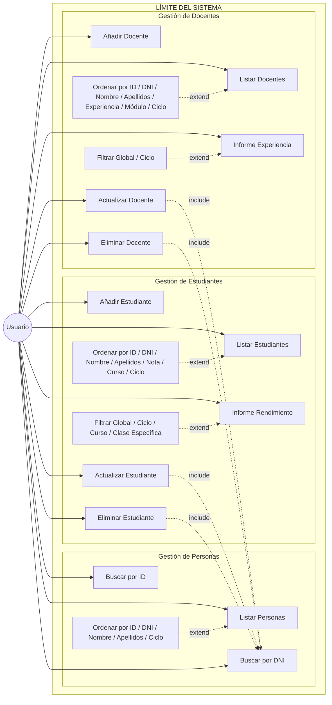

#### Leyenda

| Elemento           | Descripción                                      |
| ------------------ | ------------------------------------------------ |
| **(Usuario)**      | Actor externo al sistema                         |
| **Rectángulos**    | Casos de uso del sistema                         |
| **→**              | Association (línea continua)                     |
| **-. include .->** | Include - relación obligatoria (base → incluido) |
| **<-. extend .-**  | Extend - relación opcional (extendido → base)    |

#### Descripción de las Relaciones

**Include (línea discontinua):**
- `Actualizar Estudiante` → `Buscar DNI`: Para modificar, primero debe localizarse.
- `Eliminar Estudiante` → `Buscar DNI`: Para eliminar, primero debe localizarse.
- `Actualizar Docente` → `Buscar DNI`: Para modificar, primero debe localizarse.
- `Eliminar Docente` → `Buscar DNI`: Para eliminar, primero debe localizarse.

**Extend (línea discontinua):**
- Los listados pueden extenderse con criterios de ordenación.
- Los informes pueden extenderse con filtros por ciclo/curso.

---

**Parametrizaciones de Ordenación (Extend):**

| Listado                | Criterios de ordenación disponibles                    |
| ---------------------- | ------------------------------------------------------ |
| **Listar Personas**    | ID, DNI, Nombre, Apellidos, Ciclo                      |
| **Listar Estudiantes** | ID, DNI, Nombre, Apellidos, Nota, Curso, Ciclo         |
| **Listar Docentes**    | ID, DNI, Nombre, Apellidos, Experiencia, Módulo, Ciclo |

---

**Parametrizaciones de Informes (Extend):**

| Informe                 | Niveles de filtrado disponibles                |
| ----------------------- | ---------------------------------------------- |
| **Informe Estudiantes** | Global, Por Ciclo, Por Curso, Clase Específica |
| **Informe Docentes**    | Global, Por Ciclo                              |

---

## 2. Arquitectura del Sistema (Capas)
El proyecto implementa una **Arquitectura en Capas** (N-Tier Architecture) con un flujo de control unidireccional, lo que garantiza que el sistema sea modular y escalable.

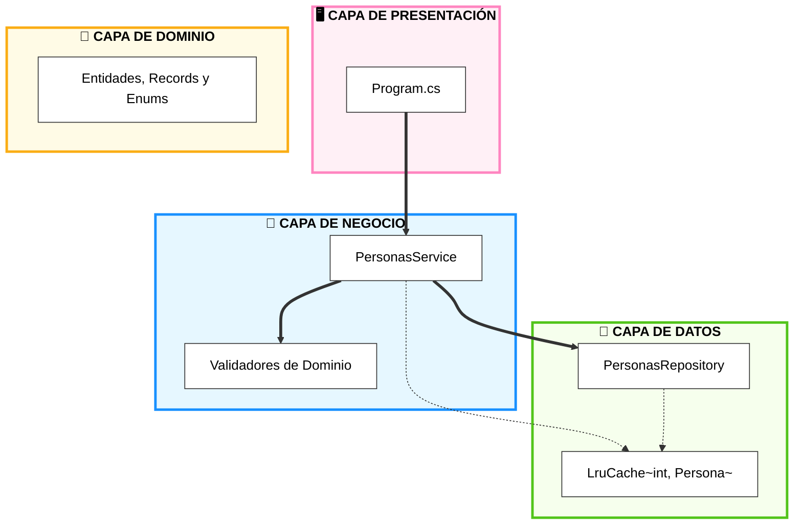

### Responsabilidades Detalladas:

#### 🖥️ Program (`Program.cs`)
Es el **"Camarero"** del sistema. Su única misión es atender al usuario.
*   **Interfaz de Usuario:** Gestiona menús, colores y formato de tablas.
*   **Sanitización de Entrada:** Usa **Regex** para asegurar que el usuario no introduce basura.
*   **Gestión de Excepciones:** Atrapa los errores que suben de las capas inferiores y los muestra de forma amigable.
*   **Configuración de Caché:** Crea e inyecta la caché LRU con capacidad configurable.

#### 🛡️ Validator (`Validators/`)
Es la **"Aduana"** del sistema. No deja pasar ningún objeto que no cumpla las leyes.
*   **Reglas de Integridad:** Aquí se decide qué es un DNI válido, que la nota sea 0-10 o que un docente tenga experiencia coherente.
*   **Desacoplamiento:** El Servicio no sabe *cómo* se valida, solo sabe que el Validador le da el "visto bueno".

#### 🧠 Service (`PersonasService`)
Es el **"Chef"** o cerebro. Orquesta todo el proceso.
*   **Coordinación:** Decide cuándo validar y cuándo guardar.
*   **Transformación de Datos:** Crea los informes estadísticos.
*   **Caché LRU:** Implementa el patrón **Look-Aside**: primero consulta la caché, si no está, va al repositorio y lo guarda en caché.

#### 💾 Repository (`PersonasRepository`)
Es la **"Despensa"**. Gestión física de los registros.
*   **Persistencia:** Almacena los objetos en estructuras `Dictionary` para búsquedas O(1).
*   **Índices Secundarios:** Usa un índice adicional por DNI para búsquedas rápidas.
*   **Identidad:** Asigna los identificadores únicos (IDs) y gestiona las marcas de tiempo (CreatedAt/UpdatedAt).

#### ⚡ Cache (`LruCache<TKey, TValue>`)
Es el **" buffer de acceso rápido"**. Optimiza las lecturas frecuentes.
*   **Algoritmo LRU:** Least Recently Used - elimina el elemento menos usado cuando se alcanza la capacidad.
*   **O(1) en operaciones:** Gracias a `Dictionary` + `LinkedList`.
*   **Logging:** Registra HIT/MISS y evictions para facilitar el aprendizaje.

---

## 3. Gestión de Errores: Excepciones de Dominio
El sistema no utiliza errores genéricos, sino que define sus propias **Excepciones de Dominio**. Esto permite una comunicación precisa y profesional entre las capas.

### Jerarquía de Excepciones
Utilizamos clases anidadas para agrupar errores bajo un mismo contexto semántico (`PersonasException`).

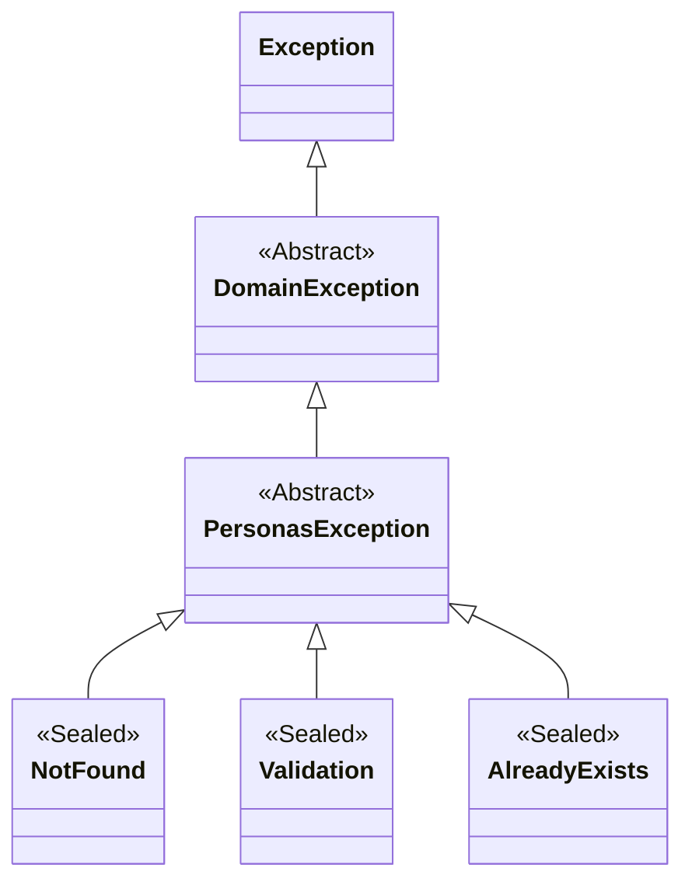

### ¿Por qué usamos Excepciones Personalizadas?
1.  **Semántica Clara:** Es mucho más descriptivo capturar un `NotFound` que un error genérico.
2.  **Desacoplamiento:** La Capa de Presentación no necesita conocer detalles técnicos.
3.  **Seguridad de Datos:** Las excepciones de validación transportan una **lista de errores**.

---

## 4. Diagrama de Clases del Modelo (Detalle Completo)
El modelo de datos refleja fielmente la realidad académica, separando las capacidades mediante interfaces.

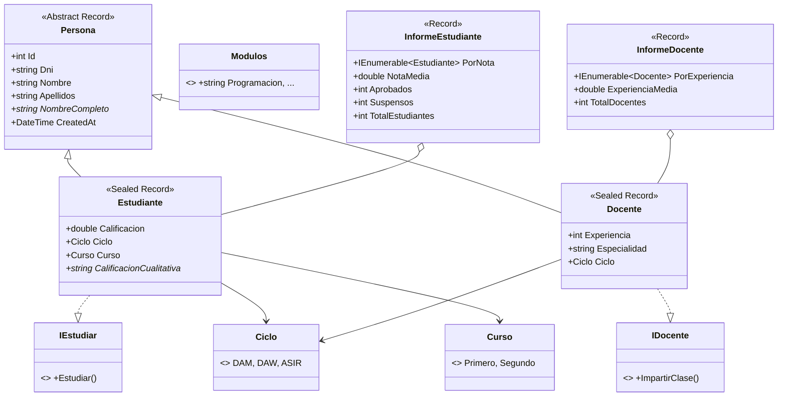

---

## 5. IEnumerable: El Contrato de Solo Lectura
El sistema usa `IEnumerable<T>` como tipo de retorno en las consultas. Este es el contrato más simple posible: "te doy los datos, tú iteras".

### ¿Por qué IEnumerable y no IList o ILista?

| Interfaz         | Características                | Uso                   |
| ---------------- | ------------------------------ | --------------------- |
| `IEnumerable<T>` | Solo iteración, sin Add/Remove | Contrato de consulta  |
| `IList<T>`       | Add, Remove, Index             | Modificación de lista |
| `ILista<T>`      | Tu implementación propia       | Estructura de datos   |

```csharp
// El Repository devuelve IEnumerable - el llamador decide qué hacer
public IEnumerable<Persona> GetAll() => _diccionario.Values;

// El Servicio lo transforma con filtros y ordenación
var resultado = repository.GetAll()
    .Where(p => p.Ciclo == Ciclo.DAW)
    .OrderBy(p => p.Nombre);
```

**Ventajas de IEnumerable:**
1. **Desacoplamiento:** El Repository no impone cómo se usa el resultado.
2. **Flexibilidad:** El caller puede convertir a lista, array, o iterar directamente.
3. **LINQ:** IEnumerable es la base de todas las operaciones LINQ (Where, OrderBy, etc.).

---

## 6. El Servicio: Motor de Inteligencia y Consultas
El `Service` no es un simple intermediario; es el **motor de orquestación** donde las reglas del mundo real se convierten en código. Su misión es transformar colecciones de datos en información estratégica.

### 6.1. Inyección de Dependencias
El Servicio recibe sus dependencias desde el exterior (Program.cs), lo que facilita el testing y el cambio de implementaciones.

```csharp
public class PersonasService(
    IPersonasRepository repository,
    IValidador<Persona> valEstudiante,
    IValidador<Persona> valDocente,
    ICache<int, Persona> cache) : IPersonasService
```

### 6.2. El Hub Central: GetAllOrderBy
Centraliza toda la lógica de ordenación del sistema usando un **Diccionario de Estrategias**.

#### 6.2.1. ¿Qué es el Patrón Strategy?
El Patrón Strategy es un patrón de diseño comportamental que permite seleccionar un algoritmo en tiempo de ejecución. En lugar de usar un gran `switch` o múltiples `if/else`, definimos cada algoritmo (estrategia) como una función y las almacenamos en un diccionario.

```csharp
// DICCIONARIO DE ESTRATEGIAS
// ==========================
// Clave: TipoOrdenamiento (enum con los criterios disponibles)
// Valor: Func<IOrderedEnumerable<Persona>> (una función que devuelve una colección ordenada)

var comparadores = new Dictionary<TipoOrdenamiento, Func<IOrderedEnumerable<Persona>>> {
    { TipoOrdenamiento.Id, () => lista.OrderBy(p => p.Id) },
    { TipoOrdenamiento.Dni, () => lista.OrderBy(p => p.Dni) },
    // ... más estrategias
};
```

#### 6.2.2. ¿Por qué usar un diccionario y no un switch?

| Enfoque                        | Ventajas                                | Inconvenientes                               |
| ------------------------------ | --------------------------------------- | -------------------------------------------- |
| **switch tradicional**         | Familiar, fácil de entender             | Cada caso nuevo requiere modificar el switch |
| **Diccionario de estrategias** | Abierto/Cerrado (Open/Closed Principle) | Menos intuitivo inicialmente                 |

**El switch tradicional:**
```csharp
// PROBLEMA: Si quieres añadir un nuevo criterio, aquí
return orden switch {
    TipoOrdenamiento.Id => lista.OrderBy(p => p.Id),
    TipoOrdenamiento.Dni => lista.OrderBy(p => p.Dni),
    // ... 10 casos después
    _ => lista.OrderBy(p => p.Id)
};
```

**El diccionario de estrategias:**
```csharp
// SOLUCIÓN: Añadir un criterio es añadir UNA LÍNEA al diccionario
// sin tocar el resto del código (Open/Closed Principle)
var comparadores = new Dictionary<...> {
    { TipoOrdenamiento.Id, () => lista.OrderBy(p => p.Id) },
    { TipoOrdenamiento.Dni, () => lista.OrderBy(p => p.Dni) },
    { TipoOrdenamiento.Nombre, () => lista.OrderBy(p => p.Nombre) },
    { TipoOrdenamiento.Edad, () => lista.OrderBy(p => p.Edad) }, // Nueva línea
};
```

#### 6.2.3. La magia de TryGetValue
Una vez definidas las estrategias, la ejecución es trivial:

```csharp
// TryGetValue: busca la clave en el diccionario
// Si existe, ejecuta la función asociada
// Si no existe, usa el fallback (orden por ID)

return comparadores.TryGetValue(orden, out var comparador)
    ? comparador()      // Ejecutar la estrategia encontrada
    : lista.OrderBy(p => p.Id);  // Fallback seguro
```

**¿Por qué TryGetValue?**
- Evita excepciones si la clave no existe
- Devuelve el valor directamente en el parámetro `out`
- Más eficiente que verificar `ContainsKey` + acceder

#### 6.2.4. Pattern Matching en propiedades polimórficas
Algunos criterios (Nota, Experiencia) solo aplican a ciertos tipos. Usamos pattern matching para manejar esto de forma segura:

```csharp
{ TipoOrdenamiento.Nota, () => lista.OrderByDescending(p => 
    p is Estudiante e ? e.Calificacion : -1) },
```

**Desglose:**
1. `p is Estudiante e` - ¿Es Estudiante? Si sí, guarda en `e`
2. `e.Calificacion` - Accedemos a la propiedad del tipo derivado
3. `: -1` - Si no es Estudiante, devolvemos -1 (va al final)

**Ventajas:**
- **Seguridad de tipos:** El compilador garantiza que solo accedemos a propiedades válidas
- **Legibilidad:** El código dice claramente qué queremos hacer
- **Flexibilidad:** Se ordena correctamente cada tipo

```csharp
// RESULTADO:
// Estudiantes: ordenados por nota (9, 8, 7, ...)
// Docentes: aparecen al final con valor -1
```

#### 6.2.5. Código completo del Hub

```csharp
public IEnumerable<Persona> GetAllOrderBy(
    TipoOrdenamiento orden = TipoOrdenamiento.Dni,
    Predicate<Persona>? filtro = null)
{
    // PASO 1: Obtener datos del repositorio
    var lista = filtro == null
        ? repository.GetAll()
        : repository.GetAll().Where(p => filtro(p));

    // PASO 2: Definir estrategias de ordenación
    var comparadores = new Dictionary<TipoOrdenamiento, Func<IOrderedEnumerable<Persona>>> {
        { TipoOrdenamiento.Id, () => lista.OrderBy(p => p.Id) },
        { TipoOrdenamiento.Dni, () => lista.OrderBy(p => p.Dni) },
        { TipoOrdenamiento.Nombre, () => lista.OrderBy(p => p.Nombre) },
        { TipoOrdenamiento.Apellidos, () => lista.OrderBy(p => p.Apellidos) },
        { TipoOrdenamiento.Ciclo, () => lista.OrderBy(p => ObtenerCicloTexto(p)) },
        { TipoOrdenamiento.Nota, () => lista.OrderByDescending(p => 
            p is Estudiante e ? e.Calificacion : -1) },
        { TipoOrdenamiento.Experiencia, () => lista.OrderByDescending(p => 
            p is Docente d ? d.Experiencia : -1) },
        { TipoOrdenamiento.Curso, () => lista.OrderBy(p => 
            p is Estudiante e ? (int)e.Curso : int.MaxValue) },
    };

    // PASO 3: Ejecutar la estrategia seleccionada
    return comparadores.TryGetValue(orden, out var comparador)
        ? comparador()
        : lista.OrderBy(p => p.Id);  // Fallback por seguridad
}
```

**Ventajas del patrón Strategy:**
1. **Open/Closed Principle:** Añadir criterios sin modificar código existente
2. **Desacoplamiento:** Cada estrategia es independiente
3. **Testeabilidad:** Cada estrategia se puede probar aisladamente
4. **Legibilidad:** Toda la lógica de ordenación en un solo lugar

### 6.3. Generación de Informes
Los informes se construyen aplicando filtros y calculando métricas.

```csharp
public InformeEstudiante GenerarInformeEstudiante(Ciclo? ciclo, Curso? curso) {
    var estudiantes = GetEstudiantesOrderBy(TipoOrdenamiento.Nota)
        .Where(e => (ciclo == null || e.Ciclo == ciclo) && 
                    (curso == null || e.Curso == curso))
        .ToList();

    var total = estudiantes.Count;
    if (total == 0) return new InformeEstudiante();

    return new InformeEstudiante {
        PorNota = estudiantes,
        TotalEstudiantes = total,
        Aprobados = estudiantes.Count(e => e.Calificacion >= 5.0),
        Suspensos = estudiantes.Count(e => e.Calificacion < 5.0),
        NotaMedia = estudiantes.Average(e => e.Calificacion)
    };
}
```

**Nota sobre `.ToList()`:** Se materializa el IEnumerable en una lista para poder contar varias veces (Aprobados, Suspensos) sin iterar múltiples veces sobre la colección.

---

## 8. Análisis de Principios SOLID y DRY
Has aplicado los estándares de la industria para garantizar que el código sea mantenible, escalable y fácil de entender.

### 📐 Principios SOLID

#### **S - Single Responsibility (Responsabilidad Única)**
Cada clase tiene una única misión. Por ejemplo, el `ValidadorEstudiante` solo se encarga de las reglas de integridad, sin saber nada de menús o de cómo se guardan los datos.

```csharp
// El validador solo valida, no persiste ni imprime
public class ValidadorEstudiante : IValidador<Persona> {
    public IEnumerable<string> Validar(Persona persona) {
        var errores = new List<string>();
        if (persona is not Estudiante estudiante) {
            errores.Add("La entidad no es un Estudiante.");
            return errores;
        }
        if (estudiante.Calificacion is < 0 or > 10)
            errores.Add("La calificación debe estar entre 0.0 y 10.0.");
        // ...
        return errores;
    }
}
```

#### **O - Open/Closed (Abierto/Cerrado)**
El sistema permite añadir funcionalidades nuevas (extender) sin modificar el código que ya funciona. Lo logras mediante **inversión de dependencias**.

```csharp
// GetAllOrderBy usa un diccionario de estrategias.
// Para añadir un nuevo criterio, solo añaden una línea al mapa:
{ TipoOrdenamiento.Edad, () => lista.OrderBy(p => p.Edad) }
```

#### **L - Liskov Substitution (Sustitución de Liskov)**
El repositorio almacena `Persona` (clase base), pero el programa funciona perfectamente inyectando `Estudiante` o `Docente`. La clase base es totalmente sustituible por sus hijas.

```csharp
// El repositorio acepta cualquier subtipo de Persona
_diccionario[id] = new Estudiante { ... };
_diccionario[id] = new Docente { ... };
```

#### **I - Interface Segregation (Segregación de Interfaces)**
No has creado una interfaz gigantesca. Has separado las capacidades: `IEstudiar` para alumnos e `IDocente` para profesores.

```csharp
public sealed record Estudiante : Persona, IEstudiar { ... }
public sealed record Docente : Persona, IDocente { ... }
```

#### **D - Dependency Inversion (Inversión de Dependencias)**
El `Service` no depende de implementaciones concretas, sino de sus **Interfaces**. Esto permite cambiar el almacenamiento o añadir caché sin tocar la lógica de negocio.

```csharp
public class PersonasService(
    IPersonasRepository repository,
    IValidador<Persona> valEstudiante,
    IValidador<Persona> valDocente,
    ICache<int, Persona> cache)
```

---

### 💧 Principio DRY (Don't Repeat Yourself)
Has evitado la repetición de lógica mediante:

1.  **Motor de Consultas Unificado:** Un único `GetAllOrderBy` con Dictionary de estrategias.
2.  **Validación Polimórfica:** Un solo método `ValidarPersonaConLogicaPolimorfica` que selecciona el validador correcto según el tipo.

```csharp
// Un solo método maneja todos los tipos de Persona
private void ValidarPersonaConLogicaPolimorfica(Persona persona) {
    var errores = persona switch {
        Estudiante => valEstudiante.Validar(persona),
        Docente => valDocente.Validar(persona),
        _ => ["Tipo no soportado."]
    };
    // ...
}
```

---

## 8. Caché LRU: Optimización de Lecturas
El sistema implementa una caché **LRU (Least Recently Used)** para optimizar las lecturas por ID.

### 8.1. ¿Qué es LRU?
LRU significa "Least Recently Used" (Menos Recientemente Usado). Cuando la caché está llena y se necesita añadir un nuevo elemento, se elimina el que lleva más tiempo sin ser accedido.

### 8.2. Estructura de la Caché

```csharp
public class LruCache<TKey, TValue> : ICache<TKey, TValue> where TKey : notnull {
    private readonly Dictionary<TKey, TValue> _data = new();      // O(1) búsqueda
    private readonly LinkedList<TKey> _usageOrder = new();       // Orden de uso
    private readonly int _capacity;                               // Capacidad máxima

    public LruCache(int capacity) {
        if (capacity <= 0)
            throw new ArgumentException("La capacidad debe ser mayor que 0.");
        _capacity = capacity;
    }
}
```

**¿Por qué dos estructuras?**
- `Dictionary`: Permite buscar cualquier elemento en O(1).
- `LinkedList`: Mantiene el orden de uso. El primer nodo (`First`) es el menos usado; el último (`Last`) es el más reciente.

### 8.3. Operaciones de la Caché

```csharp
// AÑADIR (Add)
public void Add(TKey key, TValue value) {
    if (_data.TryGetValue(key, out _)) {
        RefreshUsage(key); // Ya existe, actualizar y mover al final
        return;
    }

    if (_data.Count >= _capacity) {
        // Caché llena: eliminar el menos usado (First de la lista)
        var oldestKey = _usageOrder.First!.Value;
        _usageOrder.RemoveFirst();
        _data.Remove(oldestKey);
    }

    _data.Add(key, value);
    _usageOrder.AddLast(key);
}

// OBTENER (Get)
public TValue? Get(TKey key) {
    if (!_data.TryGetValue(key, out var value)) return default;
    RefreshUsage(key); // "Rejuvenecer" el elemento
    return value;
}

// REFRESCAR USO (RefreshUsage)
private void RefreshUsage(TKey key) {
    _usageOrder.Remove(key);  // Sacar de donde esté
    _usageOrder.AddLast(key); // Poner como el más reciente
}
```

### 8.4. Patrón Look-Aside en el Servicio
El Servicio implementa el patrón **Look-Aside** para la caché:

```csharp
public Persona GetById(int id) {
    var cached = cache.Get(id);
    if (cached != null) return cached;  // HIT: está en caché

    var persona = repository.GetById(id) ?? throw new PersonasException.NotFound(id.ToString());
    cache.Add(id, persona);  // MISS: añadir a caché
    return persona;
}
```

### 8.5. Estrategias de Caché en Operaciones CRUD

| Operación    | Estrategia             | Código                                     |
| ------------ | ---------------------- | ------------------------------------------ |
| **Create**   | Añadir                 | `cache.Add(id, persona)`                   |
| **Update**   | Invalidar              | `cache.Remove(id)`                         |
| **Delete**   | Invalidar              | `cache.Remove(id)`                         |
| **GetById**  | Look-Aside             | `cache.Get()` → repository → `cache.Add()` |
| **GetByDni** | Añadir (tenemos el ID) | `cache.Add(persona.Id, persona)`           |

**Nota pedagógica:** En producción, Create normalmente NO añade a caché (se repoblará en el primer GetById). Aquí lo hacemos para que veáis el funcionamiento.

### 8.6. Complejidad Algorítmica

| Operación      | Complejidad     |
| -------------- | --------------- |
| `Add`          | O(1) amortizado |
| `Get`          | O(1)            |
| `Remove`       | O(1)            |
| `RefreshUsage` | O(1)            |

---

## 9. Diagramas de Secuencia: Trazabilidad de Código
Los diagramas de secuencia muestran el flujo de mensajes entre los componentes para las operaciones clave del sistema. Esto te ayuda a entender cómo se orquesta el código en tiempo de ejecución.

### 9.1. Listar Todo el Personal (Operación READ ALL)

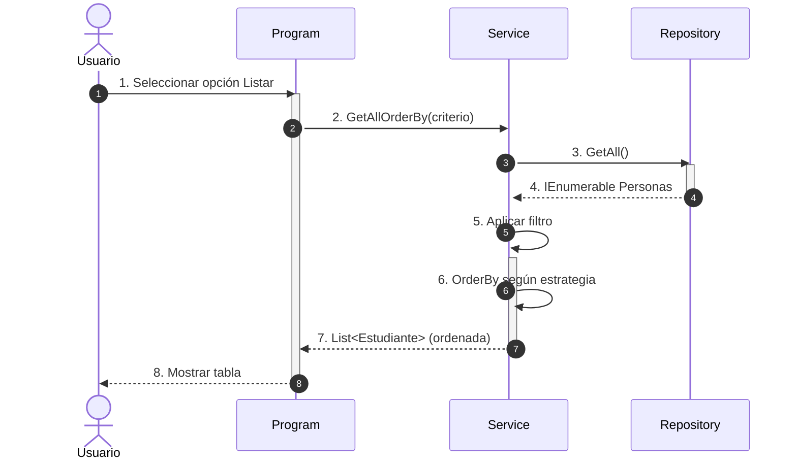

#### Trazabilidad de Código:
*   **[1] Usuario:** Selecciona opción del menú
*   **[2] Program:** `var lista = service.GetAllOrderBy(criterio);`
*   **[3-4] Repository:** `repository.GetAll()` → `_diccionario.Values`
*   **[5-6] Service:** Aplicar filtro y ordenación con diccionario de estrategias
*   **[7-8] Program:** `ImprimirTablaPersonas(lista)`

---

### 9.2. Buscar por ID (Operación READ ONE con Caché)

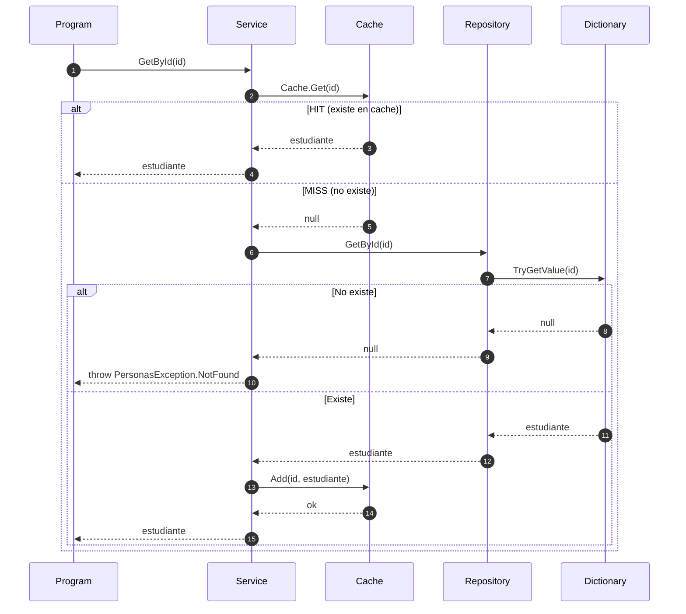

#### Trazabilidad de Código:
*   **[1] Program:** `var p = service.GetById(id);`
*   **[2] Service:** `cache.Get(id)` - Si existe (HIT) devuelve directamente
*   **[3] Cache:** Si no existe (MISS) → `null`
*   **[4] Repository:** `repository.GetById(id)`
*   **[5-6] Dictionary:** `_diccionario.TryGetValue(id, out var persona)` - Búsqueda O(1)
*   **[7-8] Service:** Si no existe → `throw new PersonasException.NotFound(id)`
*   **[9-10] Cache:** Si existe → `cache.Add(id, persona)` - Se añade tras lectura
*   **[11] Program:** `ImprimirFichaPersona(p)`

---

### 9.3. Crear Estudiante (Operación CREATE)

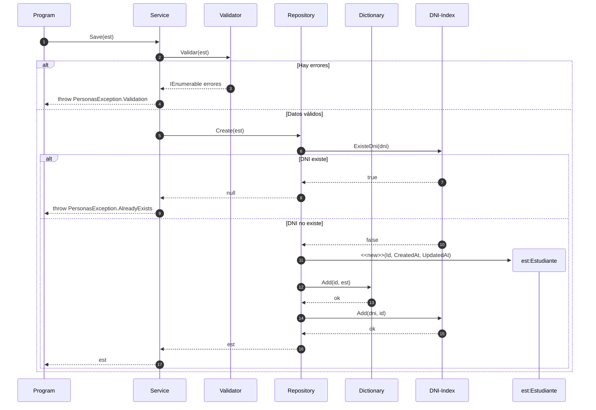

#### Trazabilidad de Código:
*   **[1] Program:** `var creado = service.Save(estudiante);`
*   **[2] Service:** Llama al Validator
*   **[3] Validator:** `valEstudiante.Validar(estudiante)` - Devuelve errores si los hay
*   **[4] Service:** Si hay errores → `throw new PersonasException.Validation(errores)`
*   **[5] Service:** Si válido → `repository.Create(estudiante)`
*   **[6] Repository:** `ExisteDni(dni)` - Verifica si el DNI ya existe
*   **[7] Repository:** Si existe → `return null` → Service → `throw PersonasException.AlreadyExists`
*   **[8] Repository:** Si no existe → Crea estudiante con `entity with { Id++, CreatedAt, UpdatedAt }`
*   **[9] Repository:** `_porId[nuevaPersona.Id] = nuevaPersona` - Añade a Dictionary
*   **[10] Repository:** `_dniIndex[nuevaPersona.Dni] = nuevaPersona.Id` - Añade a índice DNI
*   **[11] Service:** Devuelve el estudiante creado
*   **[12] Program:** `ImprimirFichaPersona(creado)`

---

### 9.4. Actualizar Estudiante (Operación UPDATE)

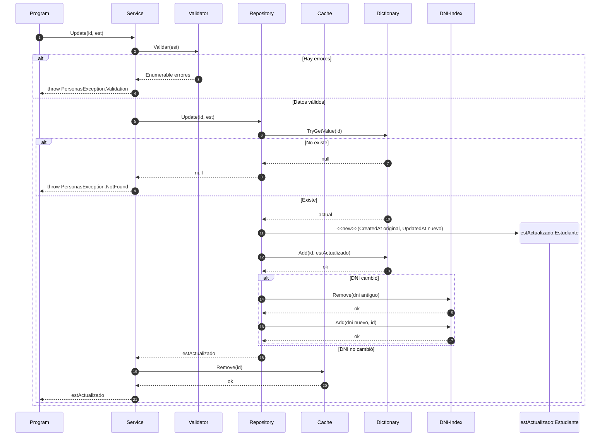

#### Trazabilidad de Código:
*   **[1] Program:** `var actualizado = service.Update(id, estudiante);`
*   **[2] Service:** Llama al Validator
*   **[3] Validator:** `valEstudiante.Validar(estudiante)` - Devuelve errores si los hay
*   **[4] Service:** Si hay errores → `throw new PersonasException.Validation(errores)`
*   **[5] Service:** Si válido → `repository.Update(id, estudiante)`
*   **[6] Repository:** `TryGetValue(id)` - Buscar si existe
*   **[7] Repository:** Si no existe → `return null` → Service → `throw PersonasException.NotFound`
*   **[8] Repository:** Si existe → Crea nuevo with `{ Id, CreatedAt original, UpdatedAt nuevo }`
*   **[9] Repository:** `_porId[id] = personaActualizada` - Actualiza en Dictionary
*   **[10] Repository:** Si DNI cambió → Actualiza índice DNI
*   **[11] Service:** `cache.Remove(id)` - Invalida caché
*   **[12] Service:** Devuelve estudiante actualizado
*   **[13] Program:** `ImprimirFichaPersona(actualizado)`

---

### 9.5. Eliminar Estudiante (Operación DELETE)

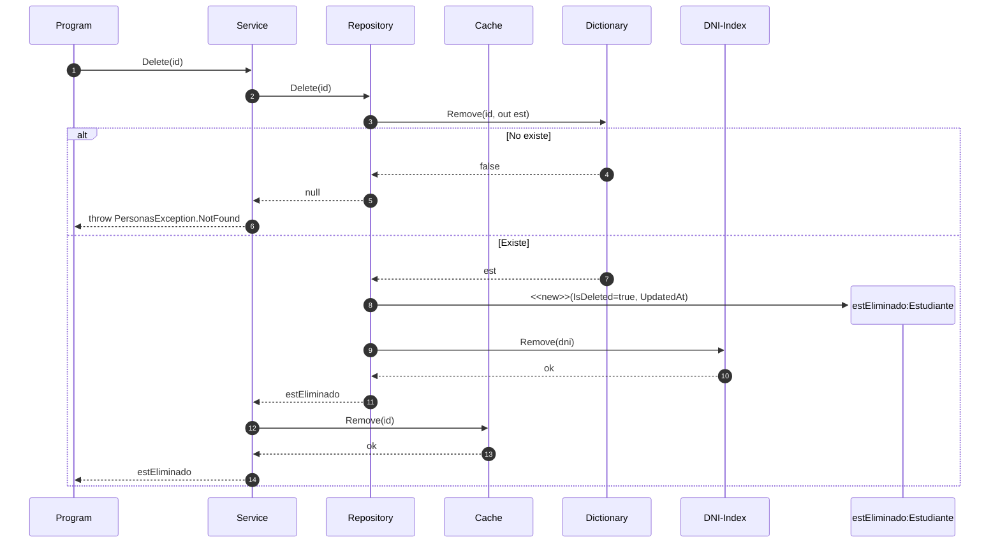

#### Trazabilidad de Código:
*   **[1] Program:** `var eliminado = service.Delete(id);`
*   **[2] Service:** `repository.Delete(id)`
*   **[3] Repository:** `_porId.Remove(id, out var persona)` - Operación atómica O(1)
*   **[4] Repository:** Si no existe → `return null`
*   **[5] Service:** Si null → `throw PersonasException.NotFound`
*   **[6] Repository:** Si existe → Crea nuevo `estEliminado` con `{ IsDeleted = true, UpdatedAt }`
*   **[7] Repository:** `_dniIndex.Remove(persona.Dni)` - Sincroniza índice DNI
*   **[8] Service:** `cache.Remove(id)` - Invalida caché
*   **[9] Service:** Devuelve `estEliminado`
*   **[10] Program:** `ImprimirFichaPersona(eliminado)`


### 9.6. Generar Informe de Rendimiento de Estudiantes (READ con Agregación)

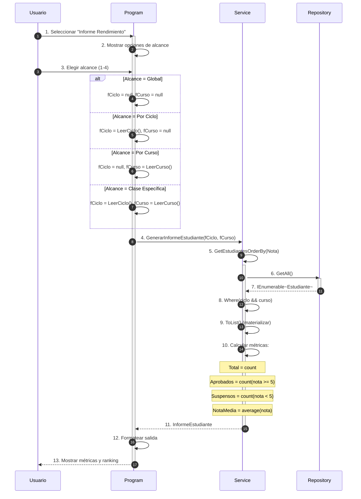

#### Trazabilidad de Código:
*   **[1] Usuario:** Selecciona opción 8 del menú (`OpcionMenu.InformeEstudiantes`)
*   **[2-3] Program:** `MostrarInformeEstudiantes(service)` - Solicita alcance
*   **[4] Program:** `service.GenerarInformeEstudiante(fCiclo, fCurso)` - Pasa filtros
*   **[5-6] Service:** `GetEstudiantesOrderBy(TipoOrdenamiento.Nota)` - Obtiene del repositorio
*   **[7] Repository:** `repository.GetAll()` - Devuelve todos los estudiantes
*   **[8] Service:** `.Where(e => (ciclo == null || e.Ciclo == ciclo) && ...)` - Aplica filtros nulos
*   **[9] Service:** `.ToList()` - Materializa para contar varias veces (LINQ deferred execution)
*   **[10] Service:** Calcula:
    *   `TotalEstudiantes = count`
    *   `Aprobados = count(e => e.Calificacion >= 5.0)`
    *   `Suspensos = count(e => e.Calificacion < 5.0)`
    *   `NotaMedia = average(e => e.Calificacion)`
*   **[11] Service:** Devuelve `InformeEstudiante` con PorNota, Total, Aprobados, Suspensos, NotaMedia
*   **[12-13] Program:** Formatea y muestra tabla con métricas y ranking por nota

#### Punto Clave: Pipeline Funcional con LINQ
El método `GenerarInformeEstudiante` encadena operaciones en una sola expresión fluida:

```csharp
var estudiantes = GetEstudiantesOrderBy(TipoOrdenamiento.Nota)  // Obtener
    .Where(e => (ciclo == null || e.Ciclo == ciclo) && ...)       // Filtrar
    .ToList();                                                     // Materializar

return new InformeEstudiante {
    PorNota = estudiantes,
    TotalEstudiantes = estudiantes.Count,
    Aprobados = estudiantes.Count(e => e.Calificacion >= 5.0),
    Suspensos = estudiantes.Count(e => e.Calificacion < 5.0),
    NotaMedia = estudiantes.Average(e => e.Calificacion)
};
```

**Nota sobre `.ToList()`:** Se materializa el IEnumerable en lista para poder:
1. Contar múltiples veces (Aprobados, Suspensos, Total)
2. Calcular la media sin iterar de nuevo
3. Evitar evaluación diferida (deferred execution) en las estadísticas

---

### 9.7. Diagrama de Actividad: Actualizar Estudiante (UPDATE)

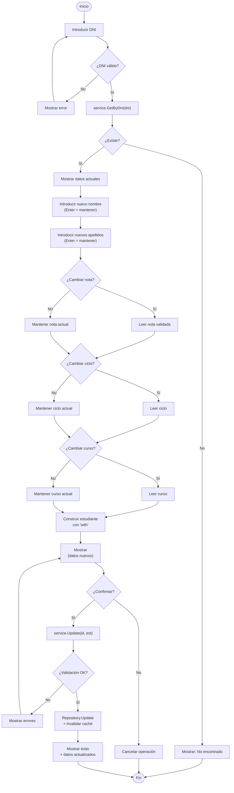

#### Trazabilidad de Código:
*   **[A-H] Validación DNI:** `ValidarDniCompleto(d)` - Validación con algoritmo real
*   **[E-F] Búsqueda:** `service.GetByDni(dni)` → `PersonasException.NotFound`
*   **[I] Mostrar actual:** `ImprimirFichaPersona(est)` - Muestra datos antes de modificar
*   **[J-T] Entrada modular:** Cada campo se pide individualmente con opción de mantener
*   **[U] Constructor with:** `est with { Nombre = ..., Calificacion = ... }` - Inmutabilidad
*   **[V] Preview:** `ImprimirFichaPersona(act)` - Revisión antes de confirmar
*   **[Y] Update:** `service.Update(est.Id, act)` - Lógica de negocio + validación
*   **[Z] Validación:** `valEstudiante.Validar(estudiante)` - Reglas de dominio
*   **[AB] Persistencia:** `repository.Update()` + `cache.Remove(id)` - Caché LRU

---

### 9.8. Diagrama de Estado: Ciclo de Vida del Estudiante

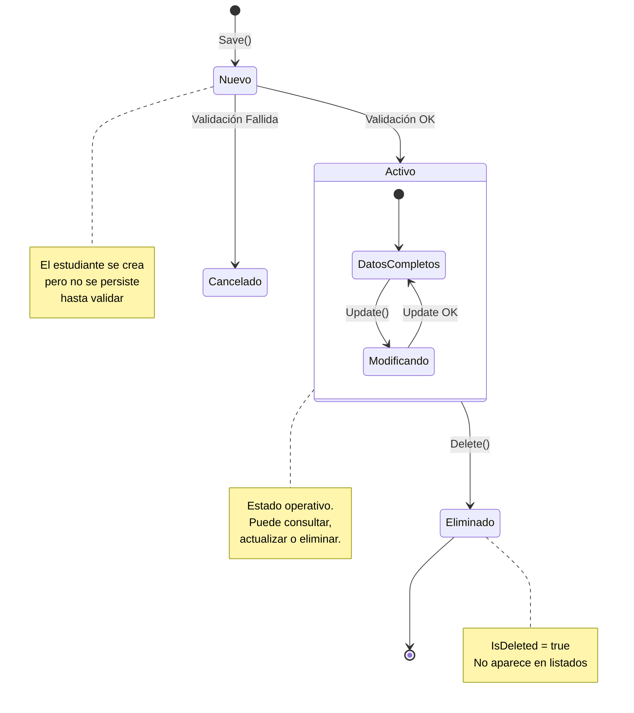

#### Estados del Estudiante:

| Estado | Descripción | Transiciones |
|--------|-------------|--------------|
| **Nuevo** | Estudiante creado en memoria, sin persistir | → Activo (validado), → Cancelado (error) |
| **Activo** | Estudiante persistido y operativo | → Modificando, → Eliminado |
| **Modificando** | Transición temporal durante Update | → Activo |
| **Eliminado** | Marcado como borrado (IsDeleted=true) | → Fin |

#### Transiciones y Eventos:

| Evento | De Estado | A Estado | Acción asociada |
|--------|-----------|----------|-----------------|
| `Save()` | - | Nuevo | Crear instancia con ID temporal |
| Validación OK | Nuevo | Activo | `repository.Create()` + caché |
| Validación FAIL | Nuevo | Cancelado | `throw ValidationException` |
| `Update()` | Activo | Modificando | Reemplazar datos |
| Update OK | Modificando | Activo | `repository.Update()` + caché.Remove() |
| `Delete()` | Activo | Eliminado | `IsDeleted = true` + caché.Remove() |

#### Implementación en Código:

```csharp
// Save - Transición Nuevo → Activo
public Persona Save(Persona persona) {
    ValidarPersonaConLogicaPolimorfica(persona);  // ¿Validación OK?
    var nueva = repository.Create(persona);       // → Activo
    return nueva;
}

// Update - Transición Activo → Modificando → Activo  
public Persona Update(int id, Persona persona) {
    ValidarPersonaConLogicaPolimorfica(persona);  // ¿Validación OK?
    var actualizada = repository.Update(id, persona);
    cache.Remove(id);                            // → Activo (nuevos datos)
    return actualizada;
}

// Delete - Transición Activo → Eliminado
public Persona Delete(int id) {
    var eliminada = repository.Delete(id);       // IsDeleted = true
    cache.Remove(id);
    return eliminada;
}
```

---

## 10. Patrones de Diseño Resumen

Este proyecto implementa varios **patrones de diseño** de forma práctica y educativa.

### 📦 10.1. Repository Pattern

**Problema:** Necesitamos abstraer la persistencia para que la lógica de negocio no dependa de cómo se almacenan los datos.

```csharp
public interface IPersonasRepository {
    Persona? GetById(int id);
    Persona? GetByDni(string dni);
    IEnumerable<Persona> GetAll();
    Persona? Create(Persona entity);
    Persona? Update(int id, Persona entity);
    Persona? Delete(int id);
}
```

| Método | Complejidad |
|--------|------------|
| `GetById` | O(1) |
| `GetByDni` | O(1) |
| `GetAll` | O(n) |
| Create/Update/Delete | O(1) |

---

### 🏭 10.2. Factory Pattern

**Problema:** Crear objetos con datos iniciales predefinidos de forma centralizada.

```csharp
public static class PersonasFactory {
    public static IEnumerable<Persona> Seed() {
        return [
            new Estudiante { Dni = "11111111H", Nombre = "Ana", ... },
            // ... más datos semilla
        ];
    }
}
```

---

### 🗺️ 10.3. Strategy Pattern

**Problema:** Aplicar diferentes algoritmos de ordenación sin múltiples `if/else`.

```csharp
var comparadores = new Dictionary<TipoOrdenamiento, Func<IOrderedEnumerable<Persona>>> {
    { TipoOrdenamiento.Id, () => lista.OrderBy(p => p.Id) },
    { TipoOrdenamiento.Nota, () => lista.OrderByDescending(p => 
        p is Estudiante e ? e.Calificacion : -1) },
};

return comparadores.TryGetValue(orden, out var comparador)
    ? comparador()
    : lista.OrderBy(p => p.Id);
```

---

### 🔒 10.4. Singleton Pattern

**Problema:** Necesitamos una única instancia del Repository.

```csharp
private static readonly Lazy<PersonasRepository> Lazy = 
    new(() => new PersonasRepository());
private PersonasRepository() { }
public static PersonasRepository Instance => Lazy.Value;
```

---

### ⚡ 10.5. LRU Cache (Least Recently Used)

**Problema:** Las búsquedas repetidas por ID son costosas.

```csharp
private readonly Dictionary<TKey, TValue> _data = new();
private readonly LinkedList<TKey> _usageOrder = new();

public void Add(TKey key, TValue value) {
    if (_data.TryGetValue(key, out _)) { RefreshUsage(key); return; }
    if (_data.Count >= _capacity) {
        var oldest = _usageOrder.First!.Value;
        _usageOrder.RemoveFirst();
        _data.Remove(oldest);
    }
    _data.Add(key, value);
    _usageOrder.AddLast(key);
}
```

| Operación | Complejidad |
|-----------|------------|
| Add/Get | O(1) |

**Patrón Look-Aside:**
```csharp
var cached = cache.Get(id);
if (cached != null) return cached;        // HIT
var persona = repository.GetById(id);       // MISS
cache.Add(id, persona);
return persona;
```

---

# 11 Lo que has aprendido en este proyecto: Pilares de Ingeniería

Completar este sistema te ha permitido trabajar con decisiones de diseño que reflejan cómo se construye el software de alta calidad en la industria.

### 1. Abstracción de la Estructura de Datos
Has aprendido a separar la lógica de almacenamiento de la lógica de negocio. El `Dictionary` te ha enseñado la diferencia entre **O(n)** (búsqueda secuencial) y **O(1)** (búsqueda por clave).

### 2. Patrón Strategy con Dictionary
Has aprendido a centralizar lógica de ordenación en un diccionario, haciendo el código más mantenible y extensible.

### 3. Caché LRU
Has implementado un algoritmo clásico de optimización de lecturas, entendiendo:
- Patrón Look-Aside
- Trade-off entre memoria y velocidad
- Invalidación de caché

### 4. Dependency Injection
Has comprendido por qué el Servicio no fabrica sus propias dependencias, sino que las recibe desde fuera.

### 5. Validación de Dominio
Has aprendido a separar las reglas de negocio (DNI válido, nota 0-10) del resto de la aplicación.

### 6. Excepciones Personalizadas
Has comprendido la diferencia entre errores de dominio (reglas del negocio) y errores técnicos.

### 7. Inmutabilidad con Records
Has aprendido a usar `record` en C# para crear objetos inmutables con métodos automáticos como `Equals()`, `GetHashCode()` y la posibilidad de usar `with` para crear copias con cambios.

### 8. Programación Funcional con LINQ
Has descubierto el poder de la programación funcional mediante LINQ: expresiones lambda, evaluación diferida (deferred execution), métodos de extensión como `Where`, `OrderBy`, `Select`, `Average`, etc.

### 9. Interfaces y Polimorfismo
Has aplicado programación orientada a objetos con interfaces (`IPersonasRepository`, `ICache`, `IValidador`) para desacoplar componentes y permitir distintas implementaciones.

### 10. Clean Code y Nomenclatura
Has practicado naming profesional: nombres descriptivos (`GetEstudiantesOrderBy`), comentarios XML (`<summary>`), y organización del código en capas.